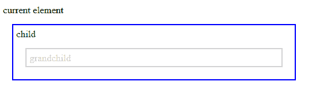
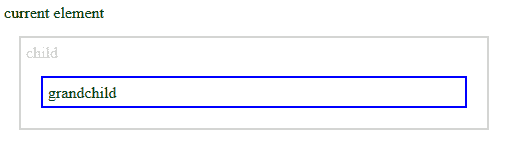

# jQuery |遍历后代

> 原文:[https://www . geesforgeks . org/jquery-遍历-后代/](https://www.geeksforgeeks.org/jquery-traversing-descendants/)

使用 jQuery，我们可以遍历 DOM 树来寻找元素的后代。
后代是孩子、孙儿、曾孙等等。

**向下遍历 DOM 树:**向下遍历 DOM 树的 jQuery 方法有。

*   儿童()
*   查找()

*   **jQuery children() Method**
    The **children()** method returns all direct children of selected element.
    This method traverses only a single level down to DOM tree.
    **Example:**

    ```html
    <!DOCTYPE html>
    <html>

    <head>
        <style>
            .descendants * {
                display: block;
                border: 2px solid lightgrey;
                color: lightgrey;
                padding: 5px;
                margin: 15px;
            }
        </style>
        <script src=
    "https://ajax.googleapis.com/ajax/libs/jquery/3.3.1/jquery.min.js">
      </script>
        <script>
            $(document).ready(function() {
                $("div").children().css({
                    "color": "green",
                    "border": "2px solid blue"
                });
            });
        </script>
    </head>

    <body>

        <div class="descendants" 
             style="width:500px;">
          current element
            <p>child
                <span>
                  grandchild
              </span>
            </p>
        </div>
    </body>

    </html>
    ```

    **输出:**
    

    *   **jQuery find() Method:**
    jQuery find() method returns descendant elements of the selected element and all the way down to last descendant.
    **Example-2:**

    ```html
    <!DOCTYPE html>
    <html>

    <head>
        <style>
            .descendants * {
                display: block;
                border: 2px solid lightgrey;
                color: lightgrey;
                padding: 5px;
                margin: 15px;
            }
        </style>
        <script src=
    "https://ajax.googleapis.com/ajax/libs/jquery/3.3.1/jquery.min.js">
      </script>
        <script>
            $(document).ready(function() {
                $("div").find("span").css({
                    "color": "green",
                    "border": "2px solid blue"
                });
            });
        </script>
    </head>

    <body>

        <div class="descendants" 
             style="width:500px;">
          current element
            <p>child
                <span>grandchild</span>
            </p>
        </div>

    </body>

    </html>
    ```

    **输出:**
    