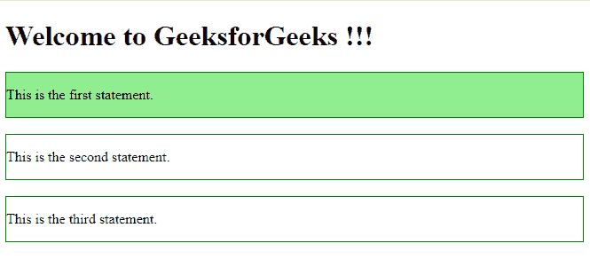
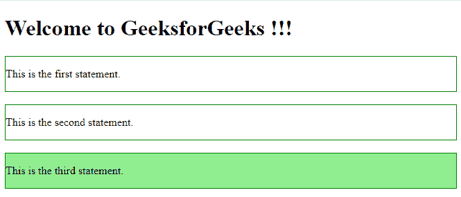
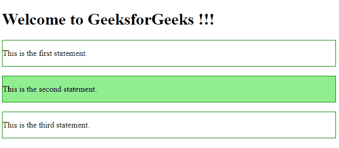
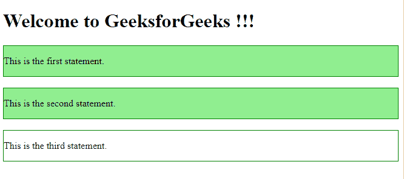
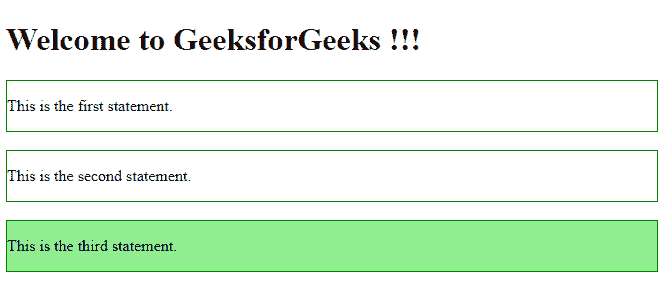

# jQuery |遍历过滤

> 原文:[https://www.geeksforgeeks.org/jquery-traversing-filtering/](https://www.geeksforgeeks.org/jquery-traversing-filtering/)

jQuery 中的遍历过滤用于根据 HTML 元素与其他元素的关系来查找它们。过滤是 jQuery 中的一个过程，用于允许在有条件或无条件的情况下找到特定的元素。有五种基本类型的过滤方法可用于选择下面列出的元素:

*   第一种()方法
*   最后()方法
*   eq()方法
*   过滤器()方法
*   not()方法

*   **first() method:** The first() method in jQuery is used to select the first element from the group of elements.

    **语法:**

    ```html
    $(selector).first()
    ```

    **参数:**不接受任何参数。

    **返回值:**返回所选元素中的第一个元素。

    **示例:**

    ```html
    <!DOCTYPE html>
    <html>

    <head>
        <title>
            jQuery first() method
        </title>
        <script src=
    "https://ajax.googleapis.com/ajax/libs/jquery/3.3.1/jquery.min.js">
        </script>

        <!-- Script to use first() method -->
        <script>
            $(document).ready(function() {
                $("div").first().css("background-color", "lightgreen");
            });
        </script>
    </head>

    <body>
        <h1>Welcome to GeeksforGeeks !!!</h1>

        <div style="border: 1px solid green;">
            <p>This is the first statement.</p>
        </div>
        <br>

        <div style="border: 1px solid green;">
            <p>This is the second statement.</p>
        </div>
        <br>

        <div style="border: 1px solid green;">
            <p>This is the third statement.</p>
        </div>
        <br>

    </body>

    </html>
    ```

    **输出:**
    

*   **last() method:** The last() method in jQuery is used to find the last element in a group of elements.

    **语法:**

    ```html
    $(selector).last()
    ```

    **参数:**不接受任何参数。

    **返回值:**返回所选元素中的最后一个元素。

    **示例:**

    ```html
    <!DOCTYPE html>
    <html>

    <head>
        <script src=
    "https://ajax.googleapis.com/ajax/libs/jquery/3.3.1/jquery.min.js">
        </script>

        <!-- Script to use last() method -->
        <script>
            $(document).ready(function() {
                $("div").last().css("background-color", "lightgreen");
            });
        </script>
    </head>

    <body>
        <h1>Welcome to GeeksforGeeks !!!</h1>
        <div style="border: 1px solid green;">
            <p>This is the first statement.</p>
        </div>
        <br>

        <div style="border: 1px solid green;">
            <p>This is the second statement.</p>
        </div>
        <br>

        <div style="border: 1px solid green;">
            <p>This is the third statement.</p>
        </div>
        <br>

    </body>

    </html>
    ```

    **输出:**
    

*   **eq() method:** This method is used to select element with the specific index number.
    **Syntax:**

    ```html
    $(selector).eq(index_number)
    ```

    **参数:**取指定元素的索引号。

    **返回值:**返回所选元素具有特定索引号的元素。

    **示例:**

    ```html
    <!DOCTYPE html>
    <html>

    <head>
        <script src=
    "https://ajax.googleapis.com/ajax/libs/jquery/3.3.1/jquery.min.js">
        </script>

        <!-- Script to use eq() method -->
        <script>
            $(document).ready(function() {
                $("div").eq(1).css("background-color", "lightgreen");
            });
        </script>
    </head>

    <body>
        <h1>Welcome to GeeksforGeeks !!!</h1>

        <div style="border: 1px solid green;">
            <p>This is the first statement.</p>
        </div>
        <br>

        <div style="border: 1px solid green;">
            <p>This is the second statement.</p>
        </div>
        <br>

        <div style="border: 1px solid green;">
            <p>This is the third statement.</p>
        </div>
        <br>

    </body>

    </html>
    ```

    **输出:**
    

*   **filter() method:** This method is used to select element with some specific criteria.
    **Syntax:**

    ```html
    $(selector).filter(parameter)
    ```

    **参数:**从另一个具有相同元素名称的元素中过滤指定的元素需要一个类名或 id 名。

    **返回值:**返回所有符合条件的元素。

    **示例:**

    ```html
    <!DOCTYPE html>
    <html>

    <head>
        <script src=
    "https://ajax.googleapis.com/ajax/libs/jquery/3.3.1/jquery.min.js">
        </script>

        <!-- Script to use filter() method -->
        <script>
            $(document).ready(function() {
                $("div").filter(".demo").css("background-color", "lightgreen");
            });
        </script>
    </head>

    <body>
        <h1>Welcome to GeeksforGeeks !!!</h1>

        <div class="demo" style="border: 1px solid green;">
            <p>This is the first statement.</p>
        </div>
        <br>

        <div class="demo" style="border: 1px solid green;">
            <p>This is the second statement.</p>
        </div>
        <br>

        <div style="border: 1px solid green;">
            <p>This is the third statement.</p>
        </div>
        <br>

    </body>

    </html>
    ```

    **输出:**
    

*   **not() method:** This method is used to select all the elements which are not meeting some criteria.
    **Syntax:**

    ```html
    $(selector).not(parameter)
    ```

    **参数:**需要类名或 id 名才能从其他具有相同元素名的元素中取消选择。

    **返回值:**返回所有不符合条件的元素。

    **示例:**

    ```html
    <!DOCTYPE html>
    <html>

    <head>
        <script src=
    "https://ajax.googleapis.com/ajax/libs/jquery/3.3.1/jquery.min.js">
        </script>

        <!-- Script to use not() method -->
        <script>
            $(document).ready(function() {
                $("div").not(".demo").css("background-color", "lightgreen");
            });
        </script>
    </head>

    <body>
        <h1>Welcome to GeeksforGeeks !!!</h1>

        <div class="demo" style="border: 1px solid green;">
            <p>This is the first statement.</p>
        </div>
        <br>

        <div class="demo" style="border: 1px solid green;">
            <p>This is the second statement.</p>
        </div>
        <br>

        <div style="border: 1px solid green;">
            <p>This is the third statement.</p>
        </div>
        <br>

    </body>

    </html>
    ```

    **输出:**
    