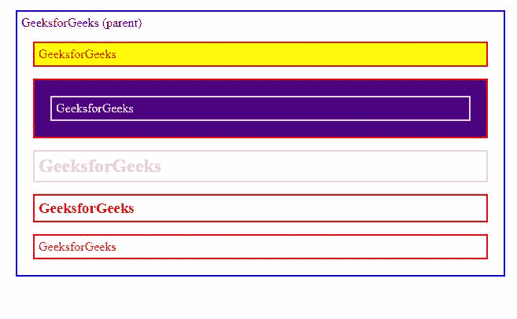
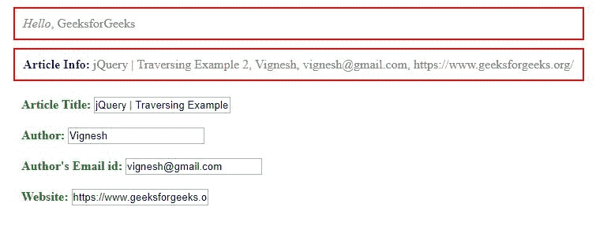

# jQuery |遍历

> 原文:[https://www.geeksforgeeks.org/jquery-traversing/](https://www.geeksforgeeks.org/jquery-traversing/)

在 jQuery 中，遍历意味着在 HTML 元素之间移动，以查找、过滤或选择特定或整个元素。
基于遍历目的，以下方法分类如下:

**树木穿越:**

**祖先:**

*   **parent()**
    它给出指定选择器的父元素
    **语法:**

    ```html
    $(selector).parent();
    ```

*   **parents()**
    它给出了指定选择器的所有祖先元素。
    **语法:**

```html
$(selector).parents();
```

*   **parentsUntil()**
    它给出了指定选择器和参数之间的所有祖先元素。
    **语法:**

    ```html
    $(selector).parentsUntil(selector, filter element)

    ```

    ```html
    $(selector).parentsUntil(element, filter element)

    ```

    *   **offsetParent()**
    给出指定选择器的第一个定位的父元素。
    **语法:**

    ```html
    $(selector).offsetParent();
    ```

    *   **closest()**
    it gives the first ancestor of the specified selector.
    **Syntax:**

    ```html
    $(selector).closest(selector);
    ```

    ```html
    $(selector).closest(selector, context);
    ```

    ```html
    $(selector).closest(selection);
    ```

    ```html
    $(selector).closest(element);
    ```

    **后代:**

    *   **children()**
        它给出每个选中元素的子元素，可选地由选择器过滤。
        **语法:**

        ```html
        $(selector).children();

        ```

    *   **find()**
        它给出指定元素的后代元素，由选择器、jQuery 对象或元素过滤。
        **语法:**

        ```html
        $(selector).find('selector to find');
        ```

    **兄弟姐妹:**

    *   **兄弟()**
        它给出指定选择器的所有兄弟。
        **语法:**

    ```html
    $(selector).siblings();
    ```

    *   **next()**
    给出指定选择器的下一个兄弟元素。
    **语法:**

    ```html
    $(selector).next();

    ```

    *   **nextAll()**
    它给出指定选择器的所有下一个兄弟元素。
    **语法:**

    ```html
    $(selector).nextAll();

    ```

    *   【next 直到()
    它给出指定选择器和参数之间的所有下一个兄弟元素。
    **语法:**

    ```html
    $(selector).nextUntil();

    ```

    *   **prev()**
    它给出了指定选择器的前一个同级元素。
    **语法:**

    ```html
    $(selector).prev(selector);

    ```

    ```html
    $(selector).prev()

    ```

    *   **普雷瓦尔()**
    它给出了指定选择器的所有先前的兄弟元素。
    **语法:**

    ```html
    $(selector).prevAll(selector, filter element)

    ```

    ```html
    $(selector).prevAll(element, filter element)

    ```

    *   **prevUntil()**
    it gives all previous sibling elements between specified selector and arguments.
    **Syntax:**

    ```html
    $(selector).prevUntil(selector, filter element)

    ```

    ```html
    $(selector).prevUntil(element, filter element)

    ```

    **过滤**

    *   **first()**
        它给出了指定选择器的第一个元素。
        **语法:**

        ```html
        $(selector).first();

        ```

    *   **last()**
        它给出了指定选择器的最后一个元素。
        **语法:**

        ```html
        $(selector).last();

        ```

    *   **eq()**
        它给一个元素指定了一个指定选择器的特定索引号。
        **语法:**

    ```html
    $(selector).eq(index);

    ```

    ```html
    $(selector).eq( indexFromEnd );

    ```

    *   **过滤器()**
    它删除/检测与指定选择器匹配的元素。
    **语法:**

    ```html
    $(selector).is(selector)
    ```

    ```html
    $(selector).is(function)
    ```

    ```html
    $(selector).is(selection)
    ```

    ```html
    $(selector).is(elements)
    ```

    *   **has()**
    它给出了内部有一个或多个元素的所有元素，这些元素与指定的选择器相匹配。
    **语法:**

    ```html
    $(selector).has(selector);

    ```

    *   **is()**
    它检查指定的选择器之一是否与参数匹配。
    **语法:**

    ```html
    .is( selector )
    ```

    ```html
    .is( function )
    ```

    ```html
    .is( selection )
    ```

    ```html
    .is( elements )
    ```

    *   **映射()**
    通过函数传递当前匹配集中的每个元素，生成一个包含返回值的新 jQuery 对象
    **语法:**

    ```html
    .map( callback )
    ```

    *   **slice()**
    it selects a subset of specified selector based on its argument index or by start and stop value.
    **Syntax:**

    ```html
    $(selector).slice(start, end );

    ```

    ```html
    $(selector).slice(start);

    ```

    **其他穿越**

    *   **add()**
        它将所有元素添加到一组匹配的元素中，以同时操纵它们。
        **语法:**

        ```html
        $(selector).add(selector to add);
        ```

    *   **addBack()**
        它将堆栈上的前一组元素添加到当前集合，可选地由选择器过滤。
        **语法:**

        ```html
        $(selector).addBack();
        ```

    *   **和**
        不推荐使用 1.8，它是 addBack()的别名。
        **语法:**

        ```html
        $(selector).addSelf();
        ```

    *   **contents()**
        它给出了指定选择器的所有直接子节点，包括文本和注释节点。
        **语法:**

    ```html
    $(selector).contents();
    ```

    *   **not()**
    给出所有与指定选择器不匹配的元素。
    **语法:**

    ```html
    $(selector).not(selector);
    ```

    *   **end()**
    it is most recent filtering operation in the current chain and return the set of matched elements to its previous state and it doesn’t accept any arguments.
    **Syntax:**

    ```html
    $(selector).each(callback function);

    ```

    **采集操作**

    *   **每个()**
        它迭代 DOM 元素并执行回调函数

    **例 1:**

    ```html
    <!DOCTYPE html>
    <html>

    <head>
        <style>
            .siblings * {
                display: block;
                border: 2px solid lightgrey;
                color: lightgrey;
                padding: 5px;
                margin: 15px;
            }
        </style>
        <script src=
    "https://ajax.googleapis.com/ajax/libs/jquery/3.4.1/jquery.min.js">
      </script>
        <script>
            $(document).ready(function() {
                $("h2").siblings().css({
                    "color": "red",
                    "border": "2px solid red"
                });
                $("h2").parent().css({
                    "color": "green",
                    "border": "2px solid blue"
                });
                $("p").first().css(
                  "background-color", "yellow");
                $("p").has("span").css(
                  "background-color", "indigo");

            });
        </script>
    </head>

    <body class="siblings">

        <div>GeeksforGeeks (parent)
            <p>GeeksforGeeks</p>
            <p><span>GeeksforGeeks</span></p>
            <h2>GeeksforGeeks</h2>
            <h3>GeeksforGeeks</h3>
            <p>GeeksforGeeks</p>
        </div>

    </body>

    </html>
    ```

    **输出:**
    

    **例 2:**

    ```html
    <!DOCTYPE html>
    <html lang="en">

    <head>
        <meta charset="utf-8">
        <style>
            p {
                color: grey;
                margin: 10px;
                padding: 10px;
            }

            form {
                margin: 10px;
                padding: 10px;
            }

            #article b {
                color: blue;
                font-weight: bold;
            }

            label {
                color: green;
                font-weight: bold;
            }
        </style>
        <script src=
    "https://code.jquery.com/jquery-1.10.2.js">
        </script>
    </head>

    <body>

        <p><em>Hello</em>GeeksforGeeks</p>
        <p id="article"><b>Article Info: </b></p>
        <form>
            <label>Article Title:</label>
            <input type="text"
                   name="article" 
                   value="jQuery | 
                         Traversing Example 2" />
            <br>
            <br>
            <label>Author:</label>
            <input type="text"
                   name="author"
                   value="Vignesh" />
            <br>
            <br>
            <label>Author's Email id:</label>
            <input type="text"
                   name="author" 
                   value="vignesh@gmail.com" />
            <br>
            <br>
            <label>Website:</label>
            <input type="text" 
                   name="url"
                   value="https://www.geeksforgeeks.org/" />
            <br>
            <br>
        </form>

        <script>
            $("#article")
                .append($("input").map(function() {
                        return $(this).val();
                    })
                    .get()
                    .join(", "));
        </script>
        <script>
            $("p")
                .find("em")
                .end()
                .css("border", "2px red solid");
        </script>

    </body>

    </html>
    ```

    **输出**
    