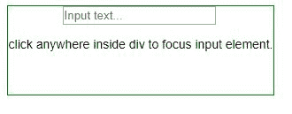

# jQuery | trigger()方法

> 原文:[https://www.geeksforgeeks.org/jquery-trigger-method/](https://www.geeksforgeeks.org/jquery-trigger-method/)

**触发器()**方法是 jQuery 中的一种方法，用于在选定的元素上触发指定的事件处理程序。

**语法:**

```html
$(selector).trigger(event, param1, param2)
```

**注意:**可以在 trigger()方法中传递额外的参数。

**例 1:** 该方法触发了两个方法来增加方法的值。

```html
<!DOCTYPE html>
<html>

<head>
    <title>
        jQuery trigger() Method
    </title>
</head>

<body>
    <div class="box-1">
        <h1>0</h1>
    </div>

    <button id="btn1">Increase #1</button>

    <div class="box-2">
        <h1>0</h1>
    </div>

    <button id="btn2">Increase #2</button>

    <script src=
"https://ajax.googleapis.com/ajax/libs/jquery/3.3.1/jquery.min.js">
    </script>

    <!-- Script to use trigger() method -->
    <script>
        $(document).ready(function() {
            $("#btn1").click(function() {
                Increase($(".box-1>h1"))
            })

            $("#btn2").click(function() {
                $("#btn1").trigger("click");

                Increase($(".box-2>h1"))
            })

            function Increase(obj) {
                var text = parseInt(obj.text(), 10);
                obj.text(text + 1);
            }
        });
    </script>
</html>                    
```

**输出:**

在上例中，使用了一个**增(obj)** 函数，该函数以一个 html 元素为对象，通过使用 parseInt()函数将字符串转换为整数，将其中的数字文本的值增加一。

```html
function Increase(obj) {
        var text = parseInt(obj.text(), 10);
        obj.text(text + 1);
      }

```

此外，jQuery 选择器用于选择按钮并向其附加点击事件方法，在其中我们调用**增加(obj)** 功能。

```html
        $("#btn1").click(function(){
            Increase($(".box-1>h1"))
        })

        $("#btn2").click(function(){
            $("#btn1").trigger("click");
            Increase($(".box-2>h1"))
        })

```

当点击**增加#1** 按钮时，相应 div 内的值增加 1。但是当点击**增加#2** 按钮时，两个 div 的值都增加一。因为我们是在 **#btn2** 的绑定点击方法内，借助**触发器()**方法事件触发“点击”。

**示例 2:** 本示例借助**触发器()**方法触发输入元素的焦点事件。

```html
<!DOCTYPE html>
<html>

<head>
    <title>
        jQuery trigger() Method
    </title>

    <script src=
"https://ajax.googleapis.com/ajax/libs/jquery/3.3.1/jquery.min.js">
    </script>

    <style>
        div {
            width: 300px;
            height: 100px;
            border: 1px solid green;
            text-align: center;
        }
    </style>
</head>

<body>
    <div>
        <input id="name" type="text" 
                placeholder="Input text..."/>

        <br/>

        <p>
            click anywhere inside div to 
            focus input element.
        </p>
    </div>

    <!-- Script to use trigger() method -->
    <script>
        $(document).ready(function() {
            $("div").click(function() {
                $("#name").trigger("focus");
            })
        });
    </script>
</body>

</html>                    
```

**输出:**
