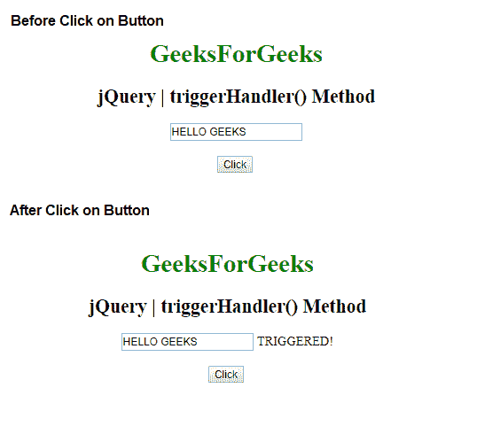
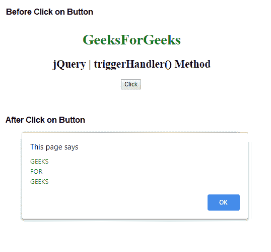

# jQuery | triggerHandler()方法

> 原文:[https://www.geeksforgeeks.org/jquery-triggerhandler-method/](https://www.geeksforgeeks.org/jquery-triggerhandler-method/)

jQuery 中的 **triggerHandler()方法**用于触发所选元素的指定事件。

**语法:**

```
$(selector).triggerHandler(event, param1, param2, ...)
```

**参数:**该方法接受两个参数，如上所述，如下所述:

*   **事件:**是一个强制参数，用于指定为指定元素触发的事件。
*   **param1，param2，… :** 这些是可选参数，用于传递给事件处理程序，对于自定义事件尤其有用。

**示例 1:** 该示例触发了输入选择元素。

```
<!DOCTYPE html>
<html>

<head> 
    <title>
        jQuery | triggerHandler() Method
    </title>

    <script src=
"https://ajax.googleapis.com/ajax/libs/jquery/3.3.1/jquery.min.js">
    </script>
</head> 

<body style = "text-align:center;">  

    <h1 style = "color:green;" >  
        GeeksForGeeks
    </h1>  

    <h2>jQuery | triggerHandler() Method</h2>

    <input type="text" value="HELLO GEEKS">

    <br><br>

    <button>Click</button>

    <!-- Script to trigger event -->
    <script>
        $(document).ready(function(){
            $("input").select(function(){
                $("input").after(" TRIGGERED!");
            });
            $("button").click(function(){
                $("input").triggerHandler("select");
            });
        });
    </script>
</body>  

</html>
```

**输出:**


**示例 2:** 本示例触发段落事件并显示提醒消息。

```
<!DOCTYPE html>
<html>

<head> 
    <title>
        jQuery | triggerHandler() Method
    </title>
    <script src=
"https://ajax.googleapis.com/ajax/libs/jquery/3.3.1/jquery.min.js">
    </script>
</head> 

<body style = "text-align:center;">  

    <h1 style = "color:green;" >  
        GeeksForGeeks
    </h1>  

    <h2>jQuery | triggerHandler() Method</h2>

    <button>Click</button>

    <!-- Script to trigger events -->
    <script>
        $(document).ready(function() {
            $("button").click(function() {
                $("button").on("myPara", function(event, 
                                param1, param2, param3) {
                    alert(param1 + "\n" + param2 + "\n" + param3);
                });

                $("button").triggerHandler("myPara",
                            ['GEEKS', 'FOR', 'GEEKS']);
            });
        });
    </script>
</body>

</html>  
```

**输出:**
