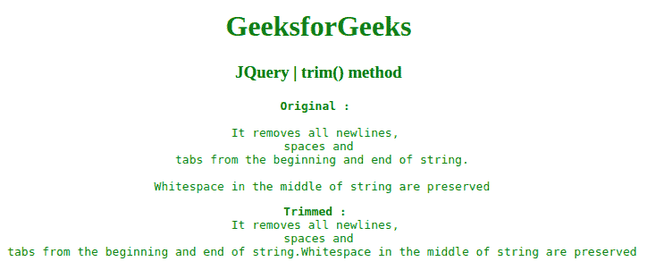

# JQuery | trim()方法

> 原文:[https://www.geeksforgeeks.org/jquery-trim-method/](https://www.geeksforgeeks.org/jquery-trim-method/)

jQuery 中的这个 **trim()** 方法用于删除字符串开头和结尾的空白

**语法:**

```html
jQuery.trim( str )
```

**参数:**该方法接受上面提到的和下面描述的单个参数:

*   **字符串:**此参数是要修剪的字符串。

**返回值:**去掉空格后返回字符串。

下面的示例说明了 **trim()方法**在 jQuery 中的使用:
**示例 1:** 在本示例中， **trim()方法**删除了字符串开头和结尾的制表符和空格。

```html
<!DOCTYPE html>
<html>

<head>
    <meta charset="utf-8">
    <title>JQuery | trim() method</title>
    <script src=
"https://code.jquery.com/jquery-3.4.1.js">
    </script>
    <style>
        div {
            color: blue;
        }
    </style>
</head>

<body style="text-align:center;">

    <h1 style="color: green"> 
        GeeksforGeeks 
    </h1>

    <h3>JQuery | trim() method</h3>
    <pre id="bb"></pre>

    <script>
        $("#bb").html(
            $.trim("     A computer science portal for geeks     "));
    </script>

</body>

</html>                                            
```

**输出:**


**示例 2:** 在本例中，**修剪()方法**从多折线中移除空白。

```html
<!DOCTYPE html>
<html>

<head>
    <meta charset="utf-8">
    <title>JQuery | trim() method</title>
    <script src=
"https://code.jquery.com/jquery-3.4.1.js">
    </script>
    <style>
        pre {
            color: green;
        }
    </style>
</head>

<body style="text-align:center;">

    <h1 style="color: green"> 
        GeeksforGeeks 
    </h1>

    <h3>JQuery | trim() method</h3>
    <pre id="geeks"></pre>
    <pre id="geeks1"></pre>
    <script>
        var varr = "\nIt removes all newlines, \n spaces"+
            " and \n tabs from the beginning and end of string.\n"
        var varr1 = " \n Whitespace in the middle"+
            " of string are preserved\n"
        $("#geeks").html("<b>Original : <br></b>" 
                         + varr + varr1);
        $("#geeks1").html("<b>Trimmed : <br></b>"
                          + $.trim(varr) + $.trim(varr1));
    </script>

</body>

</html>       
```

**输出:**
