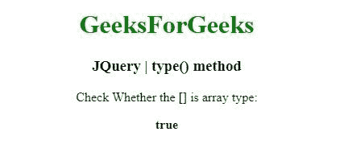
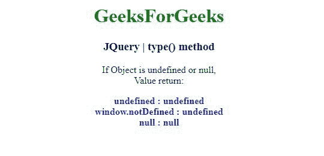

# JQuery | type()方法

> 原文:[https://www.geeksforgeeks.org/jquery-type-method/](https://www.geeksforgeeks.org/jquery-type-method/)

jQuery 中的这个**类型()**方法用于确定一个对象的内部 JavaScript [[Class]]。

**语法:**

```
jQuery.type( obj )

```

**参数:**type()方法只接受上面提到的一个参数，如下所述:

*   **obj:** 这个参数是获取内部 JavaScript [[Class]]的对象。

**返回值:**返回字符串。

*   jquery . type(true)= = " boolean "*   jQuery.type( new 布尔值())=== "布尔值"*   jQuery.type( 3 ) === "number "*   键入(新的数字(3) ) === "数字"*   jquery . type(undefined)= = " undefined "*   jquery . type()= = " undefined "*   jquery . type(window . not defined)= = = " undefined "*   jquery . type(null)= null*   jQuery.type( "test" ) === "string "*   jQuery.type(新字符串(“测试”)===“字符串”*   jquery . type(function(){ })= = = " function "*   jQuery.type( [] ) === "array "*   jquery . type(new Array())= = = " Array "*   jquery . type(new date())= = " date "*   jQuery.type(新的 Error() ) === "error "*   jquery . type(Symbol())= = = " Symbol "*   类型(对象(符号()))=== "符号"*   jQuery.type( /test/ ) === “regexp”

    **例 1:** 在本例中， **type()方法**检查参数是否为数组。

    ```
    <!DOCTYPE html>
    <html>
    <head>
    <meta charset="utf-8">
    <title>JQuery | type() method</title> 
    <script src="https://code.jquery.com/jquery-3.4.1.js"></script>
    <style>
        div {
            color: blue;
        }
    </style>
    </head>
    <body style="text-align:center;"> 

        <h1 style="color: green"> 
            GeeksForGeeks 
        </h1> 

        <h3>JQuery | type() method</h3>
        <p> Check Whether the [] is array type:</p>
        <b></b>
        <script>
        $( "b" ).append( "" + jQuery.type( [] ) === "array");
        </script>

    </body>
    </html>                                    
    ```

    **输出:**
    

    **例 2:** 在本例中， **type()方法**对象未定义或为空。

    ```
    <!DOCTYPE html>
    <html>
    <head>
    <meta charset="utf-8">
    <title>JQuery | type() method</title> 
    <script src="https://code.jquery.com/jquery-3.4.1.js"></script>
    <style>
        b {
            color: blue;
        }
    </style>
    </head>
    <body style="text-align:center;"> 

        <h1 style="color: green"> 
            GeeksForGeeks 
        </h1> 

        <h3>JQuery | type() method</h3>
        <p> If Object is undefined or null, <br>Value return:</p>
        <b></b>
        <script>
        $( "b" ).append("undefined : " + jQuery.type( undefined )+ "<br>"+
        "window.notDefined  : " + jQuery.type(window.notDefined )+ "<br>"+
        "null  : " + jQuery.type( null  )+ "<br>"
        );
        </script>

    </body>
    </html>                                    
    ```

    **输出:**
    