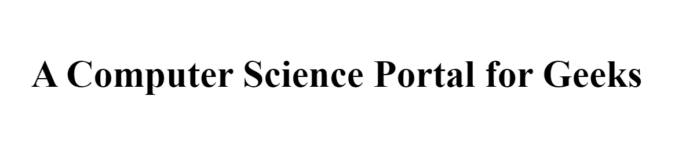
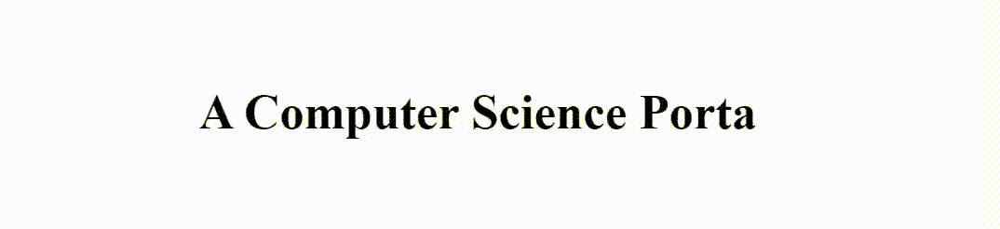

# jQuery |打字插件

> 原文:[https://www.geeksforgeeks.org/jquery-typing-plugins/](https://www.geeksforgeeks.org/jquery-typing-plugins/)



**Typed.js** 是一个 jQuery 插件，给我们的文本一个打字机的效果。typed.js 提供的各种特性有:

*   自定义打字速度。
*   自定义退格速度。
*   支持循环(也支持无限循环)。

要使用这个插件，只需在主体标签的正上方添加 CDN 链接。
**CDN 链接打字插件:**

**HTML 代码:**在 HTML 中，我们刚刚添加了一个正常结构的 h1 标签，来执行 jQuery 中的打字插件。

```html
<!DOCTYPE html>
<html lang="en">
<head>
    <meta charset="UTF-8" />
    <meta name="viewport"
        content="width=device-width, initial-scale=1.0" />
    <title>jQuery | Typing Plugins</title>
</head>
<body>
    <h1 class="geeks"></h1>
</body>
</html>                    
```

**CSS 代码:**对于样式，我们必须将文本与页面中心对齐。

```html
<style>
    body {
        margin: 0;
        padding: 0;
    }
    h1 {
        position: absolute;
        top: 50%;
        transform: translateY(-50%);
        width: 100%;
        text-align: center;
        color: Black;
    }
</style>
```

**JavaScript 代码:**在 JS 中，我们有一个 **TYPED** 的对象，我们在其中传递了 h1 标签的类。然后我们有一个具有四个属性的对象。让我们逐一了解它们。

*   **字符串:**需要 N 个字符串才能应用效果。在我们的例子中，我们使用了两个字符串。
*   **打字速度:**用于设置文本的打字或出现速度。
*   **退格速度:**用于设置文本退格或消失速度。
*   **循环:**是布尔属性。我们将其设置为 true 以循环效果。
*   **JS 代码:**

    ```html
    <script>
        var typed = new Typed(".geeks", {
            strings: ["Hello!!!", 
            "A Computer Science Portal for Geeks"],
            typeSpeed: 50,
            backSpeed: 50,
            loop: true,
        });
    </script>
    ```

**最终解:**是上面三段代码与 CDN 链接的组合。

*   **程序:**

    ```html
    <!DOCTYPE html>
    <html lang="en">

    <head>
        <meta charset="UTF-8" />
        <meta name="viewport" content=
            "width=device-width, initial-scale=1.0" />
        <title>jQuery | Typing Plugins</title>

        <style>
            body {
                margin: 0;
                padding: 0;
            }

            h1 {
                position: absolute;
                top: 50%;
                transform: translateY(-50%);
                width: 100%;
                text-align: center;
                color: Black;
            }
        </style>
    </head>

    <body>
        <h1 class="geeks"></h1>
        <script src=
    "https://cdn.jsdelivr.net/npm/typed.js@2.0.11">
        </script>
        <script>
            var typed = new Typed(".geeks", {
                strings: ["Hello!!!",
                "A Computer Science Portal for Geeks"],

                typeSpeed: 50,
                backSpeed: 50,
                loop: true,
            });
        </script>
    </body>

    </html>                       
    ```

*   **输出:**
    