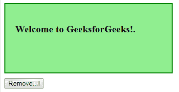
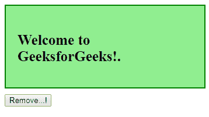
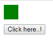
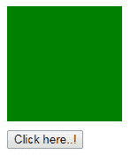

# jQuery | undelete()带示例

> 原文:[https://www . geeksforgeeks . org/jquery-undelegate-with-examples/](https://www.geeksforgeeks.org/jquery-undelegate-with-examples/)

undelegate()方法是 jQuery 中的一个内置方法，用于从所选元素中移除指定的事件处理程序。

**语法:**

```
$(selector).undelegate(selector, event, function)
```

**参数:**该方法接受三个参数，如上所述，如下所述:

*   **选择器:**这是一个可选参数，用于指定事件将从其中移除的选择器。
*   **事件:**是可选参数，用于在选择器上指定事件类型的名称。
*   **函数:**是一个可选参数，用于指定要移除的处理函数的名称。

**返回值:**此方法返回由 undelegate()方法进行指定更改的选定元素。

以下示例说明了 jQuery 中的 undelegate()方法:

**示例 1:** 本示例不包含任何参数。

```
<!DOCTYPE html>
<html>
    <head>
        <title>The undelegate Method</title>
        <script src=
        "https://ajax.googleapis.com/ajax/libs/jquery/3.3.1/jquery.min.js">
        </script>

        <!-- jQuery code to show the working of this method -->
        <script>
            $(document).ready(function() {
                $("body").delegate("p", "click", function() {
                    $(this).css("font-size", "25px");
                });
                $("button").click(function() {
                    $("body").undelegate();
                });
            });
        </script>
        <style>
            div {
                width: 300px;
                height: 100px;
                background-color: lightgreen;
                padding: 20px;
                font-weight: bold;
                font-size: 20px;
                border: 2px solid green;
            }
            button {
                margin-top: 10px;
            }
        </style>
    </head>
    <body>
        <div>
            <!-- click on this p element -->
            <p>Welcome to GeeksforGeeks!.</p>
        </div>
        <!-- click on this button to remove the 
        event handler -->
        <button>Remove...!</button>
    </body>
</html>                                            
```

**输出:**
之前点击任意位置:

之后点击段落:

**注意:**先点击按钮再点击段落，然后不发生变化。

**例 2:** 本例包含所有参数。

```
<!DOCTYPE html>
<html>
    <head>
        <title>The undelegate Method</title>
        <script src=
        "https://ajax.googleapis.com/ajax/libs/jquery/3.3.1/jquery.min.js">
        </script>

        <!-- jQuery code to show the working of this method -->
        <script>
            $(document).ready(function() {
                $("body").delegate("div", "click", function() {
                    $(this).animate({
                        height: "+=100px"
                    });
                    $(this).animate({
                        width: "+=100px"
                    });
                });
                $("button").click(function() {
                    $("body").undelegate("div", "click");
                });
            });
        </script>
        <style>
            div {
                width: 30px;
                height: 30px;
                background-color: green;
            }
            button {
                margin-top: 10px;
            }
        </style>
    </head>
    <body>
        <div></div>
        <!-- click on this button -->
        <button>Click here..!</button>
    </body>
</html>
```

**输出:**
点击任意位置前:

点击 div 元素后获得调整大小。

**注意:**如果点击按钮，然后点击 div 元素，那么大小不会发生变化。