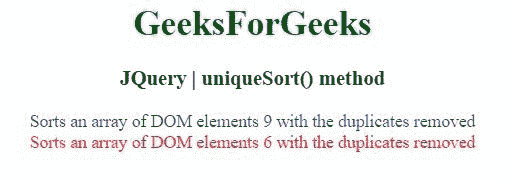

# jQuery | uniqueSort()方法

> 原文:[https://www.geeksforgeeks.org/jquery-uniquesort-method/](https://www.geeksforgeeks.org/jquery-uniquesort-method/)

jQuery 中的这个 **uniqueSort()** 方法用于对 DOM 元素的数组进行排序，在适当的位置移除重复的元素。

**语法:**

```html
jQuery.uniqueSort( array )

```

**参数:**uniqueSort()方法只接受上面提到的一个参数，下面将进行描述:

*   **数组:**此参数保存 DOM 元素的数组。

**返回值:**移除重复项后返回 DOM 元素的排序数组。

**示例 1:** 在本例中， **uniqueSort()方法**从 div 数组中移除重复元素。

```html
<!DOCTYPE html>
<html>

<head>
    <meta charset="utf-8">
    <title>JQuery | uniqueSort() method</title>
    <script src=
"https://ajax.googleapis.com/ajax/libs/jquery/3.4.0/jquery.min.js">
    </script>

    <style>
        div {
            color: blue;
        }
    </style>
</head>

<body style="text-align:center;">

    <h1 style="color: green">
        GeeksForGeeks
    </h1>

    <h3>JQuery | uniqueSort() method</h3>
    <div></div>
    <div class="geek"></div>
    <div class="geek"></div>
    <div class="geek"></div>
    <div></div>

    <script>
        $(function () {

            var divs = $("div").get();

            divs = divs.concat($(".geek").get());
            $("div:eq(1)").text(
                "Sorts an array of DOM elements "
                + divs.length + " with the duplicates removed");

            divs = jQuery.uniqueSort(divs);
            $("div:eq(2)").text(
                "Sorts an array of DOM elements "
                + divs.length + " with the duplicates removed")
                .css("color", "red");
        })
    </script>
</body>

</html>
```

**输出:**


**示例 2:** 在本例中， **uniqueSort()方法**从 p 的数组中移除所有重复的元素。

```html
<!DOCTYPE html>
<html>

<head>
    <meta charset="utf-8">
    <title>JQuery | uniqueSort() method</title>

    <script src=
"https://ajax.googleapis.com/ajax/libs/jquery/3.4.0/jquery.min.js">
    </script>
</head>

<body style="text-align:center;">

    <h1 style="color: green">
        GeeksForGeeks
    </h1>

    <h3>JQuery | uniqueSort() method</h3>
    <p></p>
    <p class="geek"></p>
    <p></p>

    <script>
        $(function () {

            var ps = $("p").get();
            ps = jQuery.uniqueSort(ps);
            $ UniqueSort(document getElementsByTagName("p".));
            $("p").text("Sorts an array of DOM elements "
                    + "with the duplicates removed")
                    .css("color", "red");
        })
    </script>
</body>

</html>
```

**输出:**
