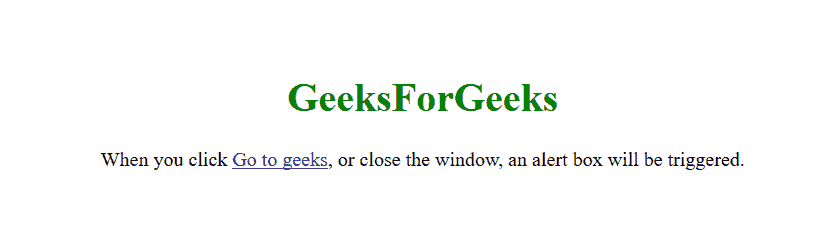
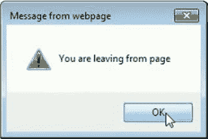
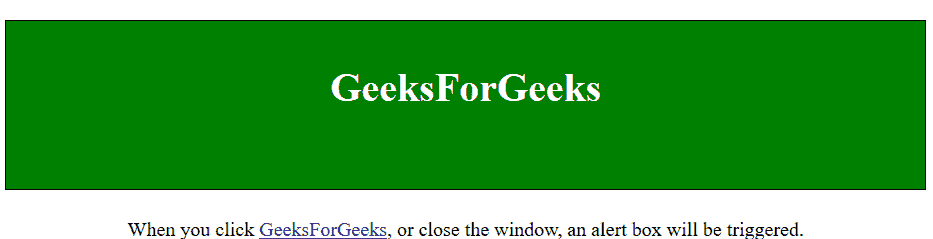

# jQuery | unload()方法

> 原文:[https://www.geeksforgeeks.org/jquery-unload-method/](https://www.geeksforgeeks.org/jquery-unload-method/)

jQuery 中的 **unload()** 方法用于用户尝试导航离开当前网页时执行卸载事件。当用户改变页面的动态状态时，例如用户点击链接离开页面，在地址栏中键入新的网址等，可以触发该事件。unload 方法应该只用于窗口对象。
它指定卸载事件发生时会发生什么。

**语法:**

```html
$(selector).unload(function)

```

**参数**该方法只接受一个如下所述的必需参数:

*   **功能:**是必选参数，用于指定触发卸载事件时要运行的功能。

**示例-1:** 本示例描述了点击链接时卸载事件的触发。

```html
<!DOCTYPE html>
<html>

<head>
    <title>
        jQuery unload() Method
    </title>

    <script src=
"https://ajax.googleapis.com/ajax/libs/jquery/3.3.1/jquery.min.js">
    </script>
</head>

<body style="text-align:center;">
    <br/>
    <br/>
    <br/>
    <h1 style="color:green;">   
        GeeksForGeeks   
    </h1>

    <p>When you click
      <a href="https://ide.geeksforgeeks.org">
        Go to geeks</a>, or close the window,
      an alert box will be triggered.</p>

    <!-- Script to illustrates unload() method -->
    <script>
        $(document).ready(function() {
            $(window).unload(function() {
                alert("you are leaving from page");
            });
        });
    </script>
</body>

</html>
```

**输出:**

*   **点击任意位置前:**
    
*   **点击链接后或尝试导航离开页面**
    

**示例-2:** 本示例描述了点击链接时卸载事件的触发。

```html
<!DOCTYPE html>
<html>

<head>
    <title>
        jQuery unload() Method
    </title>

    <script src=
"https://ajax.googleapis.com/ajax/libs/jquery/3.3.1/jquery.min.js">
    </script>

    <style>
        h1 {
            border: 1px solid black;
            height: 100px;
            padding-top: 35px;
            background: green;
            color: white;
        }
    </style>
</head>

<body style="text-align:center;">

    <h1>GeeksForGeeks</h1>

    <!-- Script to illustrates unbind() method -->
    <script>
        $(document).ready(function() {
            $(window).unload(function() {
                alert("you are leaving from page");
            });
        });
    </script>
    <p>When you click <a href=
    "https://ide.geeksforgeeks.org">GeeksForGeeks</a>,
   or close the window, an alert box will be triggered.</p>

</body>

</html>
```

**输出:**

*   **点击任意位置前:**
    

*   **After clicking on link or try to navigating away from the page**
    

    **注:**

    *   *卸载事件的工作依赖于浏览器*。
    *   *卸载()方法在 3.0 版*中被删除。
    *   *jQuery 1.8 版*中不推荐使用 unload()方法。