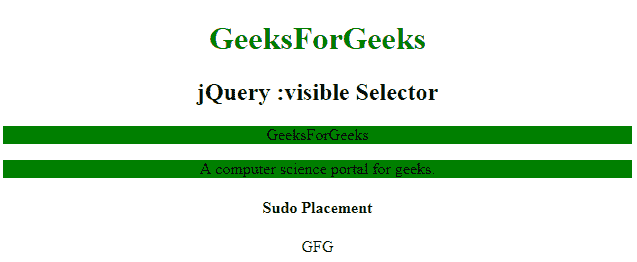

# jQuery |:可见选择器

> 原文:[https://www.geeksforgeeks.org/jquery-visible-selector/](https://www.geeksforgeeks.org/jquery-visible-selector/)

**:可见选择器**用于选择文档中当前可见的所有元素。

可视元素不支持下面给出的任何条件:

*   设置为显示:无
*   type="hidden "的表单元素
*   宽度和高度设置为 0
*   隐藏的父元素(这也隐藏了子元素)

**语法:**

```html
$(":visible") 
```

**示例:**

```html
<!DOCTYPE html>
<html>

<head>
    <script src=
"https://ajax.googleapis.com/ajax/libs/jquery/3.3.1/jquery.min.js">
  </script>

  <script>
        $(document).ready(function() {
            $("p:visible").css(
              "background-color", "green");
        });
    </script>
</head>

<body>
    <center>
        <h1 style="color:green;">
          GeeksForGeeks
      </h1>
        <h2>
          jQuery :visible Selector
      </h2>
        <p>GeeksForGeeks</p>
        <p style="display:none;">
         A Computer science portal for Geeks.
      </p>
        <p>
          A computer science portal for geeks.
      </p>
        <h4>Sudo Placement</h4>
        <div>GFG</div>
  </center>
</body>

</html>
```

**输出:**


**支持的浏览器:**支持的浏览器 **jQuery:可见选择器**如下:

*   谷歌 Chrome
*   微软公司出品的 web 浏览器
*   火狐浏览器
*   歌剧
*   旅行队