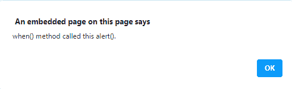
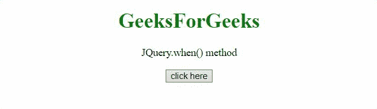

# JQuery when()方法

> 原文:[https://www.geeksforgeeks.org/jquery-when-method/](https://www.geeksforgeeks.org/jquery-when-method/)

JQuery 中的这个 **JQuery.when()方法**给出了一种根据零个或多个可调用对象执行回调函数的方法，这些对象通常是表示异步事件的延迟对象。

**语法:**

```
jQuery.when(deferreds)
```

**参数:**

*   **推迟**:此参数指定零个或多个可命名对象。

**返回值**:此方法返回一个承诺。

下面讨论两个例子:

*   **Example**: In this example, the Deferred() is used to create a new object and after that then() method is called with notify and resolve method.

    ```
    <!DOCTYPE HTML> 
    <html>  
    <head>
        <script src="https://code.jquery.com/jquery-3.5.0.js">
    </script> 
    </head>   
    <body style="text-align:center;">
        <h1 style="color:green;">  
            GeeksForGeeks  
        </h1> 
        <p>
        JQuery.when() method
        </p>
        <button onclick = "Geeks();">
        click here
        </button>
        <p id="GFG_DOWN"> 
        </p>
        <script>
            var def = $.Deferred();
            function Geeks() {
                $.when().then(function(a) {
                alert(
                "when() method called this alert()." );
                });
            } 
        </script> 
    </body>   
    </html>        
    ```

    **输出** :
    **点击按钮前:**
    

    **点击按钮后:**

    

    *   **Example**: In this example, the Deferred() method is used and the state of Deferred object is checked.

        ```
        <!DOCTYPE HTML> 
        <html>  
        <head>
            <script src="https://code.jquery.com/jquery-3.5.0.js">
        </script> 
        </head>   
        <body style="text-align:center;">
            <h1 style="color:green;">  
                GeeksForGeeks  
            </h1> 
            <p>
            JQuery.when() method 
            </p>
            <button onclick = "Geeks();">
            click here
            </button>
            <p id="GFG_DOWN"> 
            </p>
            <script>
                var def = $.Deferred();
                function Geeks() {
                    $.when(def).done(function (x) {
                        $('#GFG_DOWN').append(
                         'when() method is executed.')
                    });
                    def.resolve();
                } 
            </script> 
        </body>   
        </html>                
        ```

        **输出:**
        