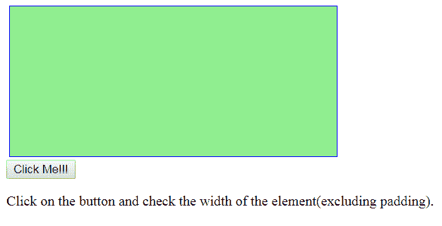
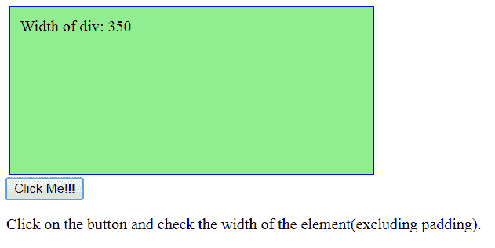
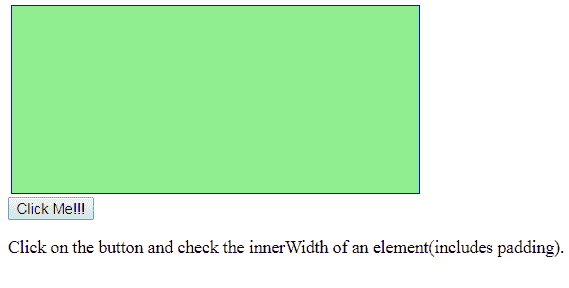
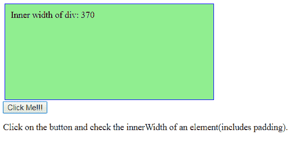

# jQuery | width()

> 原文:[https://www.geeksforgeeks.org/jquery-width/](https://www.geeksforgeeks.org/jquery-width/)

**宽度()**是 JavaScript 中的一个内置函数，用于检查元素的宽度。它不检查元素的填充、边框和边距。
**语法:**

```html
$("param").width()

```

**参数:**这里的参数是“param”，是要提取宽度的元素的类或 id。
**返回值:**返回所选元素的宽度。

<center>**jQuery code to show the working of this function:**</center>

**Code #1:**

```html
<html>

<head>
    <script src="https://ajax.googleapis.com/ajax/libs/jquery
                 /3.3.1/jquery.min.js"></script>
    <script>
        $(document).ready(function() {
            $("button").click(function() {
                var msg = "";
                msg += "Width of div: " + $("#demo").width();
                $("#demo").html(msg);
            });
        });
    </script>
    <style>
        #demo {
            height: 150px;
            width: 350px;
            padding: 10px;
            margin: 3px;
            border: 1px solid blue;
            background-color: lightgreen;
        }
    </style>
</head>

<body>
    <div id="demo"></div>
    <button>Click Me!!!</button>
    <p>Click on the button and check the width of the
       element (excluding padding).</p>
</body>

</html>
```

**输出:**
点击按钮前-

点击按钮后-

**jQuery** 也包含 **innerWidth()** 方法即它也用于检查包含填充的元素的内部宽度。
**语法:**

```html
$("param").innerWidth()

```

**参数:**这里参数“param”是要提取宽度的元素的类或 id。

**返回值:**返回所选元素的宽度。
**代码#2:**

```html
<html>

<head>
    <script src="https://ajax.googleapis.com/ajax/libs/
                 jquery/3.3.1/jquery.min.js"></script>
    <script>
        $(document).ready(function() {
            $("button").click(function() {
                var msg = "";
                msg += "Inner width of div: " + $("#demo")
                         .innerWidth() + "</br>";
                $("#demo").html(msg);
            });
        });
    </script>
</head>
<style>
    #demo {
        height: 150px;
        width: 350px;
        padding: 10px;
        margin: 3px;
        border: 1px solid blue;
        background-color: lightgreen;
    }
</style>

<body>
    <div id="demo"></div>
    <button>Click Me!!!</button>
    <p>Click on the button and check the innerWidth of
        an element(includes padding).</p>
</body>

</html>
```

点击按钮-
前
点击按钮-
后