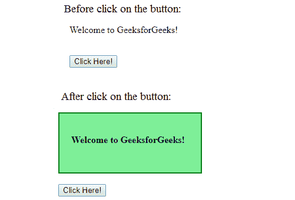

# jQuery |用示例包装()

> 原文:[https://www.geeksforgeeks.org/jquery-wrap-with-examples/](https://www.geeksforgeeks.org/jquery-wrap-with-examples/)

wrap()方法是 jQuery 中的一个内置方法，用于将指定的元素环绕在选定的元素周围。

**语法:**

```html
$(selector).wrap(element, function)
```

**参数:**该方法接受两个参数，如上所述，如下所述:

*   **元素:**必选参数，用于指定要环绕所选元素的元素。
*   **函数:**是可选参数，用于指定返回包装元素的函数。

**返回值:**该方法返回由 wrap()方法进行指定更改的选定元素。

以下示例说明了 jQuery 中的 wrap()方法:

**例 1:** 本例不接受可选参数。

```html
<!DOCTYPE html>
<html>
    <head>
        <title>The wrap() Method</title>
        <script src=
        "https://ajax.googleapis.com/ajax/libs/jquery/3.3.1/jquery.min.js">
        </script>

        <!-- jQuery code to show the working of this method -->
        <script>
            $(document).ready(function() {
                $("button").click(function() {
                    $("p").wrap("<div></div>");
                });
            });
        </script>
        <style>
            div {
                background-color: lightgreen;
                padding: 20px;
                width: 200px;
                font-weight: bold;
                height: 60px;
                border: 2px solid green;
            }
        </style>
    </head>

    <body>
        <!-- click on this paragraph and see the change -->
        <p>Welcome to GeeksforGeeks!</p><br>
        <button>Click Here!</button>
    </body>
</html>
```

**输出:**


**例 2:**

```html
<!DOCTYPE html>
<html>
    <head>
        <title>The wrap Method</title>
        <script src=
        "https://ajax.googleapis.com/ajax/libs/jquery/3.3.1/jquery.min.js">
        </script>

        <!-- jQuery code to show the working of this method -->
        <script>
            $(document).ready(function() {
                $("button").click(function() {
                    $("p").wrap(function() {
                        return "<div></div>"
                    });
                });
            });
        </script>
        <style>
            div {
                background-color: lightgreen;
                padding: 20px;
                width: 200px;
                font-weight: bold;
                height: 60px;
                border: 2px solid green;
            }
        </style>
    </head>
    <body>
        <!-- click on this paragraph and see the change -->
        <p>Welcome to GeeksforGeeks!</p><br>
        <button>Click Here!</button>
    </body>
</html>
```

**输出:**
