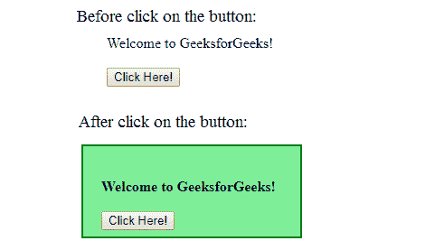

# jQuery | wrappall()带示例

> 原文:[https://www.geeksforgeeks.org/jquery-wrapall-with-examples/](https://www.geeksforgeeks.org/jquery-wrapall-with-examples/)

wrapAll()方法是 jQuery 中的一个内置方法，当指定的元素将针对所有选定的元素进行包装时使用。

**语法:**

```
$(selector).wrapAll(wrap_element)
```

**参数:**该方法接受单参数 *wrap_element* ，该参数为必选项。此参数用于指定哪一个元素缠绕在所选元素周围。

**返回值:**此方法返回由 wrapAll()方法进行指定更改的选定元素。

下面的例子说明了 jQuery 中的 wrapAll()方法:

**示例:**

```
<!DOCTYPE html>
<html>
    <head>
        <title>The wrapAll Method</title>
        <script src=
        "https://ajax.googleapis.com/ajax/libs/jquery/3.3.1/jquery.min.js">
        </script>

        <!-- jQuery code to show the working of this method -->
        <script>
            $(document).ready(function() {
                $("button").click(function() {
                    $("p").wrapAll("<div></div>");
                });
            });
        </script>
        <style>
            div {
                background-color: lightgreen;
                padding: 20px;
                width: 200px;
                font-weight: bold;
                height: 60px;
                border: 2px solid green;
            }
        </style>
    </head>
    <body>
        <!-- click on this paragraph and see the change -->
        <p>Welcome to GeeksforGeeks!<br><br>

        <button>Click Here!</button></p>
    </body>
</html>
```

**输出:**
