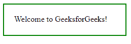
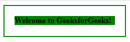
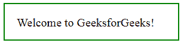
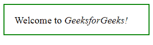

# jQuery | wrappinner()带示例

> 原文:[https://www . geeksforgeeks . org/jquery-wrap inner-with-examples/](https://www.geeksforgeeks.org/jquery-wrapinner-with-examples/)

wrapInner()方法是 jQuery 中的一个内置方法，用于将 HTML 元素包装在每个选定元素的内容周围。

**语法:**

```html
$(selector).wrapInner(wrap_element, function(index))
```

**参数:**该函数接受两个参数，如上所述，如下所述:

*   **wrap_element:** 为必选项，用于指定要环绕所选元素内容的 HTML 元素
*   **函数:**是可选参数，用于指定返回换行元素的函数。
    *   **索引:**返回元素的索引。

**返回值:**此方法返回应用了更改的选定元素。

以下示例说明了 jQuery 中的 wrapInner()方法:

**示例 1:** 本示例不包含可选参数。

```html
<!DOCTYPE html>
<html>
    <head>
        <script src=
        "https://ajax.googleapis.com/ajax/libs/jquery/3.3.1/jquery.min.js">
        </script>

        <!-- jQuery code to show the working of this method -->
        <script>
            $(document).ready(function() {
                $("div").click(function() {
                    $(this).wrapInner("<b></b>").css(
                           "background-color", "green");
                });
            });
        </script>
        <style>
            body {
                width: 200px;
                padding: 20px;
                height: 20px;
                border: 2px solid green;
            }
        </style>
    </head>
    <body>
        <!-- click on this div and see the change -->
        <div>Welcome to GeeksforGeeks!</div>

    </body>
</html>
```

**输出:**
前点击
后点击
后点击


**例 2:**

```html
<!DOCTYPE html>
<html>
    <head>
        <script src=
        "https://ajax.googleapis.com/ajax/libs/jquery/3.3.1/jquery.min.js">
        </script>

        <!-- jQuery code to show the working of this method -->
        <script>
            $(document).ready(function() {
                $("div").click(function() {
                    $("span").wrapInner(function(n) {
                        return "<i></i>";
                    });
                });
            });
        </script>
        <style>
            body {
                width: 250px;
                padding: 20px;
                height: 20px;
                font-size: 20px;
                border: 2px solid green;
            }
        </style>
    </head>
    <body>
        <!-- click on this div and see the change -->
        <div>Welcome to <span>GeeksforGeeks!</span></div>
    </body>
</html>
```

**输出:**
前点击
后点击
后点击


**相关文章:**

*   [jQuery | find()带示例](https://www.geeksforgeeks.org/jquery-find-with-examples/)
*   [jQuery | clearQueue()带示例](https://www.geeksforgeeks.org/jquery-clearqueue-with-examples/)