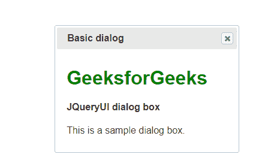
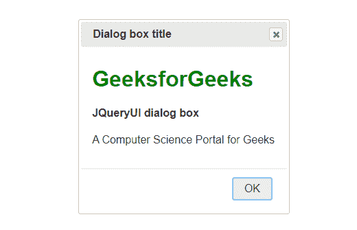

# JQueryUI |对话

> 原文:[https://www.geeksforgeeks.org/jqueryui-dialog/](https://www.geeksforgeeks.org/jqueryui-dialog/)

对话框是通知用户某事的方式。这是一个很好的方法，可以在用户窗口上弹出，显示下一步将要发生的信息，或者开发人员想要向用户澄清的任何类型的信息。jQueryUI 对话框方法用于在页面内部创建一个基本的对话框窗口。它有一个标题栏和一个内容区，默认情况下可以用“X”图标移动、调整大小和关闭。

**语法:**

```
$(selector, context).dialog(options)
```

**注意:**我们可以在代码中绕过对话框函数内部的各种选项自定义对话框。如果有多个选项，我们可以使用逗号分隔的方式传递它们。我们可以通过以下方式向它添加某些功能。

```
$(selector, context).dialog({option1: value1, option2: value2... })
```

**参数:**有一个参数被上面提到的 jQuery 对话框接受，描述如下:

*   **选项:**该参数是一个指定窗口外观和行为的对象。

下面的例子说明了 **jQueryUI 对话框**。

**示例 1:** 本示例不包含带有空白选项的按钮。

```
<!DOCTYPE html>
<html>

<head>
    <title>jQueryUI-Dialog</title>

    <link rel="stylesheet" href=
"//code.jquery.com/ui/1.12.1/themes/base/jquery-ui.css">

    <link rel="stylesheet"
        href="/resources/demos/style.css">

    <script src=
"https://code.jquery.com/jquery-1.12.4.js">
    </script>

    <script src=
"https://code.jquery.com/ui/1.12.1/jquery-ui.js">
    </script>

    <script>
        $(function() {
            $("#dialog").dialog();
        });
    </script>
</head>

<body>

    <div id="dialog" title="Basic dialog">
        <h1 style="color:green;">GeeksforGeeks</h1>
        <h4>JQueryUI dialog box</h4>
        <p>This is a sample dialog box.</p>
    </div>
</body>

</html>
```

**输出:**


**示例 2:** 本示例包含具有关闭值的按钮。

```
<!DOCTYPE html>
<html>

<head>
    <title>jQueryUI-Dialog</title>

    <link rel="stylesheet" href=
"//code.jquery.com/ui/1.12.1/themes/base/jquery-ui.css">

    <link rel="stylesheet"
            href="/resources/demos/style.css">

    <script src=
"https://code.jquery.com/jquery-1.12.4.js">
    </script>

    <script src=
"https://code.jquery.com/ui/1.12.1/jquery-ui.js">
    </script>

    <script>
        $(function() {
            $("#dialog").dialog({
                buttons: {
                    OK: function() {
                        $(this).dialog("close");
                    }
                },
                title: "Dialog box title"
            });
        });
    </script>
</head>

<body>

    <div id="dialog" title="Basic dialog">
        <h1 style="color:green;">GeeksforGeeks</h1>
        <h4>JQueryUI dialog box</h4>
        <p>A Computer Science Portal for Geeks</p>
    </div>
</body>

</html>
```

**输出:**


**支持的浏览器:****JQueryUI 对话框**支持的浏览器如下:

*   谷歌 Chrome
*   微软公司出品的 web 浏览器
*   火狐浏览器
*   旅行队
*   歌剧