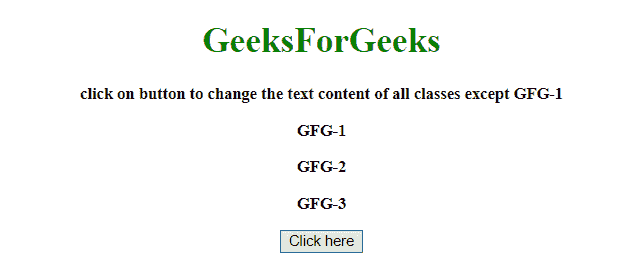
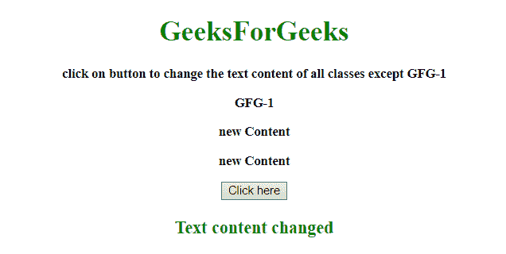

# 不是 jQuery 中的类选择器

> 原文:[https://www.geeksforgeeks.org/not-class-selector-in-jquery/](https://www.geeksforgeeks.org/not-class-selector-in-jquery/)

给定一个元素列表，任务是不要使用 JQuery 选择特定的类。

*   **jQuery :not() Selector:** This selector selects all elements except the specified element.

    **语法:**

    ```
    $(":not(selector)")
    ```

    **参数:**包含单参数**选择器**，必选。它指定不选择的元素。这个参数接受所有类型的选择器。

*   **jQuery not() Method:** This method returns elements that do not match a defined condition. This method specifies a condition. Elements that do not match the condition are returned, and those that match will be removed. Mostly this method is used to remove one or more than one elements from a group of selected elements.

    **语法:**

    ```
    $(selector).not(condition, function(index))

    ```

    **参数:**

    *   **条件:**此参数为可选。它指定了一个选择器表达式、一个 jQuery 对象或一个或多个要从一组选定元素中移除的元素。
    *   **功能(索引):**此参数可选。它为组中的每个元素指定一个要运行的函数。如果返回 true，则移除该元素，否则保留该元素。
        *   **索引:**指定元素在集合中的索引位置

**示例 1:** 在本示例中，首先选择开始的所有等级 **GFG-** ，然后使用**从选择中移除等级 **GFG-1** 。不()法**。

```
<!DOCTYPE HTML> 
<html> 
    <head> 
        <title> 
            Not class selector in jQuery.
        </title>

        <script src = 
"https://ajax.googleapis.com/ajax/libs/jquery/3.4.0/jquery.min.js">
        </script>
    </head> 

    <body style = "text-align:center;"> 

        <h1 id = "h" style = "color:green;" > 
            GeeksForGeeks 
        </h1>

        <p id = "GFG" style = 
            "font-size: 15px; font-weight: bold;">
            click on button to change the text content
            of all classes except GFG-1 
        </p>

        <p class = "GFG-1" style = 
            "font-size: 15px; font-weight: bold;">
            GFG-1
        </p>

        <p class = "GFG-2" style =
            "font-size: 15px; font-weight: bold;">
            GFG-2
        </p>

        <p class = "GFG-3" style =
            "font-size: 15px; font-weight: bold;">
            GFG-3
        </p>

        <button id = "button">
            Click here
        </button>

        <p class = "GFG" style =
            "color:green; font-size: 20px; font-weight: bold;">
        </p>

        <script> 
            $("button").on('click', function() {
                $('p[class^="GFG-"]').not('.GFG-1').text("new Content");
                $(".GFG").text("Text content changed")
            });         
        </script> 
    </body> 
</html>                    
```

**输出:**

*   **点击按钮前:**
    
*   **点击按钮后:**
    

**示例 2:** 在本示例中，首先选择起始的所有等级 **GFG-** ，然后使用**:而不是选择器**从选择中移除等级 **GFG-1** 。

```
<!DOCTYPE HTML> 
<html> 
    <head> 
        <title> 
            Not class selector in jQuery.
        </title>

        <script src = 
"https://ajax.googleapis.com/ajax/libs/jquery/3.4.0/jquery.min.js">
        </script>
    </head> 

    <body style = "text-align:center;"> 

        <h1 id = "h" style = "color:green;" > 
            GeeksForGeeks 
        </h1>

        <p id = "GFG" style =
            "font-size: 15px; font-weight: bold;">
            click on button to change the text content
            of all classes except GFG-1 
        </p>

        <p class = "GFG-1" style =
            "font-size: 15px; font-weight: bold;">
            GFG-1
        </p>

        <p class = "GFG-2" style =
            "font-size: 15px; font-weight: bold;">
            GFG-2
        </p>

        <p class = "GFG-3" style = 
            "font-size: 15px; font-weight: bold;">
            GFG-3
        </p>

        <button id = "button">
            Click here
        </button>

        <p class = "GFG" style =
            "color:green; font-size: 20px; font-weight: bold;">
        </p>

        <script>         
            $("button").on('click', function() {
                $('p[class^="GFG-"]:not(.GFG-1)').text("new Content");
                $(".GFG").text("Text content changed")
            });         
        </script> 
    </body> 
</html>                    
```

**输出:**

*   **点击按钮前:**
    
*   **点击按钮后:**
    