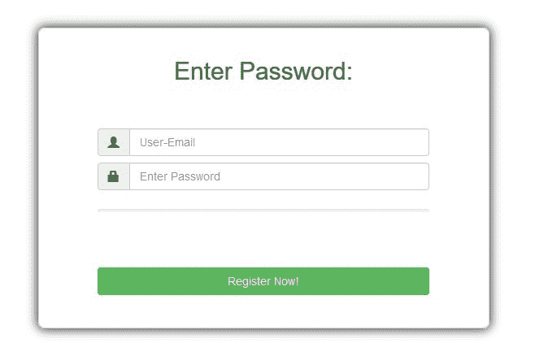
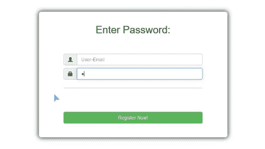

# 使用 jQuery 的密码强度指示器

> 原文:[https://www . geesforgeks . org/password-strength-indicator-using-jquery/](https://www.geeksforgeeks.org/password-strength-indicator-using-jquery/)

随着 web 技术中新框架的出现，设计和实现功能丰富且响应迅速的网页变得非常容易。在这里，我们将使用 jQuery 和 Bootstrap 为注册页面设计一个密码强度指示器。

**要实现的功能:**
每当用户将输入添加到密码输入表单时，进度条都会显示密码的强度。进度条的长度代表密码的强度。我们将只在前端实现这一点。

<u>有效密码的评估标准如下</u>:(确定长度贡献的百分比)

*   至少一个大写字母(10%)、小写字母(10%)、数字(10%)、特殊符号(10%)
*   字长标准:
    *   6 个字:20%
    *   8 个字:40%
    *   [10，无穷大]字数:60%

**先决条件:**
HTML、CSS、JavaScript、jQuery、Bootstrap 的基础知识。此外，用户应该知道 Bootstrap 中的网格系统是如何工作的。

**程序:**

1.  **Initialize the layout:**
    First of all, let us initialize the layout of our register page using bootstrap. For the progress bar, we will use *progress* class for building progress bars from the bootstrap (irrespective of the variant/version of bootstrap used).

    ```
    <!-- Register page for password strength indicator -->
    <!DOCTYPE html>
    <html lang="en">

    <head>
        <meta charset="utf-8" />
        <!-- Required CDN's -->
        <link rel="stylesheet"
              href=
    "https://maxcdn.bootstrapcdn.com/bootstrap/3.4.1/css/bootstrap.min.css">
        <script src=
    "https://ajax.googleapis.com/ajax/libs/jquery/3.4.1/jquery.min.js">
      </script>
        <script src=
    "https://maxcdn.bootstrapcdn.com/bootstrap/3.4.1/js/bootstrap.min.js">
      </script>
    </head>
    <style>
        .container-fluid {
            background-color: #ffffff;
            border-radius: 8px;
            border: 1px solid lightgrey;
            padding: 16px;
            /* Box shadow for the register container */
            -webkit-box-shadow: 0px 0px 12px 2px rgba(0, 0, 0, 0.75);
            -moz-box-shadow: 0px 0px 12px 2px rgba(0, 0, 0, 0.75);
            box-shadow: 0px 0px 12px 2px rgba(0, 0, 0, 0.75);
        }

        .input-group {
            width: 80%;
            height: auto;
            padding: 4px;
        }

        .progress {
            height: 4px;
        }

        .progress-bar {
            background-color: green;
        }
    </style>

    <body>
        <br>
        <br>
        <div class="container">
            <div class="row">
                <div class="col-sm-3">   </div>
                <div class="col-sm-6">
                    <div class="container-fluid">
                        <center>
                            <h2 class="text-success">
                              Enter Password:
                          </h2>
                            <br>
                            <br>
                            <div class="form-group">
                                <div class="input-group">
                                    <span class="input-group-addon">
                                      <i class="glyphicon glyphicon-user">
                                      </i>
                                  </span>
                                    <input id="email" 
                                           type="text" 
                                           class="form-control"
                                           name="email"
                                           placeholder="User-Email">
                                </div>
                                <div class="input-group">
                                    <span class="input-group-addon">
                                      <i class="glyphicon glyphicon-lock">
                                      </i>
                                  </span>
                                    <input id="password" 
                                           type="password" 
                                           class="form-control" 
                                           name="password" 
                                           placeholder="Enter Password">
                                </div>
                            </div>
                            <div class="input-group">
                                <div class="progress">
                                    <div class="progress-bar" 
                                         role="progressbar" 
                                         aria-valuenow="0"
                                         aria-valuemin="0" 
                                         aria-valuemax="100"
                                         style="width:0%">
                                    </div>
                                </div>
                            </div>
                            <br>
                            <br>
                            <div class="input-group">
                                <button class="btn btn-success btn-block">
                                  Register Now!
                              </button>
                            </div>
                        </center>
                        <br>
                    </div>
                </div>
                <div class="col-sm-3">   </div>
            </div>
        </div>
    </body>

    </html>
    ```

    **输出:**
    

2.  **更新进度条:**
    现在，我们需要确保每当密码输入字段更新时，进度条都会按照上面提到的指定要求进行更新。
    T4 应遵循的步骤:
    *   在密码字段中，使用*键向上()*功能检查每次按键。
    *   提取密码字段中添加的输入。
    *   根据密码长度更新*百分比*变量和进度条颜色。
    *   检查字符集约束。
    *   Update the width of the progress-bar.

        **最终解决方案:**

        ```
        <!-- Update progress-bar whenever input field is updated.-->
        <!DOCTYPE html>
        <html lang="en">

        <head>
            <meta charset="utf-8" />
            <!-- Required CDN's -->
            <link rel="stylesheet"
                  href=
        "https://maxcdn.bootstrapcdn.com/bootstrap/3.4.1/css/bootstrap.min.css">
            <script src=
        "https://ajax.googleapis.com/ajax/libs/jquery/3.4.1/jquery.min.js">
          </script>
            <script src=
        "https://maxcdn.bootstrapcdn.com/bootstrap/3.4.1/js/bootstrap.min.js">
          </script>
        </head>
        <style>
            .container-fluid {
                background-color: #ffffff;
                border-radius: 8px;
                border: 1px solid lightgrey;
                padding: 16px;
                -webkit-box-shadow: 0px 0px 12px 2px rgba(0, 0, 0, 0.75);
                -moz-box-shadow: 0px 0px 12px 2px rgba(0, 0, 0, 0.75);
                box-shadow: 0px 0px 12px 2px rgba(0, 0, 0, 0.75);
            }

            .input-group {
                width: 80%;
                height: auto;
                padding: 4px;
            }

            .progress {
                height: 4px;
            }

            .progress-bar {
                background-color: green;
            }
        </style>

        <body>
            <br>
            <br>
            <div class="container">
                <div class="row">
                    <div class="col-sm-3">   </div>
                    <div class="col-sm-6">
                        <div class="container-fluid">
                            <center>
                                <h2 class="text-success">
                                  Enter Password:
                              </h2>
                                <br>
                                <br>
                                <div class="form-group">
                                    <div class="input-group">
                                        <span class="input-group-addon">
                                          <i class="glyphicon glyphicon-user">
                                          </i>
                                      </span>
                                        <input id="email" 
                                               type="text" 
                                               class="form-control" 
                                               name="email" 
                                               placeholder="User-Email">
                                    </div>
                                    <div class="input-group">
                                        <span class="input-group-addon">
                                          <i class="glyphicon glyphicon-lock">
                                          </i>
                                      </span>
                                        <input id="password" 
                                               type="password" 
                                               class="form-control" 
                                               name="password" 
                                               placeholder="Enter Password">
                                    </div>
                                </div>
                                <div class="input-group">
                                    <div class="progress">
                                        <div class="progress-bar" 
                                             role="progressbar" 
                                             aria-valuenow="0" 
                                             aria-valuemin="0" 
                                             aria-valuemax="100" 
                                             style="width:0%">
                                        </div>
                                    </div>
                                </div>
                                <br>
                                <br>
                                <div class="input-group">
                                    <button class="btn btn-success btn-block">
                                      Register Now!
                                  </button>
                                </div>
                            </center>
                            <br>
                        </div>
                    </div>
                    <div class="col-sm-3">   </div>
                </div>
            </div>
            <script>
                var percentage = 0;

                function check(n, m) {
                    if (n < 6) {
                        percentage = 0;
                        $(".progress-bar").css("background", "#dd4b39");
                    } else if (n < 8) {
                        percentage = 20;
                        $(".progress-bar").css("background", "#9c27b0");
                    } else if (n < 10) {
                        percentage = 40;
                        $(".progress-bar").css("background", "#ff9800");
                    } else {
                        percentage = 60;
                        $(".progress-bar").css("background", "#4caf50");
                    }

                    // Check for the character-set constraints
                    // and update percentage variable as needed.

                    //Lowercase Words only
                    if ((m.match(/[a-z]/) != null)) 
                    {
                        percentage += 10;
                    }

                    //Uppercase Words only
                    if ((m.match(/[A-Z]/) != null)) 
                    {
                        percentage += 10;
                    }

                    //Digits only
                    if ((m.match(/0|1|2|3|4|5|6|7|8|9/) != null)) 
                    {
                        percentage += 10;
                    }

                    //Special characters
                    if ((m.match(/\W/) != null) && (m.match(/\D/) != null))
                    {
                        percentage += 10;
                    }

                    // Update the width of the progress bar
                    $(".progress-bar").css("width", percentage + "%");
                }

                // Update progress bar as per the input
                $(document).ready(function() {
                    // Whenever the key is pressed, apply condition checks. 
                    $("#password").keyup(function() {
                        var m = $(this).val();
                        var n = m.length;

                        // Function for checking
                        check(n, m);
                    });
                });
            </script>
        </body>

        </html>
        ```

        **输出** :
        