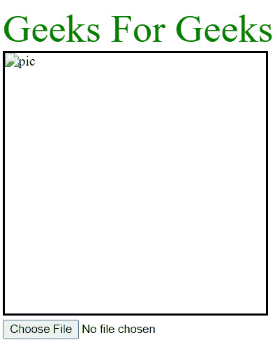

# 使用 jQuery

在上传之前预览图像

> Original: [https://www.geeksforgeeks.org/preview-an-image-before-uploading-using-jquery/](https://www.geeksforgeeks.org/preview-an-image-before-uploading-using-jquery/)

在本文中，我们将讨论两种预览通过表单作为输入的图像的方法。 我们将使用 JavaScript 构造函数**FileReader()**读取提供的图像，然后显示它。

**示例：**让我们看看具有 CSS 样式的 HTML 结构。

## 超文本标记语言

```html
<!DOCTYPE html>
<html lang="en">
    <head>
        <meta charset="UTF-8" />
        <meta name="viewport"
              content="width=device-width, initial-scale=1.0" />
        <title>Geeks</title>
        <style>
            .holder {
                height: 300px;
                width: 300px;
                border: 2px solid black;
            }
            img {
                max-width: 300px;
                max-height: 300px;
                min-width: 300px;
                min-height: 300px;
            }
            input[type="file"] {
                margin-top: 5px;
            }
            .heading {
                font-family: Montserrat;
                font-size: 45px;
                color: green;
            }
        </style>
    </head>
    <body>
        <script src=
"https://ajax.googleapis.com/ajax/libs/jquery/1.9.1/jquery.min.js">
        </script>
        <span class="heading">Geeks For Geeks</span>
        <form>
            <div class="holder">
                
            </div>
            <input type="file" name="photograph"
                   id="photo" required="true" />
        </form>
    </body>
</html>
```

我们将使用 JavaScript 与两个主要元素交互。 首先，我们有一个包含“img”标记的 Division 元素。 使用 jQuery，我们会在上传时更改 img 标签的 src 属性来预览图片。 第二个元素是“input”标记。 在此上下文中指定**type=“file”**非常重要。
**输出：**和



**Javascript 代码：**和

## JavaScript

```html
$(document).ready(()=>{
      $('#photo').change(function(){
        const file = this.files[0];
        console.log(file);
        if (file){
          let reader = new FileReader();
          reader.onload = function(event){
            console.log(event.target.result);
            $('#imgPreview').attr('src', event.target.result);
          }
          reader.readAsDataURL(file);
        }
      });
    });
```

**说明：**和

*   **FileReader()：****FileReader()**是用于创建**FileReader**对象(类的实例)的构造函数，它帮助我们执行异步读取原始数据缓冲区或文件等操作。 **File**或**Blob**对象用于指定要读取的数据类型。 在本例中，变量 Reader 是我们用来执行所需操作的对象。
*   **reader.readAsDataURL：**上传后的**文件**或**Blob**被转换为**Data：URL**，它保存表示**Blob**或**文件**中的数据的**Base64**编码字符串。 这个“data：url”存储在**result**属性中，该属性可以通过**event.target.result**访问。
*   **reader.onload：****reader.onload**函数包含一个事件处理程序，该事件处理程序在成功加载读取器时触发。 这是一个异步操作，因此后续代码甚至在加载完成之前就执行了。 加载成功后，我们使用**event.target.result**访问形成的“DataURL”，并将其插入到**src**属性中。 这种方式可以预览图像。

**最终代码：**和

## 超文本标记语言

```html
<!DOCTYPE html>
<html lang="en">
    <head>
        <meta charset="UTF-8" />
        <meta name="viewport"
              content="width=device-width, initial-scale=1.0" />
        <title>Geeks</title>
    </head>
    <body>
        <script src=
"https://ajax.googleapis.com/ajax/libs/jquery/1.9.1/jquery.min.js">
        </script>
        <span class="heading">Geeks For Geeks</span>
        <form>
            <div class="holder">
                
            </div>
            <input type="file" name="photograph"
                   id="photo" required="true" />
        </form>
        <style>
            .holder {
                height: 300px;
                width: 300px;
                border: 2px solid black;
            }
            img {
                max-width: 300px;
                max-height: 300px;
                min-width: 300px;
                min-height: 300px;
            }
            input[type="file"] {
                margin-top: 5px;
            }
            .heading {
                font-family: Montserrat;
                font-size: 45px;
                color: green;
            }
        </style>
        <script>
            $(document).ready(() => {
                $("#photo").change(function () {
                    const file = this.files[0];
                    if (file) {
                        let reader = new FileReader();
                        reader.onload = function (event) {
                            $("#imgPreview")
                              .attr("src", event.target.result);
                        };
                        reader.readAsDataURL(file);
                    }
                });
            });
        </script>
    </body>
</html>
```

发帖主题：Re：Колибри0.7.8.0

