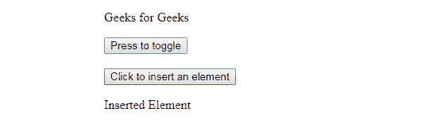

# 在 jQuery

中将 live()替换为 on()

> 原文:[https://www . geesforgeks . org/replace-live-with-on-in-jquery/](https://www.geeksforgeeks.org/replace-live-with-on-in-jquery/)

下面的 jQuery 事件处理函数基本上用于将事件附加到元素或选择器，但它们之间有很大的不同。在将 jQuery **live()** 变成 **on()** 函数之前，让我们先了解一下事件处理程序以及它们的区别。

**jQuery live() :**
这个 jQuery 函数为所有元素附加了一个函数处理程序，这个函数处理程序在当前元素中匹配给定的选择器，在将来或者当一些内容被动态添加到页面时也是如此。该函数将函数处理程序与给定的选择器和数据一起附加到根文档。它是在 jQuery 1.3 及更高版本中引入的。
在 jQuery-1.4 版本之后，它为所有事件提供了支持。
早些时候，它只支持点击、双击、鼠标向下、鼠标向上、鼠标悬停、鼠标移出、按键向上、按键向下、按键按下等几个事件。

**语法:**

```html
  $( selector ).live( events, data, function handler); 

```

*   事件:由空格分隔的一个或多个事件，附属于选择器。
*   数据:传递给函数处理程序的可选数据参数。
*   函数处理程序:每当事件发生时执行的函数。

**注:**采用事件委托和事件冒泡的概念。

**代码片段:**

```html
$( "#container a" ).live( "click", function() {
 // some response code to the event
  alert( "GeeksforGeeks" ); 
});

```

函数处理程序与*选择器*和*点击*事件一起被绑定到文档的根。
当用户点击锚点元素时，事件被触发到文档的根，并与*#容器 a* 匹配，然后执行*点击*事件功能。
在动态网站中使用 jQuery **live()** ，程序员不用担心更新事件处理程序。
既适用于现有元素，也适用于未来元素。

**代码片段:**

```html
$('a').live('click', function() { 
 alert("GeeksforGeeks") 
});

```

报警功能与*点击*事件和 *a* 一起作为参数附在文档上。
每当任何事件被冒泡到根文档时，jQuery 检查*点击*事件，并且还检查 CSS 选择器 *a* 。
如果两个条件都满足，那么处理程序内部的代码就会被有效地执行，使得函数非常不灵活。

```html
$( "a" ).live( "click", function( event ) {
 // It cancels the default action by this method.
  event.preventDefault();
});

```

**示例 1:**
在下面的示例中，“click”事件使用此方法与给定的“p”关联。

```html
<!DOCTYPE html>
<html>

<head>
    <script src=
"https://ajax.googleapis.com/ajax/libs/jquery/1.7/jquery.min.js">
    </script>
    <script>
        $(document).ready(function() {
            $("button").live("click", function() {
                $("p").slideToggle();
            });
        });
         $('body').append(
'
<p>Adding dynamic items to test live function</p>
');
    </script>
</head>

<body>

<p>Geeks for Geeks</p>

    <button>Press</button>
    <br>
    <br>

    <div><b><h4>Clicking on the 'Press' 
      button will execute the live method().
      </h4></b> </div>
</body>

</html>
```

**输出:**

点击【按下】按钮后，如下图所示:
**输出:**


**示例 2:**
在下面的示例中，“click”事件附带给定的“p”和另一个按钮，使用这种方法。

```html
<!DOCTYPE html>
<html>

  <head>
    <script src=
"https://ajax.googleapis.com/ajax/libs/jquery/1.7/jquery.min.js">
    </script>
    <script>
        $(document).ready(function() {

            $("#pressbutton").live("click", function() {
                $("p").slideToggle();
            });
            $("#insertbutton").click(function() {
                $("
<p>Inserted Element</p>
").insertAfter(
                  "#insertbutton");
            });
        });
    </script>
    </head>
    <body>

<p>Geeks for Geeks</p>

    <button id="pressbutton">Press to toggle</button>
    <br>
    <br>

    <button id="insertbutton">Click to insert an element</button>

</body>

</html>
```

**输出:**

**例 3 :**
在下面的例子中，“click”事件是附带类“div”的，使用的就是这个方法。

```html
<!DOCTYPE html>
<html>
<head>
<title>jQuery live() method</title>
<script src =
"https://ajax.googleapis.com/ajax/libs/jquery/1.6.1/jquery.min.js"></script>
   <script>

   $(document).ready(function() {

     $('div').live('click', function( event ){
         alert('GeeksforGeeks');
     });

   });

   </script>
   <style>
      .div{
        width: 50px;
            height: 50px;
            margin: 10px;
            float: left;
            border: 2px solid black;       
      }
  </style>
</head>
<body>
   <h1 style="color:green">GeeksforGeeks</h1>

<p>Click on any square to see the output:</p>

   <div class="div" style="background-color:#99f;"></div>
   <div class="div" style="background-color:#8f8;"></div>
   <div class="div" style="background-color:orange;"></div>
</body>
</html>
```

**输出:**

**注意:**这个函数在 jQuery 1.7 中被弃用，最后因为它的一些漏洞在 jQuery 1.9 中被移除。该函数被重写，通常称为 jQuery **on()** ，这是实现的首选。

**使用 jQuery live 的缺点():**
让我们来看看 jQuery 的一些缺点。live()函数，该函数已被弃用和删除。

1.  由于事件触发器被委派到文档的根，因此使用**event . stopperpagation()** 没有任何意义。
2.  在执行函数处理程序之前，函数必须一直遍历到
    文档的根。
3.  因此，在大的 **DOM** 的情况下，性能和灵活性会受到影响，并且还会消耗时间
    。

*   Use of jQuery **live()** does not support chaining.

    **jQuery。on()** :
    这个 jQuery 函数附加了一个或多个与当前选择器匹配的函数处理程序以及所有子元素。当代码在()上调用 jQuery 时，当前的选择器必须存在于页面上。这个函数是在 jQuery 1.7 和更高版本中引入的，目的是为了简化和合并所有以前的事件处理程序，即 live()，bind()，delegate()成为一个一致的函数。

    **语法:**

    ```html
      $(selector).on(events, childSelector, data, function handler);

    ```

    或者

    ```html
     $( document ).on( events, selector, data, function handler ); 

    ```

    *   事件:由空间分隔的一个或多个事件。
    *   选择器:触发事件的选择器或子选择器。
    *   数据:要传递给函数处理程序的数据。
    *   函数处理程序:在事件触发器上执行的函数。

    **代码片段:**

    ```html
    $('#parentId').on('click', '#childId', function() {
        // Code to be written
    });

    ```

    **注意:**每当所选元素上发生事件时，都会调用函数处理程序。
    事件可以发生在来自内部子元素的元素上。

    **在()上使用 jQuery 的优势:**

    让我们来看看 jQuery 的一些优势*。在*上，因为它是在 jQuery *live()* 上使用的

    1.  jQuery。on()函数是所有事件绑定函数(如 live()、bind()和
        delegate()的实际替换，这给代码带来了很多简单性和一致性。
    2.  jQuery.on()函数可以将事件处理程序附加到更接近实际对象
        的父对象上，有效提高了性能。
    3.  该功能适用于当前和未来的元素。
    4.  即使对于简单的静态元素，在()上使用 jQuery 也是一种很好的做法。
    5.  事件处理程序从最里面的元素到最外面的元素执行。

    **代码片段:**

    ```html
    $("#container a").on("click", function () {
    // some response code to the event
      alert("GeeksforGeeks.");
     });

    ```

    ```html
    $(document).on('click', '.selector', function() {
      /* some response code to the event */ 
      alert("GeeksforGeeks");
    });

    ```

    ```html
    $("#dataTable tbody").on("click", "tr", function(event){
      alert("GeeksforGeeks");
    })

    ```

    在上面的例子中，jQuery 将“点击”事件绑定到了*数据表的*表体*。*
    如果点击子元素，由于事件向上冒泡，事件将到达 *tbody* 。

    **事件处理程序的代码片段:**

    ```html
    function print_message() {
      alert( "GeeksforGeeks" );
    }
    $( "button" ).on( "click", print_message );

    ```

    **注意:**简而言之，jQuery *on()* 代表了一种将事件处理程序附加到元素的简化方式。
    **示例 1 :**
    此示例显示了使用 on()方法将“click”事件附加到“div”方块。

    ```html
    <html>

       <head>
          <title>jQuery on() method</title>
          <script src =
    "https://ajax.googleapis.com/ajax/libs/jquery/2.1.3/jquery.min.js"></script>

          <script>
             $(document).ready(function() {
                $('div').on('click', function( event ){
                   alert('GeeksforGeeks!');
                });
             });
          </script>

          <style>
             .div {
                width: 50px;
                height: 50px;
                margin: 10px;
                float: left;
                border: 2px solid black;
             }
          </style>
       </head>

       <body>
          <h1 style="color:green">GeeksforGeeks</h1>

    <p>Click on any square to see the output:</p>

          <div class = "div" style = "background-color:#99f;"></div>
          <div class = "div" style = "background-color:#8f8;"></div>
          <div class = "div" style = "background-color:orange;"></div>

       </body>
    </html>
    ```

    **输出:**
    

    **例 2:**
    此例显示，使用 on()方法将“click”事件附加到“li”上。

    ```html
    <!Doctype html>
    <html lang="en">
    <head>
      <meta charset="utf-8">
      <title>on demo</title>
      <style>
      li {
        width:200px;
        background: yellow;
        cursor: pointer;
        padding: 5px;
      }
      li.hover {
        background: #ccc;
      }

      </style>
      <script src="https://code.jquery.com/jquery-3.4.1.js"></script>
    </head>
    <body>
      <h1 style="color:green">GeeksforGeeks</h1>
      <ul>
    <li class="active">Click me!</li>
    </ul>
    <span></span>

    <script>
    var count = 0;

    $( "body" ).on( "click", "li", function() {
      $( this ).after( "<li>Paragraph number : " + (++count) + "</li>" );
    });
    </script>

    </body>
    </html>
    ```

    **输出:**
    

    **jQuery live()弃用原因:**

    1.  这是一个糟糕的编程实践。整个文档对象上的 live()事件处理程序。
    2.  在非常大的文档上，它的性能和内存利用率很差，响应时间也很慢。
    3.  当事件处理程序附加到文档元素时，会引发意外结果，降低效率。

    **将 live()转为 on():**
    将 *live()* 转为 on()需要事件委托。()上的 jQuery *性能更好，因为它将事件处理程序直接绑定到元素，而不是文档根。
    jQuery 将事件处理程序附加到最近的祖先元素，然后允许它从子元素中冒泡。最初，jQuery live()用于将函数处理程序附加到当前不在文档中并且可以动态生成的元素。
    一些代表团如下:*

    ```html
     $('#container a').live('click', function(e) {
      e.preventDefault();
      alert('Anchor element is  clicked');
    });

    ```

    将 *live()* 变为 *on()* 后，代码编写如下:

    ```html
     $('#container').on('click', 'a', function(e) {
       e.preventDefault();
       alert('Anchor element is  clicked');
     });

    ```

    ```html
     $('button').live('click', execute);
     function execute() {
        // code for execution
     }

    ```

    将 *live()* 变为 *on()* 后，上面的代码编写如下:

    ```html
      $(document).on('click', 'button', execute);
      function execute() {
        // code for execution
      }

    ```

    在上面的示例中，对文档调用了 jQuery on()。
    但是如果选择更接近选择器的元素而不是文档，性能会更好。

    ```html
     $( "#id" ).live( "click", function() {
       alert("GeeksforGeeks live event .");
     });

    ```

    将 *live()* 变为 *on()* 后，上面的代码编写如下:

    ```html
      $( "#id" ).on( "click", function() {
        alert("GeeksforGeeks on event.");
      });

    ```