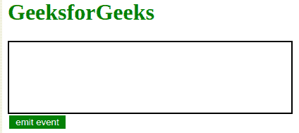
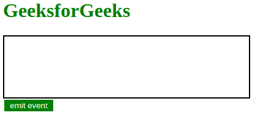

# 在 JS/jQuery

中触发按键/下键/上键事件

> 原文:[https://www . geesforgeks . org/trigger-a-key press-keydown-key up-event-in-js-jquery/](https://www.geeksforgeeks.org/trigger-a-keypress-keydown-keyup-event-in-js-jquery/)

在本文中，我们将讨论在 web 技术中使用普通的 JavaScript 和 Jquery 记录按键的两种方法。我们还将讨论 JavaScript 中与按键相关的事件。首先，我们必须创建一个结构，所以让我们先做一个 HTML 和 CSS 布局。

**HTML 和 CSS 布局:**在给定的布局中，当在字段中进行输入时，键码值将被记录在框中。
与按键相关的事件如下:

*   **按下键:**当一个键被按下时，该事件被触发。
*   **按键:**当按键被按下时，该事件被触发。此事件无法识别 tab、shift、ctrl、退格键等键。
*   **按键启动**:释放按键时触发该事件。

```html
<!DOCTYPE html>
<html lang="en">
    <head>
        <meta charset="UTF-8" />
        <meta name="viewport" 
              content="width=device-width, initial-scale=1.0" />
        <title>Document</title>

        <style>
        h1 {
            color: green;
        }
        .display {
            border: 2px solid black;
            height: 100px;
            width: 400px;
            text-align: center;
        }

        .input {
            display: flex;
            flex-direction: column;
            font-size: 0px;
        }
        button {
            border: none;
            margin: 2px;
            width: 80px;
            height: 3vw;
            float: right;
            background-color: green;
            color: white;
        }
        button:hover {
            background-color: rgb(5, 94, 12);
        }
    </style>
    </head>
    <body>
        <h1>GeeksforGeeks</h1>
        <div class="display"><h3></h3></div>
        <div class="input">
            <button>emit event</button>
        </div>
    </body>
</html>
```

**输出:**


我们将使用两种方法来实现在 JS/jQuery 中触发按键/向下按键/向上按键事件:

*   **Using Vanilla JavaScript:** We will use the native dispatchEvent in order to create keyboard events as follows.

    我们在按钮上添加了一个事件监听器来触发一系列事件，这些事件将在我们创建的显示部分显示“嘿，极客”。为此，我们使用了 dispatchEvent(新的键盘事件(…))。KeyboardEvent 是一个构造函数，它将事件和事件属性的对象作为参数。

    ```html
    window.addEventListener('load', ()=>{
        document.querySelector('button').addEventListener('click', ()=>{
            document.dispatchEvent(new KeyboardEvent('keypress', {'key': 'H'}));
            document.dispatchEvent(new KeyboardEvent('keypress', {'key': 'e'}));
            document.dispatchEvent(new KeyboardEvent('keypress', {'key': 'y'}));
            document.dispatchEvent(new KeyboardEvent('keypress', {'key': ' '}));
            document.dispatchEvent(new KeyboardEvent('keypress', {'key': 'G'}));
            document.dispatchEvent(new KeyboardEvent('keypress', {'key': 'e'}));
            document.dispatchEvent(new KeyboardEvent('keypress', {'key': 'e'}));
            document.dispatchEvent(new KeyboardEvent('keypress', {'key': 'k'}));
        });
    });
    document.addEventListener('keypress', (event)=>{
        document.querySelector('h1').innerHTML += event.key;
    });
    ```

*   **使用 jQuery:** 我们首先创建一个事件 e，并为其分配 key 属性，如上面的代码所示。使用 Jquery.trigger(e)，我们发出事件，并以与方法 1 中相同的方式处理它。然而，我们没有使用 innerHTML，而是使用了 Jquery 的**。追加()方法**。

    ```html
    $(document).ready(()=>{
           $('button').on('click', ()=>{
               let e = $.Event('keypress');
               e.key = 'H';
               $(document).trigger(e);
               e.key = 'e';
               $(document).trigger(e);
               e.key = 'y';
               $(document).trigger(e);
               e.key = ' ';
               $(document).trigger(e);
               e.key = 'G';
               $(document).trigger(e);
               e.key = 'e';
               $(document).trigger(e);
               e.key = 'e';
               $(document).trigger(e);
               e.key = 'k';
               $(document).trigger(e);

           })
       });
       $(document).on('keypress', (event)=>{

           $('h1').append(event.key);
       })
    ```

**最终解决方案:**我们将在这段代码中简单地使用方法 1，您可以使用其中的任何一个如下:

```html
<!DOCTYPE html>
<html lang="en">
    <head>
        <meta charset="UTF-8" />
        <meta name="viewport" 
              content="width=device-width, initial-scale=1.0" />
        <title>Document</title>
        <script src="https://code.jquery.com/jquery-3.5.0.slim.js" 
                integrity="sha256-sCexhaKpAfuqulKjtSY7V9H7QT0TCN90H+Y5NlmqOUE="
                crossorigin="anonymous">
        </script>
            <style>
        h1 {
            color: green;
        }
        .display {
            border: 2px solid black;
            height: 100px;
            width: 400px;
            text-align: center;
        }

        .input {
            display: flex;
            flex-direction: column;
            font-size: 0px;
        }
        button {
            border: none;
            margin: 2px;
            width: 80px;
            height: 3vw;
            float: right;
            background-color: green;
            color: white;
        }
        button:hover {
            background-color: rgb(5, 94, 12);
        }
    </style>
    </head>
    <body>
        <h1>GeeksforGeeks</h1>
        <div class="display"><h3></h3></div>
        <div class="input">
            <button>emit event</button>
        </div>
        <script type="text/javascript">
            window.addEventListener("load", () => {
                document.querySelector("button").addEventListener("click", () => {
                    document.dispatchEvent(new KeyboardEvent("keypress", { key: "H" }));
                    document.dispatchEvent(new KeyboardEvent("keypress", { key: "e" }));
                    document.dispatchEvent(new KeyboardEvent("keypress", { key: "y" }));
                    document.dispatchEvent(new KeyboardEvent("keypress", { key: " " }));
                    document.dispatchEvent(new KeyboardEvent("keypress", { key: "G" }));
                    document.dispatchEvent(new KeyboardEvent("keypress", { key: "e" }));
                    document.dispatchEvent(new KeyboardEvent("keypress", { key: "e" }));
                    document.dispatchEvent(new KeyboardEvent("keypress", { key: "k" }));
                });
            });

            document.addEventListener("keypress", (event) => {
                document.querySelector("h3").innerHTML += event.key;
            });
        </script>
    </body>
</html>
```

**输出:** 

jQuery 是一个开源的 JavaScript 库，它简化了 HTML/CSS 文档之间的交互，它以其“少写多做”的理念而闻名。
跟随本 [jQuery 教程](https://www.geeksforgeeks.org/jquery-tutorials/)和 [jQuery 示例](https://www.geeksforgeeks.org/jquery-examples/)可以从头开始学习 jQuery。