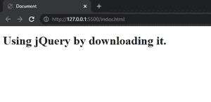
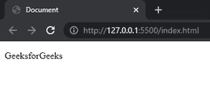
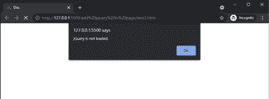
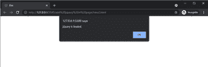
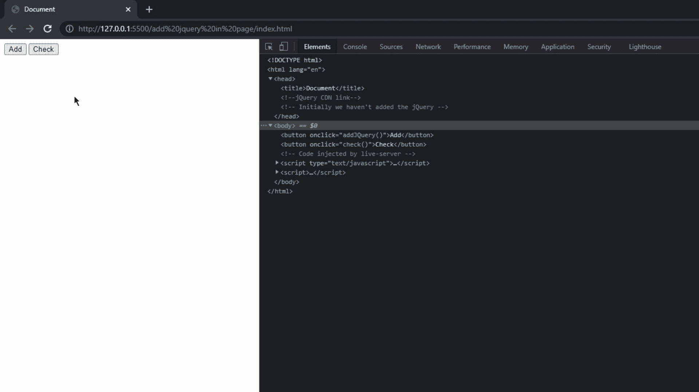

# 在页面中包含 jQuery 的方法有哪些？

> 原文:[https://www . geeksforgeeks . org/什么是在页面上包含 jquery 的所有方法/](https://www.geeksforgeeks.org/what-are-all-the-ways-to-include-jquery-on-a-page/)

在本文中，我们将探索向网页添加 jQuery 的方法。jQuery 是一个开源的 JavaScript 库，它简化了 HTML/CSS 文档，或者更准确地说是文档对象模型(DOM)和 JavaScript 之间的交互。通过阐述这些术语，jQuery 简化了 HTML 文档遍历和操作、浏览器事件处理、DOM 动画、Ajax 交互和跨浏览器 JavaScript 开发。

**方法一:下载 jQuery 库**

**第一步:**我们需要下载 jQuery 库的开发版本，我们将用于开发和测试目的。点击以下[下载链接](https://code.jquery.com/jquery-3.6.0.min.js)。您将被重定向到 jQuery 文件的确切页面，现在右键单击该页面并将该文件保存在本地存储中。

**第二步:**创建一个 HTML 文件，在 HTML 文件的 [<头>标记](https://www.geeksforgeeks.org/html-head-tag/)段内的 [<脚本>标记](https://www.geeksforgeeks.org/html-script-tag/)中声明 jQuery 文件路径。请注意，jQuery 文件必须放在工作区内。

```
<script src="jquery-3.6.0.min.js"></script>
```

**示例:**下载后将 jQuery 文件添加到网页中。

## 超文本标记语言

```
<!DOCTYPE html>
<html>

<head>
    <script src="jquery-3.6.0.min.js">
    </script>
</head>

<body>
    <h1>Using jQuery by downloading it.</h1>
</body>

</html>
```

**输出:**



**方法 2:** **通过 CDN 使用 jQuery:**与之前的方法相比，这个方法非常容易使用。我们只需要将下面的代码粘贴到 HTML 文件的头部。

```
<script src=”https://code.jquery.com/jquery-3.6.0.min.js”></script>
```

现在让我们来理解什么是 CDN，它代表内容交付网络，它是一个由几个网络服务组成的全球分布式服务器组，提供快速交付的互联网内容。因此，CDN 包含了特定 web 服务的所有基本信息，因此任何用户都可以随时随地使用它。对于我们的案例，我们将使用 jQuery 的 CDN，为了使用带有 CDN 的 jQuery，我们必须连接到网络，因为它是基于在线的服务。

**示例:**在本例中，我们将使用 CDN 链接将 jQuery 包含到我们的网页中。

## 超文本标记语言

```
<!DOCTYPE html>
<html>

<head>

    <!--jQuery CDN link-->
    <script src="
https://code.jquery.com/jquery-3.6.0.min.js">
    </script>
</head>

<body>
    <p>GeeksforGeeks</p>
</body>

</html>
```

**输出:**



我们上面讨论的方法都是关于在页面中包含 jQuery 的方法。现在，我们将检查 jQuery 是否被加载。我们将看到一些输出正确的例子，以便用户能够清楚地了解它们。下面这段代码将检查 jQuery 是否加载到我们的页面上。我们将把这段代码添加到我们的页面中。

**语法:**

```
window.onload = function () {
  if (window.jQuery) {
    alert("jQuery is loaded.");
  } else {
    alert("jQuery is not loaded.");
  }
};
```

**示例 1:** 在本例中，我们不会通过这两种方法中的任何一种有意添加 jQuery，而是使用上面的代码检查 jQuery。在输出图像中，我们可以清楚地看到它检测到没有加载 jQuery。

## 超文本标记语言

```
<!DOCTYPE html>
<html>

<head>
    <script src="jquery-3.6.0.min.js"></script>
</head>

<body>
    <script>
        window.onload = function () {
            if (window.jQuery) {

                alert("jQuery is loaded.");
            } else {

                alert("jQuery is not loaded.");
            }
        };
    </script>
</body>

</html>
```

**输出:**



**示例 2:** 在这个示例中，我们将看到在页面中添加 jQuery 后，它将检测页面中的 jQuery。

## 超文本标记语言

```
<!DOCTYPE html>
<html>

<head>
    <script src=
"https://ajax.googleapis.com/ajax/libs/jquery/3.6.0/jquery.min.js">
    </script>
</head>

<body>
    <script>
        window.onload = function () {
            if (window.jQuery) {

                alert("jQuery is loaded.");
            } else {

                alert("jQuery is not loaded.");
            }
        };
    </script>
</body>

</html>
```

**输出:**我们可以看到它检测到页面中包含了 jQuery。



**示例 3:** 现在在这个示例中，我们将在页面上检查 jQuery。如果加载了 jQuery，那就没问题，但是如果没有加载，那么我们将把 jQuery 库添加到页面中。

## 超文本标记语言

```
<!DOCTYPE html>
<html>

<!--jQuery CDN link-->
<!-- Initially we haven't added the jQuery CDN link -->

<body>
    <button onclick="addJQuery()">Add</button>
    <button onclick="check()">Check</button>

    <script>
        function check() {
            if (window.jQuery) {

                // jQuery is included in the page
                alert("jQuery is loaded");
            } else {

                // jQuery is not included in the page
                alert("jQuery is not Loaded, click "
                    + "add button to add jQuery");
            }
        };

        function addJQuery() {

            // When we click the add button it will 
            // check for availablity of jQuery
            if (window.jQuery) {
                alert("jQuery already loaded!");
            } else {

                // If its not present then these code 
                // will add jQuery to the page
                var script = document.createElement("script");
                script.type = "text/javascript";
                script.src =
"https://ajax.googleapis.com/ajax/libs/jquery/3.5.1/jquery.min.js";

                document.getElementsByTagName("head")[0]
                            .appendChild(script);

                alert("now jQuery is loaded");
            }
        }
    </script>
</body>

</html>
```

**输出:**

