# jQuery 遍历是什么意思？

> 原文:[https://www . geeksforgeeks . org/什么意思-jquery-遍历/](https://www.geeksforgeeks.org/what-do-you-mean-by-jquery-traversing/)

[**jQuery 遍历**](https://www.geeksforgeeks.org/jquery-traversing/) 意味着在 **HTML** 页面中移动链接的元素。使用 jQuery 遍历，我们可以根据元素之间的关系来搜索和查找不同的元素。元素可以是父母、兄弟姐妹、孩子等。

我们可以向上移动(祖先)，向下移动(后代)，侧向移动(兄弟姐妹)。我们可以在下图中看到一个 DOM。这只是为了演示 DOM 是如何工作的，并不完美。从 DOM 中的任何元素开始，我们可以到达 DOM 中的任何元素，因为每个元素都是 HTML 的后代，这是遍历的一部分。

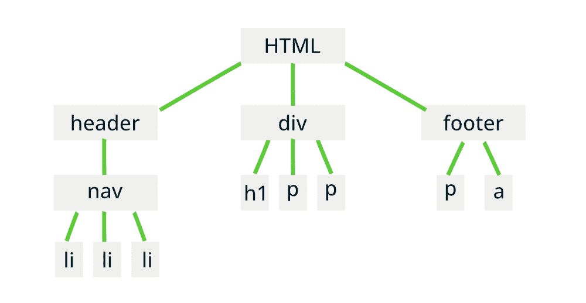

数字正射影像图

从上图可以得出以下结论。

*   [< html >](https://www.geeksforgeeks.org/html-tutorials/) 是根元素。
*   [<页眉>](https://www.geeksforgeeks.org/html5-header-tag/)[<div>](https://www.geeksforgeeks.org/div-tag-html/)和 [<页脚>](https://www.geeksforgeeks.org/html5-footer-tag/) 是< html >元素的子元素。
*   [<导航>](https://www.geeksforgeeks.org/html-nav-tag/) 是<标题>的子元素，该标题又是三个< li >元素的父元素。
*   再次元素，

    <header>的同胞是

    # 和两个 [< p >](https://www.geeksforgeeks.org/html-paragraph/) 的祖先。

    </header>

*   [<页脚>](https://www.geeksforgeeks.org/html5-footer-tag/) 是< html >的继承者，后者是 [< p >](https://www.geeksforgeeks.org/html-paragraph/) 和 [< a >](https://www.geeksforgeeks.org/html-a-tag/) 的祖先。

**向上遍历:**向上遍历 DOM 意味着向父母或祖先移动。以下三种方法用于在 jQuery 中向上遍历。

*   [jQuery 父()方法](https://www.geeksforgeeks.org/jquery-parent-parents-with-examples/)
*   [jQuery 父母()方法](https://www.geeksforgeeks.org/jquery-parent-parents-with-examples/)
*   [jQuery parentsUntil()方法](https://www.geeksforgeeks.org/jquery-parentsuntil-with-example/)

[jQuery parent()方法](https://www.geeksforgeeks.org/jquery-parent-parents-with-examples/) **:** 该方法用于为我们正在搜索的元素获取最近的父元素。下面是一个例子，我们正在寻找< li >的父代，也就是< ul >。我们使用 CSS [parent()](https://www.geeksforgeeks.org/jquery-parent-parents-with-examples/) 函数来获取直接的父级。< ul >是两个< li >元素的直接母体。

## 超文本标记语言

```html
<!DOCTYPE html>
<html>

<head>
    <meta charset="utf-8">
    <meta name="viewport" content="width=device-width">
    <title>GeeksforGeeks</title>
    <script src=
"https://ajax.googleapis.com/ajax/libs/jquery/3.5.1/jquery.min.js">
    </script>
</head>

<body>
    <h1>GeeksforGeeks</h1>
    <div>
        <h4>Welcome to GeeksforGeeks</h4>
        <ul>
            <li>Data Structures</li>
            <li>Algorithms</li>
        </ul>
    </div>
    <script>
        $("li").parent().css({
            "color": "green",
            "margin": "2rem",
            "border": "2px solid green"
        })
    </script>
</body>
</html>
```

**输出:**

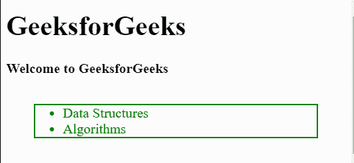

[jQuery parents()方法](https://www.geeksforgeeks.org/jquery-parent-parents-with-examples/) **:** 这个方法是用来获取所有祖先一直到文档的根即 [< html >](https://www.geeksforgeeks.org/html-tutorials/) 。在下面的例子中，我们有一个嵌套的元素树，我们将对 id 为“lastchild”的 [< li >](https://www.geeksforgeeks.org/html-li-tag/) 项的所有祖先应用[样式](https://www.geeksforgeeks.org/html-style-attribute/)。

## 超文本标记语言

```html
<!DOCTYPE html>
<html>

<head>
    <meta charset="utf-8">
    <meta name="viewport" content="width=device-width">
    <title>GeeksforGeeks</title>
    <script src=
"https://ajax.googleapis.com/ajax/libs/jquery/3.5.1/jquery.min.js">
    </script>
</head>

<body>
    <h1>GeeksforGeeks</h1>
    <div>
        <h4>Welcome to GeeksforGeeks</h4>
        <ul>
            <li>
                Data Structures
                <ul>
                    <li id="lastchild">Array</li>
                    <li>Struct</li>
                    <li>Queue</li>
                    <li>Linked List</li>
                </ul>
            </li>
            <li>
                Algorithms
                <ul>
                    <li>Searching</li>
                    <li>Sorting</li>
                    <li>Backtracking</li>
                </ul>
            </li>
        </ul>
    </div>
    <script>
        $('#lastchild').parents().css({
            "margin": ".2rem",
            "border": "2px solid green"
        })
    </script>
</body>
</html>
```

**输出:**

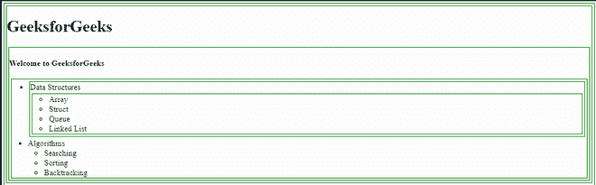

[jQuery parentsUntil()方法](https://www.geeksforgeeks.org/jquery-parentsuntil-with-example/)**:**jQuery 的这个方法是用来获取只达到声明元素的父元素。下面的例子有一个包含项目列表的 HTML [分区](https://www.geeksforgeeks.org/div-tag-html/)。我们希望样式直到第一个 [< ul >](https://www.geeksforgeeks.org/html-ul-tag/) 具有从< li >项目的“last child”id 开始的“final parent”id。

所以[边界](https://www.geeksforgeeks.org/css-border-property/)和[边界](https://www.geeksforgeeks.org/css-margins-padding/)应该应用于两个元素。先是 [< ul >](https://www.geeksforgeeks.org/html-ul-tag/) 的直系父母，然后是 [< li >](https://www.geeksforgeeks.org/html-li-tag/) 。

## 超文本标记语言

```html
<!DOCTYPE html>
<html>

<head>
    <meta charset="utf-8">
    <meta name="viewport" content="width=device-width">
    <title>GeeksforGeeks</title>
    <script src=
"https://ajax.googleapis.com/ajax/libs/jquery/3.5.1/jquery.min.js">
    </script>
</head>

<body>
    <h1>GeeksforGeeks</h1>
    <div>
        <h4>Welcome to GeeksforGeeks</h4>
        <ul id="finalparent">
            <li>
                Data Structures
                <ul>
                    <li id="lastchild">Array</li>
                    <li>Struct</li>
                    <li>Queue</li>
                    <li>Linked List</li>
                </ul>
            </li>
            <li>
                Algorithms
                <ul>
                    <li>Searching</li>
                    <li>Sorting</li>
                    <li>Backtracking</li>
                </ul>
            </li>
        </ul>
    </div>
    <script>
        $('#lastchild').parentsUntil("#finalparent").css({
            "margin": ".2rem",
            "border": "2px solid green"
         })
    </script>
</body>
</html>
```

**输出:**

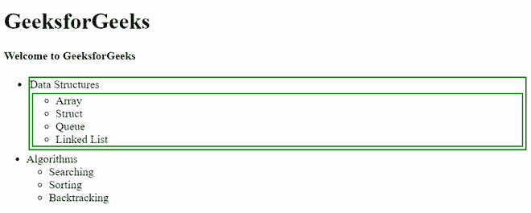

**向下穿越**:向下穿越意味着我们要到达祖先元素的后代。后代可以是直接子代或嵌套子代。我们可以使用以下两个函数在 jQuery 中找到不同的后代。

*   [**jQuery 子()法**](https://www.geeksforgeeks.org/jquery-children-with-examples/)
*   [**jQuery find()方法**](https://www.geeksforgeeks.org/jquery-find-with-examples/)

[**jQuery children()方法**](https://www.geeksforgeeks.org/jquery-children-with-examples/) :使用这个 jQuery 函数，我们可以访问元素的所有直接子元素。直接子元素是指元素内部的元素，而不是进一步嵌套的元素。

下面是一个例子，其中 [< div >](https://www.geeksforgeeks.org/div-tag-html/) 元素有三个[T6】p>T3】段落。结果是所有段落都有绿色边框。](https://www.geeksforgeeks.org/html-paragraph-2/)

## 超文本标记语言

```html
<!DOCTYPE html>
<html>

<head>
    <meta charset="utf-8">
    <meta name="viewport" content="width=device-width">
    <title>GeeksforGeeks</title>
    <script src=
"https://ajax.googleapis.com/ajax/libs/jquery/3.5.1/jquery.min.js">
    </script>
</head>

<body>
    <h1>GeeksforGeeks</h1>
    <div>
        <p>GeeksforGeeks is a coding and development tutorial website.</p>
        <p>We can also find tutorials for Machine Learning and IOT.</p>
        <p>Almost all of the resources on GeeksforGeeks is for free.</p>

    </div>
    <script>
        $('div').children().css({
            "margin": "1rem",
            "border": "2px dotted green"
        })
    </script>
</body>
</html>
```

**输出:**

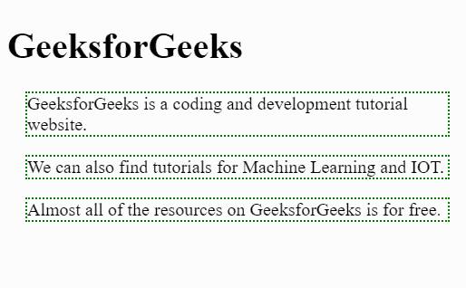

[**jQuery find()方法**](https://www.geeksforgeeks.org/jquery-find-with-examples/) **:在此功能中。我们传递元素的名称、id 或类名，它是元素的直接或间接子元素。在这个例子中，我们想要找到 id 为“lastchild”的 [< li >](https://www.geeksforgeeks.org/html-li-tag/) 项，它是 [< div >](https://www.geeksforgeeks.org/div-tag-html/) 的间接后代。**

## 超文本标记语言

```html
<!DOCTYPE html>
<html>

<head>
    <meta charset="utf-8">
    <meta name="viewport" content="width=device-width">
    <title>GeeksforGeeks</title>
    <script src=
"https://ajax.googleapis.com/ajax/libs/jquery/3.5.1/jquery.min.js">
    </script>
</head>

<body>
    <h1>GeeksforGeeks</h1>
    <div>
        <p>
            GeeksforGeeks is a coding and 
            development tutorial website.
        </p>
        <p>
            We can also find tutorials for 
            Machine Learning and IOT.
        </p>
        <p>
            Almost all of the resources on 
            GeeksforGeeks is for free.
        </p>

        <ul>
            <li>Algorithms</li>
            <li id="lastchild">Data Structures</li>
            <li>Machine Learning</li>
        </ul>
    </div>
    <script>
        $('div').find("#lastchild").css({
            "padding": ".5rem",
            "margin": "1rem",
            "border": "5px solid green"
        })
    </script>
</body>

</html>
```

**输出:**

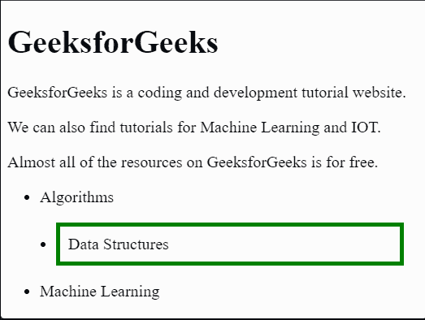

**遍历兄弟姐妹**:兄弟姐妹可以和兄弟姐妹相关。假设无序列表的列表项都是兄弟。我们可以使用以下函数来查找 jQuery 中的兄弟。

*   [jQuery 姐弟()方法](https://www.geeksforgeeks.org/jquery-siblings-with-examples/)
*   [jQuery next()方法](https://www.geeksforgeeks.org/jquery-next-nextall-with-examples/)
*   [jQuery nextAll()方法](https://www.geeksforgeeks.org/jquery-next-nextall-with-examples/)
*   [jQuery next 直到()方法](https://www.geeksforgeeks.org/jquery-nextuntil-with-examples/)
*   [jQuery prev()方法](https://www.geeksforgeeks.org/jquery-prev-prevall-with-examples/)
*   [jQuery prevAll()方法](https://www.geeksforgeeks.org/jquery-prev-prevall-with-examples/)
*   [jQuery previous()方法](https://www.geeksforgeeks.org/jquery-prevuntil-with-examples/)

[**【jQuery 兄弟】()方法**](https://www.geeksforgeeks.org/jquery-siblings-with-examples/) **:** 该方法用于查找除元素本身之外的所有位于顶部或底部的横向元素。这个方法找到< h3 >标签的所有兄弟，并应用 CSS 来识别元素。

## 超文本标记语言

```html
<!DOCTYPE html>
<html>

<head>
    <meta charset="utf-8">
    <meta name="viewport" content="width=device-width">
    <title>GeeksforGeeks</title>
    <script src=
"https://ajax.googleapis.com/ajax/libs/jquery/3.5.1/jquery.min.js">
    </script>
</head>

<body>
    <h1>GeeksforGeeks</h1>
    <div>
        <h3>Welcome to GeeksforGeeks</h3>
        <p>
            GeeksforGeeks is a coding and 
            development tutorial website.
        </p>
        <p>
            We can also find tutorials for 
            Machine Learning and IOT.
        </p>

        <ul>
            <li>Algorithms</li>
            <li>Data Structures</li>
            <li>Machine Learning</li>
        </ul>
    </div>

    <script>
        $('h3').siblings().css({
            "margin": "1rem",
            "border": "5px solid green"
        })
    </script>
</body>
</html>
```

**输出:**

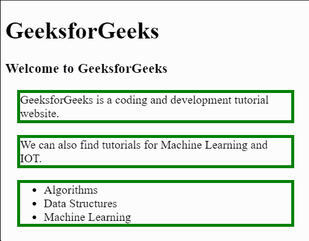

[**jQuery next()方法**](https://www.geeksforgeeks.org/jquery-next-nextall-with-examples/) **:这个方法是用来寻找刚好下一个兄弟元素的。在下面的例子中，我们找到了第一个< p >元素< h3 >旁边的元素。**

## 超文本标记语言

```html
<!DOCTYPE html>
<html>

<head>
    <meta charset="utf-8">
    <meta name="viewport" content="width=device-width">
    <title>GeeksforGeeks</title>
    <script src=
"https://ajax.googleapis.com/ajax/libs/jquery/3.5.1/jquery.min.js">
    </script>
</head>

<body>
    <h1>GeeksforGeeks</h1>
    <div>
        <h3>Welcome to GeeksforGeeks</h3>
        <p>
            GeeksforGeeks is a coding and 
            development tutorial website.
        </p>

        <p>
            We can also find tutorials for 
            Machine Learning and IOT.
        </p>

        <ul>
            <li>Algorithms</li>
            <li>Data Structures</li>
            <li>Machine Learning</li>
        </ul>
    </div>
    <script>
        $('h3').next().css({
            "margin": "1rem",
            "border": "5px solid green"
        })
    </script>
</body>
</html>
```

**输出:**

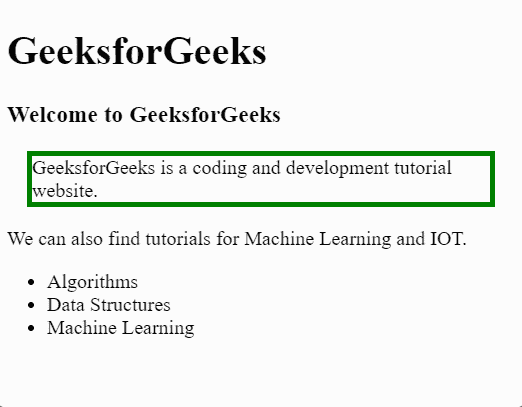

[**jQuery nextAll()方法**](https://www.geeksforgeeks.org/jquery-next-nextall-with-examples/) **:** 该方法与 [**next()**](https://www.geeksforgeeks.org/jquery-next-nextall-with-examples/) 方法非常相似，但它会找到我们想要查找的元素旁边的所有元素。在下面的例子中，我们想找到 [< p >](https://www.geeksforgeeks.org/html-paragraph/) 元素旁边有一个 [id](https://www.geeksforgeeks.org/html-id-attributes/) 的元素。

## 超文本标记语言

```html
<!DOCTYPE html>
<html>

<head>
    <meta charset="utf-8">
    <meta name="viewport" content="width=device-width">
    <title>GeeksforGeeks</title>
    <script src=
"https://ajax.googleapis.com/ajax/libs/jquery/3.5.1/jquery.min.js">
    </script>
</head>

<body>
    <h1>GeeksforGeeks</h1>
    <div>
        <h3>Welcome to GeeksforGeeks</h3>
        <p>GeeksforGeeks is a coding and development tutorial website.</p>
        <p id="paragraph">
            We can also find tutorials for Machine Learning and IOT.
        </p>

        <ul>
            <li>Algorithms</li>
            <li>Data Structures</li>
            <li>Machine Learning</li>
        </ul>
    </div>
    <script>
        $('#paragraph').nextAll().css({"margin": "1rem",
                                       "border": "5px solid green"})
    </script>
</body>

</html>
```

**输出:**

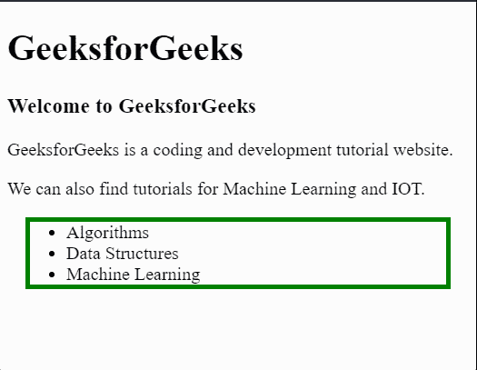

[**jQuery nextUntil()方法**](https://www.geeksforgeeks.org/jquery-nextuntil-with-examples/) **:** 该方法用于查找兄弟元素，直到元素被指定或传递给该函数。在这个例子中，我们从第一个 [< p >](https://www.geeksforgeeks.org/html-paragraph/) 元素开始，我们将一直移动到 [< ul >](https://www.geeksforgeeks.org/html-ul-tag/) 。

## 超文本标记语言

```html
<!DOCTYPE html>
<html>

<head>
    <meta charset="utf-8">
    <meta name="viewport" content="width=device-width">
    <title>GeeksforGeeks</title>
    <script src=
"https://ajax.googleapis.com/ajax/libs/jquery/3.5.1/jquery.min.js">
    </script>
</head>

<body>
    <h1>GeeksforGeeks</h1>
    <div>
        <h3>Welcome to GeeksforGeeks</h3>
        <p id="paragraph">
          GeeksforGeeks is a coding and 
          development tutorial website.
        </p>

        <p>We can also find tutorials for Machine Learning and IOT.</p>

        <ul>
            <li>Algorithms</li>
            <li>Data Structures</li>
            <li>Machine Learning</li>
        </ul>
    </div>
    <script>
        $('#paragraph').nextUntil("ul").css({"margin": "1rem",
                                             "border": "5px solid green"})
    </script>
</body>

</html>
```

**输出:**


[**jQuery prev()【方法】**](https://www.geeksforgeeks.org/jquery-prev-prevall-with-examples/)**:****prev()**函数查找当前元素之前或之上的元素。这两个元素是兄弟。它会找到前面的元素。所以我们在下面的例子中使用了这个函数来查找前面的元素到具有 [id](https://www.geeksforgeeks.org/html-id-attributes/) 的 [< p >](https://www.geeksforgeeks.org/html-paragraph-2/) 元素。

## 超文本标记语言

```html
<!DOCTYPE html>
<html>

<head>
    <meta charset="utf-8">
    <meta name="viewport" content="width=device-width">
    <title>GeeksforGeeks</title>
    <script src=
"https://ajax.googleapis.com/ajax/libs/jquery/3.5.1/jquery.min.js">
    </script>
</head>

<body>
    <h1>GeeksforGeeks</h1>
    <div>
        <h3>Welcome to GeeksforGeeks</h3>
        <p id="paragraph">
            GeeksforGeeks is a coding and 
            development tutorial website.
        </p>

        <p>
            We can also find tutorials for 
            Machine Learning and IOT.
        </p>

        <ul>
            <li>Algorithms</li>
            <li>Data Structures</li>
            <li>Machine Learning</li>
        </ul>
    </div>
    <script>
        $('#paragraph').prev().css({"margin": "1rem",
                                    "border": "5px solid green"})
    </script>
</body>

</html>
```

**输出**:

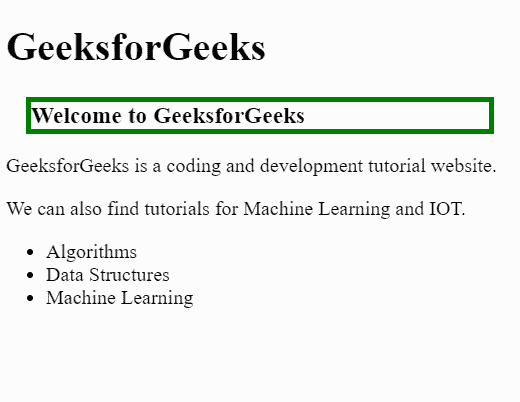

[**jQuery prevAll()方法**](https://www.geeksforgeeks.org/jquery-prev-prevall-with-examples/) **:** 此函数用于查找当前元素之前的所有兄弟元素。该方法类似于 [nextAll()](https://www.geeksforgeeks.org/jquery-next-nextall-with-examples/) 功能。在下面的例子中，我们正在寻找 [< ul >](https://www.geeksforgeeks.org/html-ul-tag/) 元素之前的元素。

## 超文本标记语言

```html
<!DOCTYPE html>
<html>

<head>
    <meta charset="utf-8">
    <meta name="viewport" content="width=device-width">
    <title>GeeksforGeeks</title>
    <script src=
"https://ajax.googleapis.com/ajax/libs/jquery/3.5.1/jquery.min.js">
    </script>
</head>

<body>
    <h1>GeeksforGeeks</h1>
    <div>
        <h3>Welcome to GeeksforGeeks</h3>
        <p>
            GeeksforGeeks is a coding and 
            development tutorial website.
        </p>
        <p>
            We can also find tutorials for 
            Machine Learning and IOT.
        </p>

        <ul>
            <li>Algorithms</li>
            <li>Data Structures</li>
            <li>Machine Learning</li>
        </ul>
    </div>
    <script>
        $('ul').prevAll().css({"margin": "1rem",
                               "border": "5px solid green"})
    </script>
</body>

</html>
```

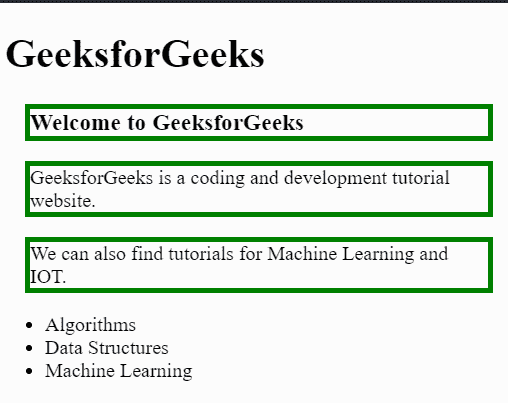

[**jQuery previtull()方法:**](https://www.geeksforgeeks.org/jquery-prevuntil-with-examples/) 此函数查找当前元素之前的所有元素，直到指定的元素。在下面的例子中，我们想要找到< ul >之前的所有元素，直到< h3 >元素。不包括< h3 >。

## 超文本标记语言

```html
<!DOCTYPE html>
<html>

<head>
    <meta charset="utf-8">
    <meta name="viewport" content="width=device-width">
    <title>GeeksforGeeks</title>
    <script src=
"https://ajax.googleapis.com/ajax/libs/jquery/3.5.1/jquery.min.js">
    </script>
</head>

<body>
    <h1>GeeksforGeeks</h1>
    <div>
        <h3>Welcome to GeeksforGeeks</h3>
        <p>
            GeeksforGeeks is a coding and 
            development tutorial website.
        </p>
        <p>
            We can also find tutorials for 
            Machine Learning and IOT.
        </p>

        <ul>
            <li>Algorithms</li>
            <li>Data Structures</li>
            <li>Machine Learning</li>
        </ul>
    </div>
    <script>
        $('ul').prevUntil('h3').css({"margin": "1rem",
                                     "border": "5px solid green"})
    </script>
</body>

</html>
```

**输出**:

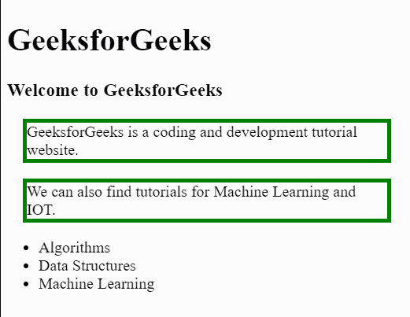