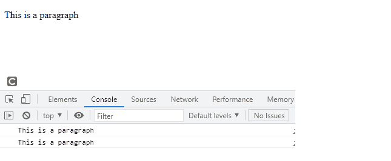

# 美元符号($)在 jQuery 中是什么意思？

> 原文:[https://www . geesforgeks . org/美元符号意味着什么 jquery/](https://www.geeksforgeeks.org/what-does-dollar-sign-means-in-jquery/)

$符号只是 jQuery()函数的一个标识符。

我们不再编写 jQuery，而是简单地编写与 jQuery()函数相同的$函数。带有选择器的$指定它是 jQuery 选择器。给它一个较短的标识符$只是为了减少编写较大语法的时间。它包含 jQuery 对象使用的所有功能，例如 [animate()](https://www.geeksforgeeks.org/jquery-animate-with-examples/) 、 [hide()](https://www.geeksforgeeks.org/jquery-hide-with-examples/) 、 [show()](https://www.geeksforgeeks.org/jquery-effect-show-method/) 、 [css()](https://www.geeksforgeeks.org/jquery-css-method/) 等等。此外，在内存方面，$比 jQuery 更好，因为$需要一个字节，而 jQuery 需要 6 个字节，它们具有相同的功能。

**语法:**

```
$('selector').action();
```

**示例 1:** 一个简单的插图显示 jQuery 和$具有相同的功能。

## 超文本标记语言

```
!DOCTYPE html>
<html lang="en">

<head>
    <meta charset="UTF-8">
    <meta http-equiv="X-UA-Compatible" content="IE=edge">
    <meta name="viewport" 
          content="width=device-width, initial-scale=1.0">

    <!-- Including jQuery  -->
    <script src="https://code.jquery.com/jquery-3.6.0.min.js"
            integrity="sha256-/xUj+3OJU5yExlq6GSYGSHk7tPXikynS7ogEvDej/m4="
            crossorigin="anonymous">
    </script>
</head>

<body>    
    <script>
       console.log($===jQuery)
    </script>
</body>

</html>
```

**输出:**

```
true
```

**注意:** $('p ')和 jQuery('p ')含义相同，返回的对象也相同。

**例 2:**

## 超文本标记语言

```
<!DOCTYPE html>
<html lang="en">

<head>
    <meta charset="UTF-8">
    <meta http-equiv="X-UA-Compatible" content="IE=edge">
    <meta name="viewport" 
          content="width=device-width, initial-scale=1.0">

    <!-- Including jQuery  -->
    <script src="https://code.jquery.com/jquery-3.6.0.min.js"
            integrity="sha256-/xUj+3OJU5yExlq6GSYGSHk7tPXikynS7ogEvDej/m4="
            crossorigin="anonymous">
   </script>
</head>

<body>
    <p> This is a paragraph</p>
    <script>
      var p = $('p').text();
      var x = jQuery('p').text()
      console.log(p);
      console.log(x);
    </script>
</body>
</html>
```

**输出:**



我们甚至可以通过使用 jQuery[**noConflict()**](https://www.geeksforgeeks.org/jquery-noconflict-with-examples/)**函数来更改$因为当我们使用其他可能有不同含义的技术时可能会有机会，在这种情况下我们可以使用 **noConflict()** 方法为 jQuery 定制标识符。**

****语法:****

```
var new_identifier = jQuery.noConflict();
```

****例 3:****

## **超文本标记语言**

```
<!DOCTYPE html>
<html lang="en">

<head>
    <meta charset="UTF-8">
    <meta http-equiv="X-UA-Compatible" content="IE=edge">
    <meta name="viewport" 
          content="width=device-width, initial-scale=1.0">

    <!-- Including jQuery  -->
    <script src="https://code.jquery.com/jquery-3.6.0.min.js"
            integrity="sha256-/xUj+3OJU5yExlq6GSYGSHk7tPXikynS7ogEvDej/m4=" 
            crossorigin="anonymous">
    </script>
</head>

<body>

<p> This is a paragraph</p>

    <script>
      var dollar =  jQuery.noConflict();

      // We can use dollar instead of $ by 
      // using jQuery noConflict() method
      var x = dollar('p').text()
      console.log(x);
    </script>
</body>

</html>
```

****输出:****

```
This is a paragraph
```