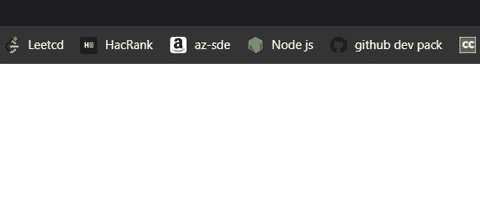
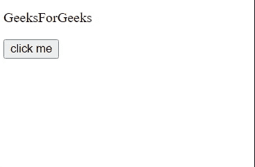

# jQuery 中什么是链接？

> 原文:[https://www.geeksforgeeks.org/what-is-chaining-in-jquery/](https://www.geeksforgeeks.org/what-is-chaining-in-jquery/)

在 jQuery 中，**链接**允许我们在一条语句中对一个元素执行多个操作。

大部分的 jQuery 函数都会返回一个 jQuery 对象，因此当第一个方法完成执行时，它会返回一个 obj。

**示例 1:** 借助于链接，我们简洁地开发了我们的代码。链接还使我们的脚本更快，因为现在浏览器不必找到相同的元素来对它们执行操作。**‘gfg’**对象的每个方法都返回一个对象。

首先调用*极客()*方法，然后调用*写()*方法，然后调用*灭()*方法。

## 超文本标记语言

```
<!DOCTYPE html>
<head>
  <script src=
      "https://code.jquery.com/jquery-git.js">
  </script>
</head>

<body>
    <script>
        let gfg = {
            geek: function(){
                alert('called geek method');
                return gfg;
            },
            write: function(){
                alert('called write method');
                return gfg;
            },
            destroy: function(){
                alert('called destroy method');
                return gfg;
            }
        }

        gfg.geek().write().destroy();
    </script>
</body>

</html>
```

**输出:**



**示例 2:** 下面的代码演示了 [**fadeOut()**](https://www.geeksforgeeks.org/jquery-effect-fadeout-method/) 和[**fade in()**](https://www.geeksforgeeks.org/jquery-fadein-method/)**方法的链接。每次你点击按钮，文本会先淡出，然后再淡入。**

## **超文本标记语言**

```
<!DOCTYPE html>
<head>
    <!-- jQuery library -->
    <script src="https://code.jquery.com/jquery-git.js"></script>
</head>

<body>
    <p id="first">GeeksForGeeks</p>

    <button>click me</button>
    <script>
        $(document).ready(function(){
            $('button').click(function(){
                $('#first').fadeOut(100).fadeIn(100);
            })
        })
    </script>
</body>

</html>
```

****输出:****

****