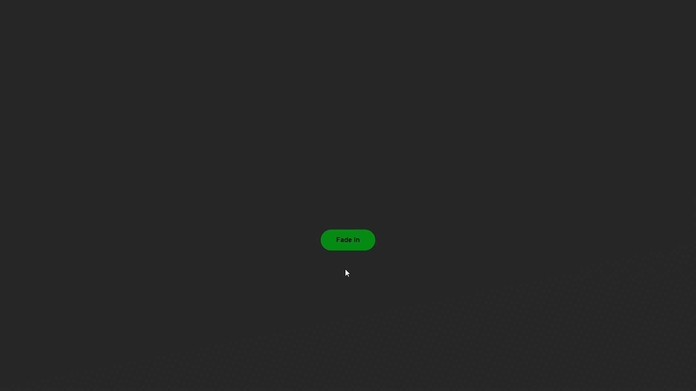
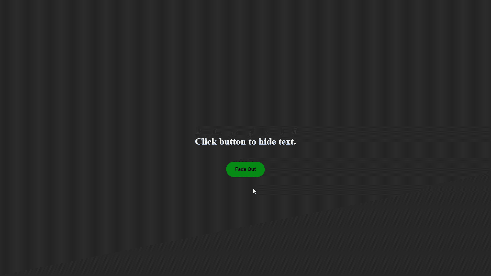
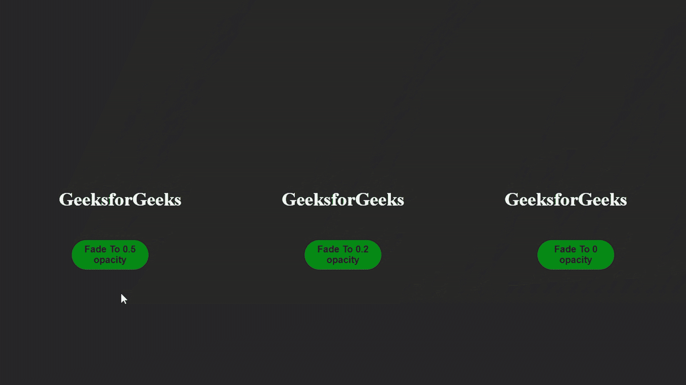

# 什么是 jQuery 淡入淡出效果？

> 原文:[https://www . geesforgeks . org/what-is-jquery-fading-effects/](https://www.geeksforgeeks.org/what-is-jquery-fading-effects/)

在本文中，我们将探讨 jQuery 中的[褪色效应。淡入淡出基本上适用于某些元素的](https://www.geeksforgeeks.org/explain-the-concept-of-fade-effect-in-jquery/)[不透明度](https://www.geeksforgeeks.org/css-opacity-transparency/)。在 jQuery 中，我们可以根据不透明度[淡入](https://www.geeksforgeeks.org/jquery-fadein-method/)和[淡出](https://www.geeksforgeeks.org/jquery-effect-fadeout-method/)元素。在 jQuery 中，我们有几种方法可以帮助我们达到淡入淡出的效果。我们将用恰当的例子来寻找每种方法。

**褪色方法:**

[**jQuery fadeIn()方法:**](https://www.geeksforgeeks.org/jquery-fadein-method/) 借助这个方法，我们可以淡入一个基本上隐藏在网页上的元素。

**语法:**

```html
$(selector).fadeIn(<duration>, 
    <easing>, <callback function>);
```

**示例:**

## 超文本标记语言

```html
<!DOCTYPE html>
<html lang="en">

<head>
    <!-- jQuery CDN link -->
    <script src=
"https://ajax.googleapis.com/ajax/libs/jquery/3.6.0/jquery.min.js">
    </script>

    <style>
        body {
            margin: 0px;
            padding: 0px;
            box-sizing: border-box;
        }

        .main {
            display: flex;
            align-items: center;
            justify-content: center;
            background-color: rgb(41, 41, 41);
            flex-direction: column;
            height: 100vh;
        }

        h1 {
            color: white;
            display: none;
        }

        #fadein {
            position: absolute;
            top: 550px;
            height: 50px;
            width: 130px;
            background-color: rgb(0, 141, 19);
            outline: none;
            border: none;
            border-radius: 60px;
            color: black;
            font-size: 1rem;
            font-weight: bold;
        }
    </style>
</head>

<body>
    <div class="main">
        <button id="fadein">Fade In</button>
        <h1 id="text">Text in now visible</h1>
    </div>

    <!-- jQuery code -->
    <script>

        // Initially text is invisible.
        $("#fadein").click(function () {
            $("#text").fadeIn(2000, function () {
                alert("Animation is completed");
            });
        });
    </script>
</body>

</html>
```

**输出:**



淡入示例

[**jQuery fadeOut()方法** :](https://www.geeksforgeeks.org/jquery-effect-fadeout-method/) 此方法的工作原理与 [**fadeIn()**](https://www.geeksforgeeks.org/jquery-fadein-method/) 方法正好相反，它会使一个元素不可见。

**语法:**

```html
$(selector).fadeOut(<duration>, 
    <easing>, <callback function>);
```

**示例:**

## 超文本标记语言

```html
<!DOCTYPE html>
<html lang="en">

<head>
    <!-- jQuery CDN link -->
    <script src=
"https://ajax.googleapis.com/ajax/libs/jquery/3.6.0/jquery.min.js">
    </script>

    <style>
        body {
            margin: 0px;
            padding: 0px;
            box-sizing: border-box;
        }

        .main {
            display: flex;
            align-items: center;
            justify-content: center;
            background-color: rgb(41, 41, 41);
            flex-direction: column;
            height: 100vh;
        }

        h1 {
            color: white;
        }

        #fadeout {
            position: absolute;
            top: 550px;
            height: 50px;
            width: 130px;
            background-color: rgb(0, 141, 19);
            outline: none;
            border: none;
            border-radius: 60px;
            color: black;
            font-size: 1rem;
            font-weight: bold;
        }
    </style>
</head>

<body>
    <div class="main">
        <button id="fadeout">Fade Out</button>
        <h1 id="text">Click button to hide text.</h1>
    </div>

    <!-- jQuery code -->
    <script>
        $("#fadeout").click(function () {
            $("#text").fadeOut(2000, function () {
                alert("Animation is completed");
            });
        });
    </script>
</body>

</html>
```



淡出示例

[**jQuery fadeToggle()方法:**](https://www.geeksforgeeks.org/jquery-fadetoggle-method/) 此方法将在 [**fadeIn()**](https://www.geeksforgeeks.org/jquery-fadein-method/) 和 [**fadeOut()**](https://www.geeksforgeeks.org/jquery-effect-fadeout-method/) 方法之间切换，只需单击一个按钮。

**语法:**

```html
$(selector).fadeToggle(<duration>, 
    <easing>, <callback function>);
```

**示例:**

## 超文本标记语言

```html
<!DOCTYPE html>
<html lang="en">

<head>
    <!-- jQuery CDN link -->
    <script src=
"https://ajax.googleapis.com/ajax/libs/jquery/3.6.0/jquery.min.js">
    </script>

    <style>
        body {
            margin: 0px;
            padding: 0px;
            box-sizing: border-box;
        }

        .main {
            display: flex;
            align-items: center;
            justify-content: center;
            background-color: rgb(41, 41, 41);
            flex-direction: column;
            height: 100vh;
        }

        h1 {
            color: white;
            display: none;
        }

        .Toggle {
            position: absolute;
            top: 550px;
            height: 50px;
            width: 130px;
            background-color: rgb(0, 141, 19);
            border-radius: 60px;
            border: none;
            color: black;
            font-size: 1rem;
            font-weight: bold;
        }

        .Toggle:hover {
            background-color: rgb(1, 122, 17);
        }
    </style>
</head>

<body>
    <div class="main">
        <button class="Toggle">Fade Toggle</button>
        <h1 id="text">Text in now visible</h1>
    </div>
    <!-- jQuery code -->
    <script>
        $(".Toggle").click(function () {
            $("#text").fadeToggle("fast");
        });
    </script>
</body>

</html>
```

**输出:**


[**jQuery fadeTo()方法:**](https://www.geeksforgeeks.org/jquery-fadeto-with-examples/) 在这个方法中，默认情况下不会淡入淡出元素，实际上，我们会通过想要的不透明度值来淡入淡出。

**语法:**

```html
$(selector).fadeTo(<duration>, <opacity>, 
        <easing>, <callback function>);
```

**示例:**在本例中，我们将一个元素淡出到三个不同的值。

## 超文本标记语言

```html
<!DOCTYPE html>
<html lang="en">

<head>
    <!-- jQuery CDN link -->
    <script src=
"https://ajax.googleapis.com/ajax/libs/jquery/3.6.0/jquery.min.js">
    </script>

    <style>
        body {
            margin: 0px;
            padding: 0px;
            box-sizing: border-box;
        }

        .main {
            display: flex;
            align-items: center;
            justify-content: center;
            background-color: rgb(41, 41, 41);
            flex-direction: row;
            height: 100vh;
        }

        #text2 {
            margin: 170px;
            color: white;
        }

        h1 {
            color: white;
        }

        #fadeto1 {
            position: absolute;
            top: 550px;
            left: 500px;
            height: 50px;
            width: 130px;
            background-color: rgb(0, 141, 19);
            outline: none;
            border: none;
            border-radius: 60px;
            color: black;
            font-size: 1rem;
            font-weight: bold;
        }

        #fadeto2 {
            position: absolute;
            top: 550px;
            height: 50px;
            width: 130px;
            background-color: rgb(0, 141, 19);
            outline: none;
            border: none;
            border-radius: 60px;
            color: black;
            font-size: 1rem;
            font-weight: bold;
        }

        #fadeto3 {
            position: absolute;
            top: 550px;
            right: 500px;
            height: 50px;
            width: 130px;
            background-color: rgb(0, 141, 19);
            outline: none;
            border: none;
            border-radius: 60px;
            color: black;
            font-size: 1rem;
            font-weight: bold;
        }
    </style>
</head>

<body>
    <div class="main">
        <button id="fadeto1">Fade To 0.5 opacity</button>
        <button id="fadeto2">Fade To 0.2 opacity</button>
        <button id="fadeto3">Fade To 0 opacity</button>

        <h1 id="text1">GeeksforGeeks</h1>
        <h1 id="text2">GeeksforGeeks</h1>
        <h1 id="text3">GeeksforGeeks</h1>
    </div>

    <!-- jQuery code -->
    <script>
        $("#fadeto1").click(function () {
            $("#text1").fadeTo("slow", 0.5);
        });

        $("#fadeto2").click(function () {
            $("#text2").fadeTo("slow", 0.2);
        });

        $("#fadeto3").click(function () {
            $("#text3").fadeTo("slow", 0);
        });
    </script>
</body>

</html>
```

**输出:**



淡入示例