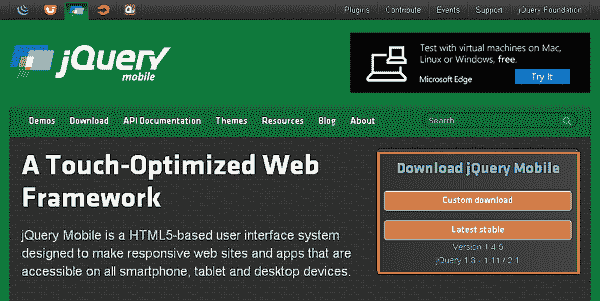

# 什么是 jQuery Mobile？

> 原文:[https://www.geeksforgeeks.org/what-is-jquery-mobile/](https://www.geeksforgeeks.org/what-is-jquery-mobile/)

**什么是 jQuery Mobile？**

jQuery Mobile 是一个基于 HTML5 的用户界面系统，旨在使所有智能手机、平板电脑和桌面设备都可以访问响应迅速的网站和应用程序。

jQuery Mobile 框架在“少写多做”的口头禅上更上一层楼。jQuery mobile 框架不需要为每个移动设备或操作系统编写独特的应用程序，而是允许您设计一个高度品牌化的响应网站或应用程序，适用于所有流行的智能手机、平板电脑和桌面平台。

**jQuery 手机的特点:**

*   它的工作基础是“少写多做”。
*   它用于制作响应性网站和应用程序。
*   它是开源的，并且是跨平台兼容的框架。
*   它利用 jQuery 和 jQuery UI 的特性来制作手机兼容的网站。

**怎么用？**

我们可以通过两种方式将 jQuery Mobile 添加到项目中:

*   下载包文件
*   使用 CDN 链接

**下载包:**当你打开 jQuery mobile 的主网站即 jquerymobile.com/,时，你会看到有两个选项可以下载 jQuery Mobile 库。

*   **自定义下载-**该选项用于下载库的自定义版本。
*   **最新稳定–**该选项用于获取 jQuery 移动库的稳定最新版本。



**使用 CDN 链接:**我们需要包含三个 CDN 链接，以便将 jQuery Mobile 包含到我们的项目中。这三个链接是–

*   包括 jQuery 移动样式表
*   包括 jQuery 库
*   包括 jQuery 移动库

> <link rel="”stylesheet”" href="”http://code.jquery.com/mobile/1.4.5/jquery.mobile-1.4.5.min.css”">

**示例:**这个示例描述了如何在 web 应用程序中使用 jQuery Mobile 类。

## 超文本标记语言

```html
<!DOCTYPE html>
<html>

<head>
    <meta name="viewport" content=
        "width = device-width, initial-scale = 1">
    <link rel="stylesheet" href=
"https://code.jquery.com/mobile/1.4.5/jquery.mobile-1.4.5.min.css">
    <script src="https://code.jquery.com/jquery-1.11.3.min.js">
    </script>
    <script src=
"https://code.jquery.com/mobile/1.4.5/jquery.mobile-1.4.5.min.js">
    </script>
</head>

<body>
    <div data-role="page" id="pageone">
        <div data-role="header">
            <h1>GeeksforGeeks</h1>
        </div>

        <div data-role="main" class="ui-content">
            <p>
                A Computer Science portal for geeks. It 
                contains well written, well thought and 
                well explained computer science and 
                programming articles, ...
            </p>
        </div>

        <div data-role="footer">
            <p>Thanks for visiting GeeksforGeeks!</p>
        </div>
    </div>
</body>

</html>
```

**输出:**


**参考:**T2】https://jquerymobile.com/