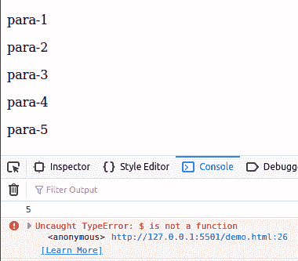

# 什么是 jQuery.noConflict？

> 原文:[https://www.geeksforgeeks.org/what-is-jquery-noconflict/](https://www.geeksforgeeks.org/what-is-jquery-noconflict/)

在 Jquery 中， **$** 符号只是 **JQuery 的别名。**表示**$(“p”)**和 **JQuery。(“p”)，**两者完全相同。我们可以用任何一种。这个 **$** 符号被很多 Javascript 库用作函数名或者变量名。在开发的时候，很明显我们将使用许多库和 JQuery。可能有其他任何库也在使用 **$** 符号。在这种情况下，当两个框架使用相同的 **$** 符号时，一个可能会停止工作。

为了解决这个问题，JQuery 实现了 **noConflict()** 方法。 **noConflict()** 方法返回 **$，**的控制权，以便其他框架/库可以使用。

**语法:**

```
$.noConflict();
```

**参数:**不接受任何参数。

**返回值:**返回对 jQuery 的引用。

**示例 1:** jQuery 代码展示 noConflicct()方法的工作原理

## 超文本标记语言

```
<!DOCTYPE html>
<html lang="en">

<head>
    <!-- Using jquery library -->
    <script src=
"https://code.jquery.com/jquery-git.js">
    </script>
    <meta charset="UTF-8">
    <meta http-equiv="X-UA-Compatible" content="IE=edge">
    <meta name="viewport" 
          content="width=device-width, initial-scale=1.0">
</head>

<body>
    <p>para-1</p>

    <p>para-2</p>

    <p>para-3</p>

    <p>para-4</p>

    <p>para-5</p>

    <script>
        // Calling with $ sign
        console.log($("p").length)

        // Releasing the control of $
        $.noConflict();

        // Calling again with $ sign
        console.log($("p").length)
    </script>
</body>

</html>
```

**输出:**在这里可以看到 **$** 标志的控制解除后，我们就不能再使用 **$** 标志了。这就是为什么当我们再次用 **$符号调用 length 属性时，我们收到了一个**错误**。**所以基本上，调用 **noConflict()** 方法后，我们要用 **jQuery** 代替 **$** 符号。而 **$** 标志将被其他图书馆使用。



**例 2:**

## 超文本标记语言

```
<!DOCTYPE html>
<html lang="en">

<head>
    <!-- using jquery library -->
    <script src=
"https://code.jquery.com/jquery-git.js">
    </script>
</head>

<body>
  <p>para-1</p>

  <p>para-2</p>

  <p>para-3</p>

  <p>para-4</p>

  <p>para-5</p>

  <script>
      $.noConflict();
      console.log(jQuery("p").length);
      // Code that uses other library's $ can follow here.
  </script>
</body>

</html>
```

**输出:**好的，由于我们的代码中存在其他库，所以我们不能对 jQuery 代码使用$ sign，而且我们非常懒，所以我们不想每一行都写 JQuery。那么为什么不呢，为 jQuery 创建我们自己的别名。

```
5
```

**为 jQuery 创建别名:****noConflict()**方法返回一个对 jQuery 的引用，我们可以将其存储在一个变量中以备将来使用。

**例 3:**

## 超文本标记语言

```
<!DOCTYPE html>
<html lang="en">

<head>
   <!-- using jquery library -->
   <script src=
"https://code.jquery.com/jquery-git.js">
   </script>
</head>

<body>
  <p>para-1</p>

  <p>para-2</p>

  <p>para-3</p>

  <p>para-4</p>

  <p>para-5</p>

  <script>
      console.log($("p").length)
      let gk = $.noConflict();
      console.log(gk("p").length);
  </script>
</body>

</html>
```

**输出:**

```
5
5
```

**案例:** Rohan 正在用 jQuery 做他的学校项目，他已经写了大约 100 行 jQuery 代码。他即将完成他的项目，但后来他想在他的项目中增加一些功能。所以他添加了一些同样使用$ sign 的 javascript 库，所以他使用了 noConflict()方法。但是当他添加了 **noconflict()** 方法时，他**意识到他必须用 jQuery 替换所有先前的$符号。**

**不……**我们不需要用 jQuery 改变每个$符号。

**在函数内部使用$符号:**如果我们有一个使用$符号的函数，我们可以将$符号作为参数传递给该函数。这将允许我们在函数内部使用$符号，但是我们仍然必须在函数外部使用 jQuery。

**示例:**

## 超文本标记语言

```
<!DOCTYPE html>
<html lang="en">

<head>
    <!-- using jquery library -->
    <script src=
"https://code.jquery.com/jquery-git.js">
    </script>
</head>

<body>
  <p>para-1</p>

  <p>para-2</p>

  <p>para-3</p>

  <p>para-4</p>

  <p>para-5</p>

  <script>
    $.noConflict();
    jQuery(document).ready(function ($) {
      console.log($("p").length);
    });
  </script>
</body>

</html>
```

**输出:**

```
5
```