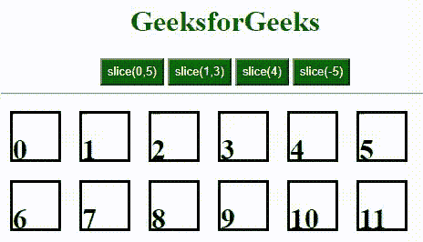

# 什么是 jQuery 中的 slice()方法？

> 原文:[https://www . geesforgeks . org/what-is-slice-method-in-jquery/](https://www.geeksforgeeks.org/what-is-slice-method-in-jquery/)

当 jQuery 中有多个所选元素的实例时，如果我们想添加特定的属性或者从一个特定的索引中选择元素到另一个索引中，可以使用 jQuery 中的 [slice()方法](https://www.geeksforgeeks.org/jquery-slice-with-examples/)。使用 jQuery 的切片，我们可以只向我们想要添加属性的元素范围添加属性。这是基于 0 的索引。

**语法:**

```html
$('selector').slice(start_index,end_index);
```

**注:**

*   如果 start_index 和 end_index 在结束索引被考虑之前都被给定了从开始索引到索引的所有元素。
*   如果参数中只给出了 start_index，那么从该索引开始到结束的所有元素都将被考虑。
*   如果它是负的，它会从最后被考虑。

**示例:**

## 超文本标记语言

```html
<!DOCTYPE html>
<html lang="en">
  <head>
    <meta charset="UTF-8" />
    <meta http-equiv="X-UA-Compatible" content="IE=edge" />
    <meta name="viewport" 
          content="width=device-width, initial-scale=1.0" />
    <!-- Including jQuery  -->
    <script
      src=
"https://code.jquery.com/jquery-3.6.0.min.js"
      letegrity=
"sha256-/xUj+3OJU5yExlq6GSYGSHk7tPXikynS7ogEvDej/m4="
      crossorigin="anonymous">
    </script>
    <style>
      h1 {
        color: #006600;
      }

      button {
        color: white;
        background-color: #006600;
        width: auto;
        height: 30px;
      }

      body {
        text-align: center;
      }

      h1 {
        color: black;
      }

      div {
        margin: 10px;
        height: 50px;
        width: 50px;
        position: relative;
        float: left;
        text-align: center;
        display: flex;
        border: 3px solid black;
      }
    </style>
  </head>

  <body>
    <h1 style="color: #006600">GeeksforGeeks</h1>

    <button id="slice1">slice(0,5)</button>
    <button id="slice2">slice(1,3)</button>
    <button id="slice3">slice(4)</button>
    <button id="slice4">slice(-5)</button>

    <hr />

    <div>
      <h1>0</h1>
    </div>
    <div>
      <h1>1</h1>
    </div>
    <div>
      <h1>2</h1>
    </div>
    <div>
      <h1>3</h1>
    </div>
    <div>
      <h1>4</h1>
    </div>
    <div>
      <h1>5</h1>
    </div>
    <div>
      <h1>6</h1>
    </div>
    <div>
      <h1>7</h1>
    </div>
    <div>
      <h1>8</h1>
    </div>
    <div>
      <h1>9</h1>
    </div>
    <div>
      <h1>10</h1>
    </div>
    <div>
      <h1>11</h1>
    </div>

    <script>
      $(document).ready(function () {
        $("#slice1").click(function () {
          $("div").slice(0, 5).css("background-color", "#006600");
        });
        $("#slice1").dblclick(function () {
          $("div").slice(0, 5).css("background-color", "white");
        });
        $("#slice2").click(function () {
          $("div").slice(1, 3).css("background-color", "#006600");
        });
        $("#slice2").dblclick(function () {
          $("div").slice(1, 3).css("background-color", "white");
        });
        $("#slice3").click(function () {
          $("div").slice(4).css("background-color", "#006600");
        });
        $("#slice3").dblclick(function () {
          $("div").slice(4).css("background-color", "white");
        });
        $("#slice4").click(function () {
          $("div").slice(-5).css("background-color", "#006600");
        });
        $("#slice4").dblclick(function () {
          $("div").slice(-5).css("background-color", "white");
        });
      });
    </script>
  </body>
</html>
```

**输出:**

