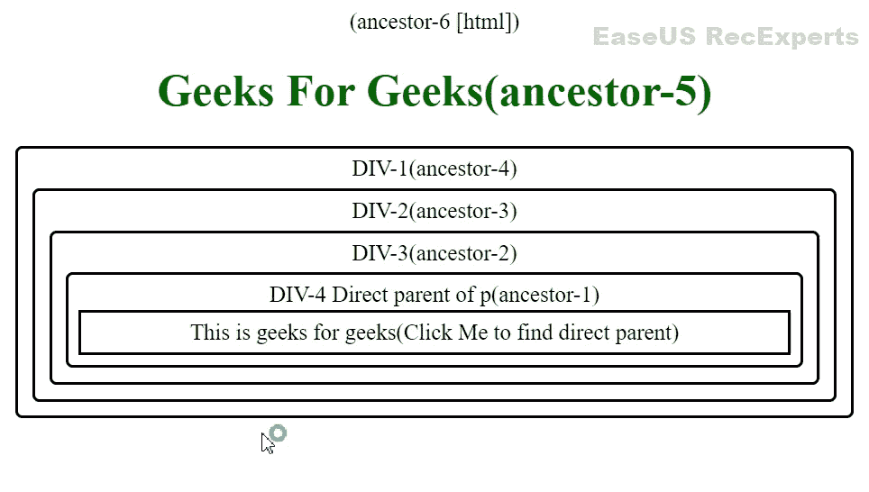
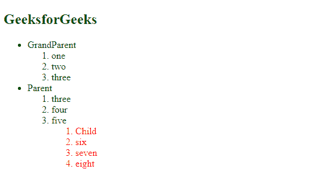
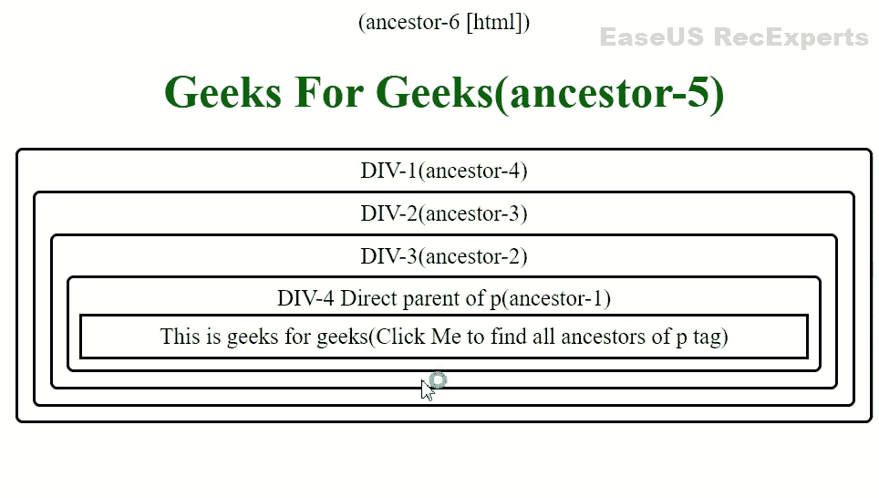
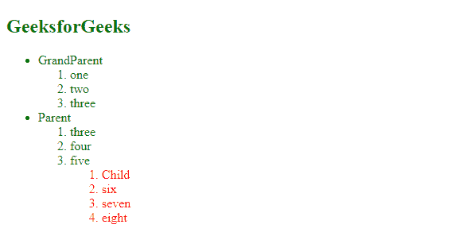

# jQuery 中 parent()和 parents()方法有什么区别？

> 原文:[https://www . geeksforgeeks . org/parent-and-parent-methods-in-jquery/](https://www.geeksforgeeks.org/what-is-the-difference-between-parent-and-parents-methods-in-jquery/)区别是什么

jQuery [父()和父()](https://www.geeksforgeeks.org/jquery-parent-parents-with-examples/)方法返回作为 DOM 祖先的元素。它在 DOM 中向上遍历以寻找祖先。

在本文中，我们将了解**父母()**和**父母()**方法的区别。

**parent()方法:****parent()**方法只遍历 DOM 之前的一个级别，并使用 jQuery 返回所选元素的直接父元素或最近的第一个祖先元素。

**语法:**

```
$('selector').parent();
```

**例 1:**

## 超文本标记语言

```
<!DOCTYPE html>
(ancestor-6 )
<html lang="en">

<head>
    <meta charset="UTF-8">
    <meta http-equiv="X-UA-Compatible" content="IE=edge">
    <meta name="viewport" 
          content="width=device-width, initial-scale=1.0">

    <!-- Including jQuery  -->
    <script src="https://code.jquery.com/jquery-3.6.0.min.js"
            integrity="sha256-/xUj+3OJU5yExlq6GSYGSHk7tPXikynS7ogEvDej/m4=" 
            crossorigin="anonymous">
   </script>
    <style>
        h1 {
            color: #006600;
        }

        body {
            text-align: center;
        }

        div {
            text-align: center;
            padding: 5px;
            border: 2px solid black;
            border-radius: 5px;
            margin: 5px;
        }       
        p{
            border: 2px solid black;
            margin: 2px;
            padding: 5px;
            background-color: white;
        }
        /* The class that turns the div's 
           background colour to red */
        .bg-blue {
            background-color: blue;
        }
    </style>
</head>

<body>    
    <h1>Geeks For Geeks(ancestor-5)</h1>
    <div>
      DIV-1(ancestor-4)
      <div> 
        DIV-2(ancestor-3)
        <div>
            DIV-3(ancestor-2)
            <div> 
                DIV-4 Direct parent of p(ancestor-1)
                <p id= 'btn'>
                  This is geeks for geeks(Click 
                  Me to find direct parent)
                </p>
            </div>
          </div>
      </div>
     </div>

    <script>
      $('p').click(function(){
        $('p').parent().addClass('bg-blue');
      });
    </script>
</body>

</html>
```

**输出:**



直接父母

如果我们观察到这一点，将类“ *bg-blue* ”添加到 *p* 的直接父代即 *DIV-4* 中，并将背景颜色更改为蓝色，因为 *p* 的背景颜色为白色，所以它保持为白色。

**示例 2:** 下面的代码还以绿色显示了子元素的父元素。

## 超文本标记语言

```
<!DOCTYPE html>
<html lang="en">

<head>
    <meta charset="UTF-8">
    <meta http-equiv="X-UA-Compatible" content="IE=edge">
    <meta name="viewport" content="width=device-width, initial-scale=1.0">
    <title>Geeks for Geeks</title>
    <!-- Including jQuery  -->
    <script src="https://code.jquery.com/jquery-3.6.0.min.js"
        letegrity="sha256-/xUj+3OJU5yExlq6GSYGSHk7tPXikynS7ogEvDej/m4="
            crossorigin="anonymous"></script>
    <style>
        h2 {
            color: #006600;
        }

        button {
            color: white;
            background-color: #006600;
            width: 100px;
            height: 30px;
        }

        #sublist2 {
            color: red;
        }
    </style>
</head>

<body>
    <h2>GeeksforGeeks</h2>

    <div>
        <ul id="list1">
            <li>
                GrandParent
                <ol id="sublist1">
                    <li>one</li>
                    <li>two</li>
                    <li>three</li>
                </ol>
            </li>
            <li>
                Parent
                <ol>
                    <li>three</li>
                    <li>four</li>
                    <li>five</li>
                    <ol id="sublist2">
                        <li> Child</li>
                        <li>six</li>
                        <li>seven</li>
                        <li>eight</li>
                    </ol>
                </ol>
            </li>
        </ul>
    </div>

    <script>
        $('ol#sublist2').parent().css('color', 'green');
    </script>
</body>

</html>
```

**输出:**绿色有序列表是子元素的父元素。



**parents()方法:****parents()**方法遍历 DOM 中高于所选元素的所有元素级别，并使用 jQuery 返回所选元素的所有祖先元素。

**语法:**

```
$('selector').parents();
```

**例 1:**

## 超文本标记语言

```
<!DOCTYPE html>
(ancestor-6 )
<html lang="en">

<head>
    <meta charset="UTF-8">
    <meta http-equiv="X-UA-Compatible" content="IE=edge">
    <meta name="viewport" 
          content="width=device-width, initial-scale=1.0">
    <!-- Including jQuery  -->
    <script src="https://code.jquery.com/jquery-3.6.0.min.js"
            integrity="sha256-/xUj+3OJU5yExlq6GSYGSHk7tPXikynS7ogEvDej/m4="
            crossorigin="anonymous">
    </script>
    <style>
        h1 {
            color: #006600;
        }

        body {
            text-align: center;
        }

        div {
            text-align: center;
            padding: 5px;
            border: 2px solid black;
            border-radius: 5px;
            margin: 5px;
        }       
        p{
            border: 2px solid black;
            margin: 2px;
            padding: 5px;
            background-color: white;
        }
        /* The class that turns the div's background colour to red */
        .bg-blue {
            background-color: blue;
        }
    </style>
</head>

<body>

    <h1>Geeks For Geeks(ancestor-5)</h1>
    <div>
      DIV-1(ancestor-4)
      <div> 
        DIV-2(ancestor-3)
        <div>
            DIV-3(ancestor-2)
            <div> 
                DIV-4 Direct parent of p(ancestor-1)
                <p id= 'btn'>
                  This is geeks for geeks(Click Me to find all 
                  ancestors of p tag)
                </p>

            </div>
          </div>
      </div>
     </div>

    <script>
      $('p').click(function()
      {
         $('p').parents().addClass('bg-blue');
      });
    </script>
</body>
</html>
```

**输出:**



所有祖先

如果我们观察到这一点，类*‘BG-blue’*被添加到 *p* 的所有祖先中，即 *DIV-4、DIV-3、DIV-2、DIV-1、h1、HTML* 标签，并将背景颜色更改为蓝色，因为 *p* 的背景颜色为白色，所以它保持为白色。

**例 2:**

## 超文本标记语言

```
<!DOCTYPE html>
<html lang="en">

<head>
    <meta charset="UTF-8">
    <meta http-equiv="X-UA-Compatible" content="IE=edge">
    <meta name="viewport" 
         content="width=device-width, initial-scale=1.0">

    <!-- Including jQuery  -->
    <script src="https://code.jquery.com/jquery-3.6.0.min.js"
            integrity="sha256-/xUj+3OJU5yExlq6GSYGSHk7tPXikynS7ogEvDej/m4=" 
            crossorigin="anonymous">
    </script>
    <style>
        h2 {
            color: #006600;
        }

        button {
            color: white;
            background-color: #006600;
            width: 100px;
            height: 30px;
        }

        #sublist2 {
            color: red;
        }
    </style>
</head>

<body>
    <h2>GeeksforGeeks</h2>

    <div>
        <ul id="list1">
            <li>
                GrandParent
                <ol id="sublist1">
                    <li>one</li>
                    <li>two</li>
                    <li>three</li>
                </ol>
            </li>
            <li>
                Parent
                <ol>
                    <li>three</li>
                    <li>four</li>
                    <li>five</li>
                    <ol id="sublist2">
                        <li> Child</li>
                        <li>six</li>
                        <li>seven</li>
                        <li>eight</li>

                    </ol>
                </ol>
            </li>
        </ul>
    </div>

    <script>
        $('ol#sublist2').parents().css('color', 'green');
    </script>

</body>

</html>
```

**输出:**所有绿色有序列表都是子元素的父元素。



**parent()和 parents()的区别方法:**

<figure class="table">

| **父项()方法**T3】 | **父母()方法**T3】 |
| It only traverses up one level
in the DOM of the selected element. | It traverses all levels in the DOM of the selected element up to the root, the HTML tag. |
| It returns only one element that is the direct parent of
. | It returns all elements as ancestors to the selected element
 |

</figure>