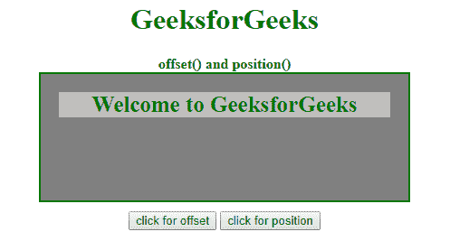
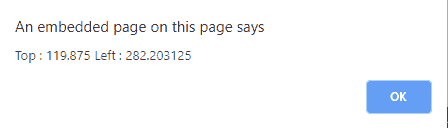
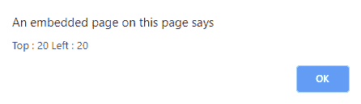

# jQuery 中位置()和偏移量()有什么区别？

> 原文:[https://www . geeksforgeeks . org/jquery 中的位置和偏移量之差是多少/](https://www.geeksforgeeks.org/what-is-the-difference-between-position-and-offset-in-jquery/)

jQueryUI 方法和都返回包含顶部和左侧位置的整数坐标属性的对象。顶部和左侧坐标的位置以像素为单位返回。这两个函数仅适用于可见元素，而不适用于隐藏元素。

**示例:**该示例给出了包含文本的框的顶部和左侧坐标。

```html
<!DOCTYPE html>
<html>

<head>
    <title>The difference between
      offset and position Method</title>
    <script src=
"https://ajax.googleapis.com/ajax/libs/jquery/3.3.1/jquery.min.js">
    </script>

    <!-- jQuery code to show the method -->
    <script>
        /* code for position */
        $(document).ready(function() {
            $("#position").click(function() {
                var Geek = $("#testDiv").position();
                alert("Top : " + Geek.top +
                    " Left : " + Geek.left);
            });

            /* code for offset */
            $("#offset").click(function() {
                var Geek = $("#testDiv").offset();
                alert("Top : " + Geek.top +
                    " Left : " + Geek.left);
            });
        });
    </script>

    <style>
        #container {
            width: 40%;
            min-height: 100px;
            padding: 20px;
            font-size: 25px;
            border: 2px solid green;
            font-weight: bold;
            color: green;
            background: gray;
            position: relative;
        }
        #testDiv {
            background: silver;
        }
        h1 {
            color: green;
        }
    </style>
</head>

<body>
    <center>
        <h1>GeeksforGeeks</h1>
        <b>offset() and position()</b>
        <div>
            <div id="container">
                <div id="testDiv">
                  Welcome to GeeksforGeeks
                </div>
            </div>

            <div style="height:10px"></div>
            <button id="offset">click for offset</button>
            <button id ="position">
                  click for position
            </button>
        </div>
    </center>
</body>

</html>
```

**输出:**

*   **点击任意按钮前:**
    
*   **点击按钮后:**
    

    偏移:

    

    位置:

**偏移量()与位置()之差方法:**

| 偏移()方法 | 位置()方法 |
| jQuery 中的 offset()方法返回 HTML 元素相对于文档的第一个找到的位置。 | jQuery 中的 position()方法返回 HTML 元素相对于其偏移父元素的当前位置。 |
| jQuery UI 偏移量()是相对于文档的。 | jQuery UI 位置()是相对于父元素的。 |
| 当您想要将新的元素放在另一个已经存在的元素之上时，最好使用 jQuery offset()方法。 | 当您想要在同一个容器中的另一个 DOM 元素附近放置一个新元素时，最好使用 jQuery position()方法。 |
| offset()方法主要用于拖放功能。 | position()方法用于相对于文档、窗口或其他元素(如鼠标或光标)定位元素。 |