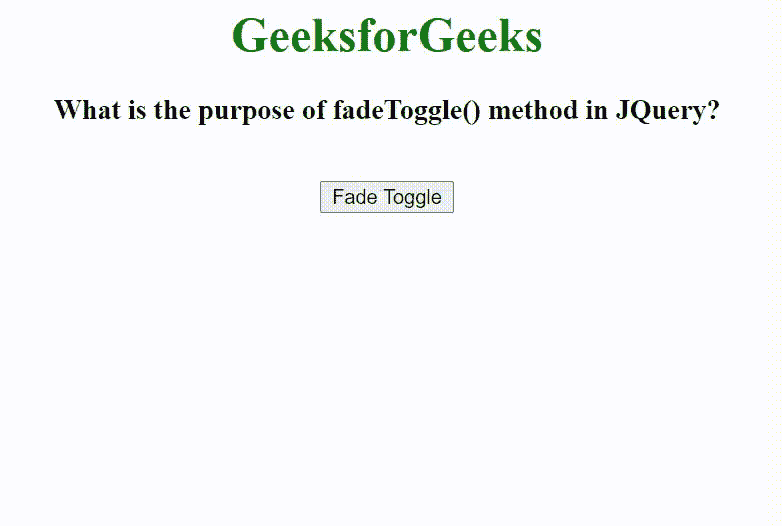

# fade toggle()方法在 JQuery 中的用途是什么？

> 原文:[https://www . geesforgeks . org/fade toggle-method-in-jquery/](https://www.geeksforgeeks.org/what-is-the-purpose-of-fadetoggle-method-in-jquery/)的目的是什么

在本文中，我们将看到如何使用 jQuery 创建 fadeToggle 效果。可以使用 [fadeToggle()方法](https://www.geeksforgeeks.org/jquery-fadetoggle-method/)创建 fadeToggle 效果。

**fadeToggle()方法**用于在 fadeIn()和 fadeOut()方法之间切换。如果元素淡入，fadeToggle()将淡出。如果元素淡出，fadeToggle()将淡入。

**语法:**

```html
$(selector).fadeToggle(speed, easing, callback)
```

在下面的例子中，我们首先创建一个大小为 250px X 200px 的 div，并将其 display 属性设置为 none。另外，创建了一个调用 fadeToggle()方法的按钮。当用户单击按钮时，调用 fadeToggle()方法，div 元素将显示，如果再次单击同一按钮，div 元素将消失。

**示例:**

## 超文本标记语言

```html
<!DOCTYPE html>
<html lang="en">

<head>
    <meta charset="UTF-8">
    <meta http-equiv="X-UA-Compatible" content="IE=edge">
    <meta name="viewport" content=
          "width=device-width, initial-scale=1.0">

    <!-- Including jQuery -->
    <script src="
https://ajax.googleapis.com/ajax/libs/jquery/3.3.1/jquery.min.js">
    </script>

    <style>
        div {
            width: 250px;
            height: 200px;
            display: none;
            background-color: green;
        }
    </style>
</head>

<body>
    <center>
        <h1 style="color: green;">
            GeeksforGeeks
        </h1>

        <h3>
            What is the purpose of fadeToggle() 
            method in JQuery?
        </h3>

        <div></div>
        <br>

        <button id="delay">Fade Toggle</button>
    </center>

    <script>
        $(document).ready(function() {
            $('#delay').click(function() {
                $("div").fadeToggle(1000);
            });
        });
    </script>
</body>

</html>
```

**输出:**

