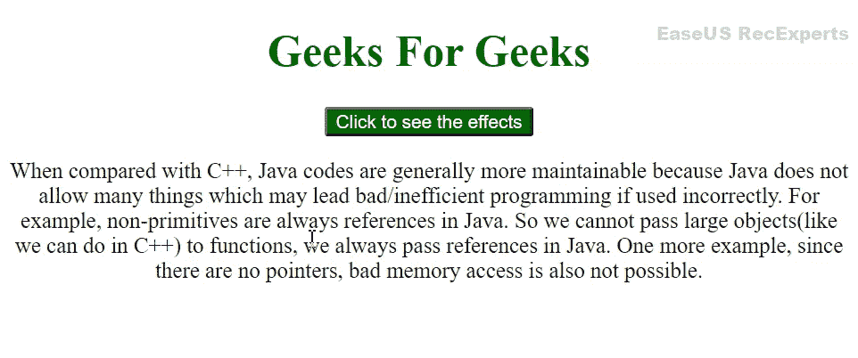

# jQuery 中代码执行的起点是什么？

> 原文:[https://www . geesforgeks . org/什么是 jquery 中代码执行的起点/](https://www.geeksforgeeks.org/what-is-the-starting-point-of-code-execution-in-jquery/)

jQuery 从 [**$(文档)开始执行代码。ready()**](https://www.geeksforgeeks.org/jquery-ready-with-examples/) 函数，每当整个 HTML DOM 被加载并完全由浏览器呈现时执行，这样事件处理程序就可以正常工作而不会出现任何错误。这 *$(文件)。ready()* 函数只有在浏览器加载了整个 DOM 之后才加载脚本。

当我们不使用 *$(文档)时，浏览器需要时间准备好文档。脚本标签中的 ready()* 函数。脚本中的 jQuery 可能会在某个事件处理程序或其他函数正在处理的内容或元素之前执行，因此这可能会在网页中引起一些问题，因此每当整个 DOM 准备就绪时，总是有必要开始执行。所以我们使用 *$(文档)。ready()* 功能。

**语法:**

```
$(document).ready(function({....})); 
```

或者

```
$(function({....}));
```

**$(文档)。ready()** 确保在加载 DOM 时得到执行。当我们希望脚本的执行能够加载所有的资源，比如图像、视频和 iframes 时，我们需要使用 **$(窗口)。on( "load "，function() { … })。**

**语法:**

```
$( window ).on( "load", function() { ... })
```

**示例:**

## 超文本标记语言

```
<!DOCTYPE html>
<html lang="en">

<head>
    <meta charset="UTF-8">
    <meta http-equiv="X-UA-Compatible" content="IE=edge">
    <meta name="viewport" 
          content="width=device-width, initial-scale=1.0">

    <!-- Including jQuery  -->
    <script src="https://code.jquery.com/jquery-3.6.0.min.js"
            integrity="sha256-/xUj+3OJU5yExlq6GSYGSHk7tPXikynS7ogEvDej/m4=" 
            crossorigin="anonymous">
    </script>
    <style>
        h1 {
            color: #006600;
            text-align: center;
        }
        #btn{
            text-align: center;
            background-color:#006600 ;
            color: white;
        }
        body {
            text-align: center;
        }
    </style>
</head>

<body>
    <h1> Geeks For Geeks</h1>
    <button id = "btn"> Click to see the effects</button>
    <div>
        <p>
            When compared with C++, Java codes are  
            generally more maintainable because Java  
            does not allow many things which may  
            lead bad/inefficient programming if used 
            incorrectly. For example, non-primitives  
            are always references in Java. So we  
            cannot pass large objects(like we can do  
            in C++) to functions, we always pass 
            references in Java. One more example,  
            since there are no pointers, bad memory  
            access is also not possible. 
        </p>

    </div>
    <script>
        $(document).ready(function (){
            console.log("Document is ready")
            $('#btn').click(function(){
            $('p').fadeToggle(1000);
        })
        })
    </script>
</body>

</html>
```

**输出:**



文档就绪