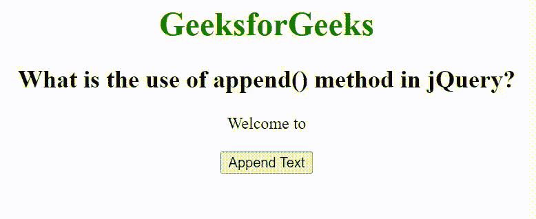

# append()方法在 JQuery 中有什么用？

> 原文:[https://www . geesforgeks . org/jquery 中追加方法的用途是什么/](https://www.geeksforgeeks.org/what-is-the-use-of-append-method-in-jquery/)

在本文中，我们将看到如何在 jQuery 中使用 [append()方法](https://www.geeksforgeeks.org/jquery-append-method/)。[追加()方法](https://www.geeksforgeeks.org/jquery-append-method/)用于在现有元素中插入新内容。还有一些其他方法可以在现有元素中插入新内容，它们是–[prepend()](https://www.geeksforgeeks.org/jquery-prepend-with-examples/)、 [html()](https://www.geeksforgeeks.org/jquery-html-method/) 、 [text()](https://www.geeksforgeeks.org/jquery-text-method/) 、 [before()](https://www.geeksforgeeks.org/jquery-before-method/) 、[before()](https://www.geeksforgeeks.org/jquery-after-with-examples/)、 [wrap()](https://www.geeksforgeeks.org/jquery-wrap-with-examples/) 等。

现在，让我们试着详细理解 [append()方法](https://www.geeksforgeeks.org/jquery-append-method/)。此方法用于将内容插入所选元素的末尾。

**语法:**

```
$(selector).append(content, function(index, html))
```

**参数:**

*   **内容:**是指定要插入内容的必选项。它可以主要包含 3 种可能的值，它们是–
    *   HTML 值
    *   jQuery 对象
    *   DOM 值
*   **函数(索引，HTML):** 它是一个可选参数，指定接受索引和 HTML 两个参数的函数，返回您想要插入的内容。
    *   **索引:**此参数指定元素在集合中的索引位置。
    *   **HTML:** 此参数指定所选元素的当前 HTML。

**示例:**

## 超文本标记语言

```
<!DOCTYPE html>
<html>

<head>
    <title>
        What is the use of append() method in JQuery?
    </title>

    <script src="
https://ajax.googleapis.com/ajax/libs/jquery/3.3.1/jquery.min.js">
    </script>

    <script type="text/javascript">
        $(document).ready(function() {
            $("#btn").click(function() {
                $('div').append(' GeeksforGeeks')
            })
        });
    </script>
</head>

<body style="text-align: center;">
    <h1 style="color: green;">GeeksforGeeks</h1>

    <h2>
        What is the use of append() method in jQuery?
    </h2>

    <div>Welcome to</div>
    <br>

    <button id="btn">Append Text</button>
</body>

</html>
```

**输出:**

