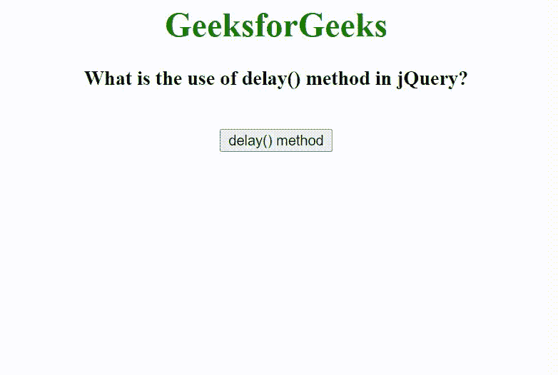

# 延迟()方法在 jQuery 中有什么用？

> 原文:[https://www . geeksforgeeks . org/什么是 jquery 中的延迟使用方法/](https://www.geeksforgeeks.org/what-is-the-use-of-delay-method-in-jquery/)

在本文中，我们将看到如何使用 [delay()方法](https://www.geeksforgeeks.org/jquery-delay-with-examples/)以及为什么在 jQuery 中使用它。delay()方法用于设置一个计时器来延迟队列中下一个项目的执行。

**语法:**

```html
$(selector).delay(para1, para2);
```

在下面的例子中，我们首先创建一个大小为 250px X 200px 的 div，并将其 display 属性设置为 none。另外，创建了一个调用 delay()方法的按钮。当用户点击按钮时，调用 delay()方法和 fadeIn()方法。delay()方法采用 2000 毫秒的值，这意味着 div 将在 2000 毫秒后显示。

**示例:**

## 超文本标记语言

```html
<!DOCTYPE html>
<html lang="en">

<head>
    <meta charset="UTF-8">
    <meta http-equiv="X-UA-Compatible" content="IE=edge">
    <meta name="viewport" content=
        "width=device-width, initial-scale=1.0">

    <!-- Including jQuery -->
    <script src="
https://ajax.googleapis.com/ajax/libs/jquery/3.3.1/jquery.min.js">
    </script>

    <style>
        div {
            width: 250px;
            height: 200px;
            display: none;
            background-color: green;
        }
    </style>
</head>

<body>
    <center>
        <h1 style="color: green;">
            GeeksforGeeks
        </h1>

        <h3>
            What is the use of delay() 
            method in jQuery?
        </h3>

        <div></div>
        <br>

        <button id="delay">delay() method</button>
    </center>

    <script>
        $(document).ready(function() {
            $('#delay').click(function() {
                $('div').delay(2000).fadeIn();
            });
        });
    </script>
</body>

</html>
```

**输出:**

