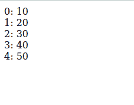
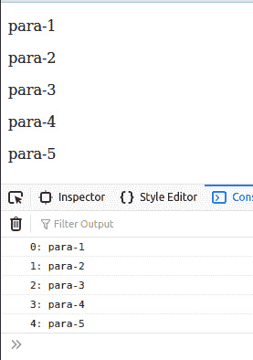

# 有什么用。jQuery 中的每个()函数？

> 原文:[https://www . geeksforgeeks . org/jquery 中每个函数的用途是什么/](https://www.geeksforgeeks.org/what-is-the-use-of-each-function-in-jquery/)

jQuery 中的**[()](https://www.geeksforgeeks.org/jquery-misc-each-method/)**函数分别遍历对象和数组。具有 length 属性的数组从索引 0 遍历到 length-1，而像对象这样的数组通过它们的属性名遍历。

**语法:**

```html
$.each('array or object', function(index, value){
  // Your code
})
```

在这。每个()函数、数组或对象都作为第一个参数和一个回调函数给出。这个回调函数可选地接受两个参数:索引和值。因此，我们必须向每个()方法传递一个回调函数。

**例 1:**

## 超文本标记语言

```html
<!DOCTYPE html>
<html lang="en">

<head>
    <!-- using jquery library -->
    <script src=
"https://code.jquery.com/jquery-git.js">
    </script>
</head>

<body>
  <script>
    let arr = [10, 20, 30, 40, 50];
    $.each(arr, function (index, value) {
        document.write(index + ": " + value + "<br>");
    });
  </script>
</body>

</html>
```

**输出:**



**$(选择器)。每个():**我们也可以通过回调函数返回 false 来提前打破循环。它与上面的每个()函数相同，但是它遍历 JQuery 对象的 DOM 元素，并且可以为每个元素执行一个函数。

**语法:**

```html
$('selector').each(function(index, value){
    // Your code
})
```

它只接受为每个选定元素执行的回调函数。

**示例:**

## 超文本标记语言

```html
<!DOCTYPE html>
<html lang="en">

<head>
    <!-- using jquery library -->
    <script src=
"https://code.jquery.com/jquery-git.js">
    </script>
</head>

<body>
    <p>para-1</p>
    <p>para-2</p>
    <p>para-3</p>
    <p>para-4</p>
    <p>para-5</p>
    <script>
        $("p").each(function (index) {
            console.log(index 
                + ": " + $(this).text());
        });
    </script>
</body>

</html>
```

**输出:**

