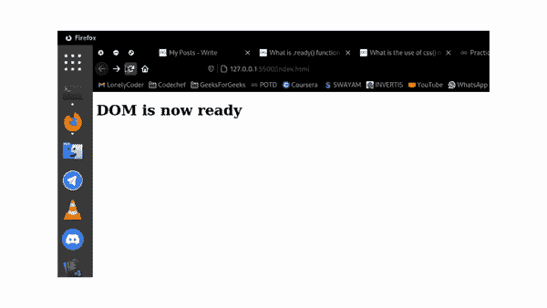

# ready()函数在 jQuery 中有什么用？

> 原文:[https://www . geeksforgeeks . org/什么是在 jquery 中使用就绪函数/](https://www.geeksforgeeks.org/what-is-the-use-of-ready-function-in-jquery/)

在本文中，我们将看到如何使用[jQuery 库](https://www.geeksforgeeks.org/jquery-introduction/)提供的 [ready()](https://www.geeksforgeeks.org/jquery-ready-with-examples/) 功能。 [ready()](https://www.geeksforgeeks.org/jquery-ready-with-examples/) 函数仅在 HTML DOM 完全加载时用于执行一些 javascript 代码。在 DOM 完全加载之前，我们不应该操作它。 [ready()](https://www.geeksforgeeks.org/jquery-ready-with-examples/) 方法检测 DOM 何时加载成功非常方便。

**语法:**

```html
$(selector).ready(handler)
```

这里的“处理程序”是一个 JavaScript 函数，一旦 DOM 准备好了，它就会被执行。括号内的选择器无关紧要。例如，下面三种语法的意思是一样的。

**示例:**在下面的示例中，我们在 ready()函数的帮助下，将 h1 的文本更改为“DOM 现在准备好了”，该函数在 DOM 完全加载时触发。

## 超文本标记语言

```html
<!DOCTYPE html>
<html>

<head>
    <script src=
"https://ajax.googleapis.com/ajax/libs/jquery/3.5.1/jquery.min.js">
    </script>
</head>

<body>
    <h1></h1>
    <script>
        $.holdReady(true);
        setTimeout(() => {
            $.holdReady(false);
        }, 2000);
        function onDOMReady() {
            $().ready(() => {
                $("h1").text("DOM is now ready");
            });
        }
        onDOMReady();
    </script>
</body>

</html>
```

**输出:**这里我们使用 holdReady()函数来保持 DOM ready 事件 2 秒，这样我们就可以模拟 DOM 加载的延迟来测试 [ready()](https://www.geeksforgeeks.org/jquery-ready-with-examples/) 函数。

