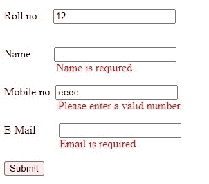

# 什么是 jQuery 中的不引人注目的验证？

> 原文:[https://www . geesforgeks . org/什么是不引人注目的验证 in-jquery/](https://www.geeksforgeeks.org/what-is-unobtrusive-validation-in-jquery/)

jQuery 是一个 Javascript 库。jQuery 中一个不引人注目的验证是一组 ASP.Net MVC HTML 助手扩展。通过使用 jQuery Validation 数据属性和 HTML 5 数据属性，您可以在客户端执行验证。

不引人注目的验证意味着无需编写大量的验证代码，您就可以通过添加合适的属性并包含合适的脚本文件来执行简单的客户端验证。

**需要添加这些不引人注目的验证库:**

*   jquery.validate.min.js
*   jquery . validate . include . js

**通过包管理器安装:**

*   ```html
    Bower: bower install jquery-validation
    ```

*   ```html
    NuGet: Install-Package jQuery.Validation
    ```

*   ```html
    NPM  : npm i jquery-validation 
    ```

**部分数据验证属性列表:**

4.  **必需**
    *   data-val-required=“这是必需的。”
    *   data-val="true/false "
5.  **电子邮件地址**
    *   数据值电子邮件=“错误消息”
6.  **最大长度**

    *   数据值最大长度=“错误消息”
    *   data-val-maxlength-max=“最大长度(例如 5)”
7.  minlength
    *   数据值最小长度=“错误消息”
    *   数据-值-最小长度-最小=“最小长度(例如 2)”

**不引人注目的验证方法:**

首先，我们需要在 HTML 文件的脚本中添加这些库。这些库提供了用于验证的数据属性列表(data-val、data-val-required 等)。然后应该根据可以使用不同类型数据属性的需求来构建表单。

**示例:**

```html
<!DOCTYPE html>
<html>
    <head>
        <!--These validation libraries need to be 
        included for unobtrusive validation -->
        <script src=
"https://ajax.googleapis.com/ajax/libs/jquery/3.3.1/jquery.min.js">
      </script>
        <script src=
"https://ajax.aspnetcdn.com/ajax/jquery.validate/1.13.1/jquery.validate.min.js">
      </script>
        <script src=
"https://ajax.aspnetcdn.com/ajax/mvc/5.2.3/jquery.validate.unobtrusive.min.js">
      </script>
    </head>
    <body>
        <form id="myform">
            <p>
                <label for="roll">Roll no.</label>
                <!-- data-val-required is used to 
                   specify the msg for each rule -->
                <!-- data-val is used to add rules to 
                      the input elements -->
                <input name="roll" 
                       type="number" 
                       data-val-required="Roll no. is required." 
                       data-val="true" 
                       style="margin-left: 15px;" /><br />
                <span data-valmsg-for="roll" 
                      data-valmsg-replace="true" 
                      style="margin-left: 75px; color: red;" />
            </p>
            <p>
                <label for="name">Name</label>

                <input name="name" 
                       type="text" 
                       data-val-required="Name is required."
                       data-val="true" 
                       style="margin-left: 30px;" /><br />
                <span data-valmsg-for="name" 
                      data-valmsg-replace="true" 
                      style="margin-left: 75px; color: red;" />
            </p>
            <p>
                <label for="mobile">Mobile no.</label>
                <input name="mobile" 
                       type="number" 
                       data-val-required="Mobile no. is required." 
                       data-val="true" /><br />
                <span data-valmsg-for="mobile" 
                      data-valmsg-replace="true" 
                      style="margin-left: 78px; color: red;" />
            </p>

            <p>
                <label for="email">E-Mail </label>
                <input type="email" name="email" 
                       data-val-required="Email is required." 
                       data-val="true" 
                       style="margin-left: 30px;" /><br />
                <span data-valmsg-for="email" 
                      data-valmsg-replace="true" 
                      style="margin-left: 80px; color: red;" />
            </p>

            <p>
                <input class="submit" 
                       type="submit" 
                       value="Submit" />
            </p>
        </form>
    </body>
</html>
```

**输出:**

**提交前:**


**提交后:**
