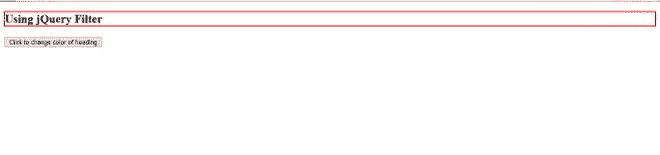
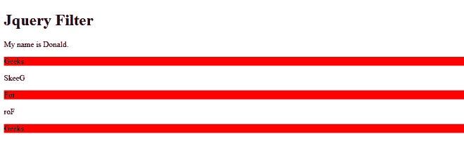

# jQuery 中的选择器和过滤器()有什么区别？

> 原文:[https://www . geeksforgeeks . org/jquery 中选择器和过滤器的区别是什么/](https://www.geeksforgeeks.org/whats-the-difference-between-selector-and-filter-in-jquery/)

[**jQuery 选择器:**](https://www.geeksforgeeks.org/jquery-selectors-and-event-methods/) 允许我们选择和操作 HTML 元素。它用于使用 jQuery 选择器选择诸如 id、类、类型、属性等 HTML 元素，然后将任何 CSS 属性或事件添加到所选的 HTML 元素中。

**语法:**选择按钮标签的语法如下

```
$("button") 
```

**示例:**

## 超文本标记语言

```
<!DOCTYPE html>
<html>

<head>
    <script src=
"https://ajax.googleapis.com/ajax/libs/jquery/3.5.1/jquery.min.js">
    </script>
    <script>
        $(document).ready(function() {
            $("button").click(function() {
                $("#heading").css("border", "2px solid red");
            });
        });
    </script>
</head>

<body>

    <h2 id="heading">Using jQuery Filter</h2>

    <button>Click to change color of heading</button>

</body>

</html>
```

**输出:**点击按钮，我们会看到标题上有红色边框。



**点击按钮创建标题边框**

[**jQuery Filter:**](https://www.geeksforgeeks.org/jquery-filter/) 该方法用于为 HTML 元素指定条件。 *Filter()方法*返回符合特定条件的元素。

**语法:**

```
$(selector).filter(criteria, function(index))
```

**示例:**

## 超文本标记语言

```
<!DOCTYPE html>
<html>

<head>
    <script src=
"https://ajax.googleapis.com/ajax/libs/jquery/3.5.1/jquery.min.js">
    </script>
    <script>
        $(document).ready(function() {
            $("p").filter(".active").css("background-color", "red");
        });
    </script>
</head>

<body>

    <h1>Jquery Filter</h1>

<p>My name is Donald.</p>

    <p class="active">Geeks</p>

    <p class="dead">SkeeG</p>

    <p class="active">For </p>

    <p class="dead">roF</p>

    <p class="active">Geeks</p>

</body>

</html>
```

**输出:过滤器**搜索出活动类标签并上色。



**过滤器激活类**

**jQuery 中选择器和过滤器()的主要区别:**

<figure class="table">

| Selector in jQuery | Filter () n jQuery |
| --- | --- |
| The jQuery selector selects all elements according to the element names you have given. | JQuery filter () adds more details to the selected elements by specifying selection criteria. |
| It works independently of filter (), which means that it is not necessary to use it with the filter () method. | It works with the selector. By combining the filter with the selector, we can achieve higher accuracy. |
| *使用的语法如下:***$(【按钮】)**选择 HTML 页面的所有按钮。 | *语法使用如下:***$(按钮)。过滤器(标准、功能(索引))**选择具有标准的按钮，并对其应用功能。 |

</figure>