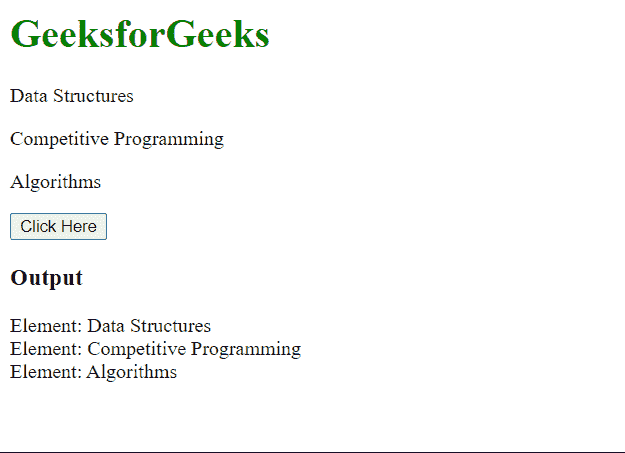
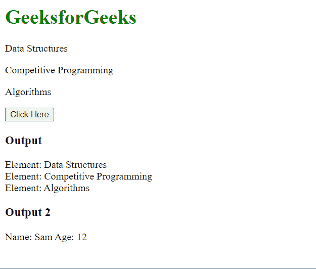

# jQuery 中的 toArray 和 makeArray 有什么区别？

> 原文:[https://www . geeksforgeeks . org/to array-and-make array-in-jquery/](https://www.geeksforgeeks.org/whats-the-difference-between-toarray-and-makearray-in-jquery/)有什么区别

在本文中，我们将学习 jQuery 中 toArray()和 makeArray()方法之间的区别。

**[to array()方法](https://www.geeksforgeeks.org/jquery-misc-toarray-method/) :** 该方法用于 DOM(文档对象模型)元素，将它们转换为 JavaScript 数组。我们可以迭代这个数组，计算它的长度，并像普通数组一样使用它们的索引访问元素。但是，我们不能使用此方法从其他类似数组的对象创建数组。这是两种功能的主要区别。

**语法:**

```html
let dom_array = $("p").toArray();
```

**示例:**在本例中，我们将了解如何使用 toArray()将 DOM 元素转换为数组，以及它如何不适用于其他类型的数据。

## 超文本标记语言

```html
<html>
<head>
  <script src=
"https://code.jquery.com/jquery-3.6.0.js">
  </script>
</head>
<body>
  <h1 style="color: green;">
    GeeksforGeeks
  </h1>
  <p>Data Structures</p>
  <p>Competitive Programming</p>
  <p>Algorithms</p>

  <button>Click Here</button>
  <h3>Output</h3>

  <div id="output"></div>
  <script>
    let obj = {
      name: "Sam",
      age: 12
    }

    $("button").click(function () {

      // Creating an array of paragraphs
      let para_array = $("p").toArray();

      // Iterating over para_array
      // and appending the data in the div
      for (i = 0; i < para_array.length; i++) {
        $("#output").append("Element: " +
          para_array[i].innerHTML + "<br>");
      }

      // We cannot use toArray() on the object
      // as toArray() works only for DOM elements
      // let obj_array = jQuery.toArray(obj);
      // console.log(obj_array);
    });
  </script>
</body>
</html>
```

**输出:**



**[make array()方法](https://www.geeksforgeeks.org/jquery-makearray-method/) :** 此方法用于类似数组的对象，将它们转换为数组。然后我们可以在这个数组上使用普通的数组函数。该方法支持 DOM 元素的转换，因为它们是类似数组的对象。

**语法:**

```html
// Array using DOM elements
let array = jQuery.makeArray($("p"));

// Array using other array-like objects
let array2 = jQuery.makeArray(array1, array2, array3);
```

**示例:**在本例中，我们将看到 makeArray()如何用于转换所有类型的类似数组的元素，包括 DOM 元素。

## 超文本标记语言

```html
<html>
<head>
  <script src=
"https://code.jquery.com/jquery-3.6.0.js">
  </script>
</head>
<body>
  <h1 style="color: green;">
    GeeksforGeeks
  </h1>

<p>Data Structures</p>

<p>Competitive Programming</p>

<p>Algorithms</p>

  <button>Click Here</button>
  <h3>Output</h3>

  <div id="output"></div>
  <h3>Output 2</h3>
  <div id="output2"></div>
  <script>
    let obj = {
      name: "Sam",
      age: 12
    }

    $("button").click(function () {

      // Creating an array of paragraphs
      let para_array = jQuery.makeArray($("p"));

      // Iterating over para_array
      // and appending the data in the first div
      for (let i = 0; i < para_array.length; i++) {
        $("#output").append("Element: " +
          para_array[i].innerHTML + "<br>");
      }

      // Creating an array of the object
      let obj_array = jQuery.makeArray(obj);

      // Iterating over obj_array
      // and appending the data in the second div
      for (let i = 0; i < obj_array.length; i++) {
        $("#output2").append("Name: " +
          obj_array[i].name + " Age: " + 
          obj_array[i].age + "<br>");
      }
    });
  </script>
</body>
</html>
```

**输出:**



**toArray()与 makeArray()的区别:**

<figure class="table">

| **toaarray()041** | **makeArray()凯伊姆** |
| This method supports converting DOM elements into arrays. | This method supports converting all array-like elements into arrays. |
| Only DOM element transformation is supported. Other array-like elements will throw an error. | All elements of type can be converted into arrays containing DOM elements. |

</figure>