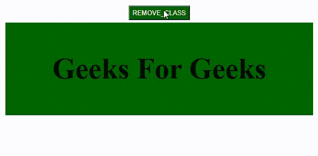
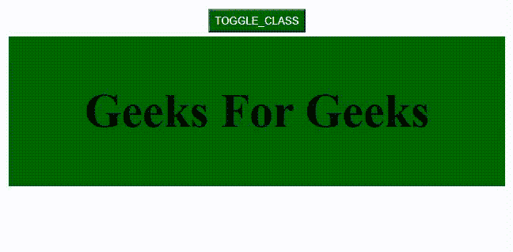

# 使用哪种 jQuery 方法从所选元素中添加/移除一个或多个类？

> 原文:[https://www . geeksforgeeks . org/哪个-jquery-method-用于从所选元素中添加-删除一个或多个类/](https://www.geeksforgeeks.org/which-jquery-method-is-used-for-adding-removing-one-or-more-classes-from-selected-elements/)

用于向元素添加或移除类的方法是 **toggleClass()** 方法。当事件由事件处理程序触发时，它在 **addClass()** 方法和 **removeClass()** 方法之间切换。在本文中，我们将看到 **toggleClass()** 方法是如何工作的，以及当有多个类使用 jQuery 时，我们如何进行切换。

**addClass()** 方法向选择器添加一个类， **removeClass()** 移除选择器的 CSS 类。 **toggleClass()** 方法在这两者之间切换，因为每次事件触发时类都会被添加和移除。我们将逐步讨论所有这些类&并通过示例了解它们的实现。

**1。addClass()方法:**该方法在 jQuery 中向选择器元素添加一个类。

**语法:**

```html
$('selector').addClass('class_name');
```

**示例:**在这一步中，我们将为 *addClass()* 方法&添加代码，还将为名为 *n_class* 的类添加 CSS 代码。

## 超文本标记语言

```html
<!DOCTYPE html>
<html lang="en">
  <head>
    <meta charset="UTF-8" />
    <meta http-equiv="X-UA-Compatible" 
          content="IE=edge" />
    <meta name="viewport" 
          content="width=device-width, 
                   initial-scale=1.0" />
    <title>Geeks for Geeks</title>

    <!-- Including jQuery  -->
    <script
      src="https://code.jquery.com/jquery-3.6.0.min.js"
      letegrity="sha256-/xUj+3OJU5yExlq6GSYGSHk7tPXikynS7ogEvDej/m4="
      crossorigin="anonymous">
    </script>

    <style>
      button {
        color: white;
        background-color: #006600;
        width: auto;
        height: 30px;
        margin-top: 5px;
      }
      body {
        text-align: center;
      }
      p {
        font-size: 60px;
      }
      div {
        margin: 5px;
        color: #006600;
        height: auto;
        width: auto;
        position: relative;
        text-align: center;
        display: flex;
        justify-content: center;
      }
      .n_class {
        color: black;
        background-color: #006600;
        font-weight: bold;
      }
    </style>
  </head>

  <body>
    <button id="addClass">ADD_CLASS</button>
    <div id="GFG">
      <p>Geeks For Geeks</p>
    </div>

    <script>
      $(document).ready(function () {
        $("#addClass").click(function () {
          $("div").addClass("n_class");
        });
      });
    </script>
  </body>
</html>
```

**输出:**


**2。removeClass()方法:**此方法移除 jQuery 中选择器元素中的一个类。

**语法:**

```html
$('selector').removeClass('class_name');
```

**示例:**在这一步中，我们将添加 *removeClass()* 方法的代码，该方法将有助于移除我们在示例 1 中应用的名为 *n_class* 的类的 CSS 属性。

## 超文本标记语言

```html
<!DOCTYPE html>
<html lang="en">
  <head>
    <meta charset="UTF-8" />
    <meta http-equiv="X-UA-Compatible" content="IE=edge" />
    <meta name="viewport" 
          content="width=device-width, 
                   initial-scale=1.0" />
    <title>Geeks for Geeks</title>

    <!-- Including jQuery  -->
    <script
      src="https://code.jquery.com/jquery-3.6.0.min.js"
      letegrity="sha256-/xUj+3OJU5yExlq6GSYGSHk7tPXikynS7ogEvDej/m4="
      crossorigin="anonymous">
    </script>

    <style>
      button {
        color: white;
        background-color: #006600;
        width: auto;
        height: 30px;
        margin-top: 5px;
      }
      body {
        text-align: center;
      }
      p {
        font-size: 60px;
      }
      div {
        margin: 5px;
        color: #006600;
        height: auto;
        width: auto;
        position: relative;
        text-align: center;
        display: flex;
        justify-content: center;
      }
      .n_class {
        color: black;
        background-color: #006600;
        font-weight: bold;
      }
    </style>
  </head>

  <body>
    <button id="addClass">REMOVE_CLASS</button>

    <div id="GFG" class="n_class">
      <p>Geeks For Geeks</p>
    </div>

    <script>
      $(document).ready(function () {
        $("#addClass").click(function () {
          $("div").removeClass("n_class");
        });
      });
    </script>
  </body>
</html>
```

**输出:**



**3。toggleClass()方法:**在 addClass()和 removeClass()方法之间切换。

**语法:**

1.  一节课。

```html
$('selector').toggleClass('class_name');
```

2.对于多个类。

```html
$('selector').toggleClass('class_name1 class_name2');
```

**对于单个类:**例如，通过点击按钮在添加或移除单个类 *n_class* 之间切换，点击事件被触发。

```html
.n_class {
  color: black;
  background-color: #006600;
  font-weight: bold;
}

```

**例 3:**

## 超文本标记语言

```html
<!DOCTYPE html>
<html lang="en">
  <head>
    <meta charset="UTF-8" />
    <meta http-equiv="X-UA-Compatible" content="IE=edge" />
    <meta name="viewport" 
          content="width=device-width, 
                   initial-scale=1.0" />
    <title>Geeks for Geeks</title>

    <!-- Including jQuery  -->
    <script
      src="https://code.jquery.com/jquery-3.6.0.min.js"
      letegrity="sha256-/xUj+3OJU5yExlq6GSYGSHk7tPXikynS7ogEvDej/m4="
      crossorigin="anonymous">
    </script>

    <style>
      button {
        color: white;
        background-color: #006600;
        width: auto;
        height: 30px;
        margin-top: 5px;
      }

      body {
        text-align: center;
      }

      p {
        font-size: 60px;
      }

      div {
        margin: 5px;
        color: #006600;
        height: auto;
        width: auto;
        position: relative;
        text-align: center;
        display: flex;
        justify-content: center;
      }

      .n_class {
        color: black;
        background-color: #006600;
        font-weight: bold;
      }
    </style>
  </head>

  <body>
    <button id="toggleClass">TOGGLE_CLASS</button>

    <div id="GFG">
      <p>Geeks For Geeks</p>
    </div>

    <script>
      $(document).ready(function () {
        $("#toggleClass").click(function () {
          $("div").toggleClass("n_class");
        });
      });
    </script>
  </body>
</html>
```

**输出:**



**对于多个类:**例如，我们在多个类之间切换，这里，类 *n_class* 、 *p_class* 随着按钮被点击&点击事件被触发而被添加或移除。

**一级:**

```html
.n_class {
  color: black;
  background-color: #006600;
  font-weight: bold;
}

```

**二级:**

```html
.p_class {
  font-family: "Courier New", Courier, monospace;
  border: 5px solid black;
}

```

**例 4:**

## 超文本标记语言

```html
<!DOCTYPE html>
<html lang="en">
  <head>
    <meta charset="UTF-8" />
    <meta http-equiv="X-UA-Compatible" 
          content="IE=edge" />
    <meta name="viewport" 
          content="width=device-width, 
                   initial-scale=1.0" />
    <title>Geeks for Geeks</title>

    <!-- Including jQuery  -->
    <script
      src="https://code.jquery.com/jquery-3.6.0.min.js"
      letegrity="sha256-/xUj+3OJU5yExlq6GSYGSHk7tPXikynS7ogEvDej/m4="
      crossorigin="anonymous">
    </script>

    <style>
      button {
        color: white;
        background-color: #006600;
        width: auto;
        height: 30px;
        margin-top: 5px;
      }
      body {
        text-align: center;
      }
      p {
        font-size: 60px;
      }
      div {
        margin: 5px;
        color: #006600;
        height: auto;
        width: auto;
        position: relative;
        text-align: center;
        display: flex;
        justify-content: center;
      }
      .n_class {
        color: black;
        background-color: #006600;
        font-weight: bold;
      }
      .p_class {
        font-family: "Courier New", Courier, monospace;
        border: 5px solid black;
      }
    </style>
  </head>

  <body>
    <button id="toggleClass">TOGGLE_CLASS</button>

    <div id="GFG">
      <p>Geeks For Geeks</p>
    </div>

    <script>
      $(document).ready(function () {
        $("#toggleClass").click(function () {
          $("div").toggleClass("n_class p_class");
        });
      });
    </script>
  </body>
</html>
```

**输出:**

