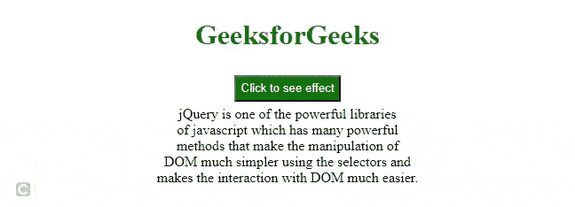
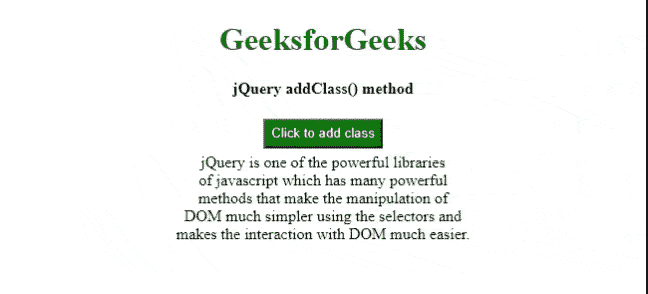

# jQuery 中选择的元素用哪些方法设置样式？

> 原文:[https://www . geesforgeks . org/哪些方法用于在 jquery 中的选定元素上设置样式/](https://www.geeksforgeeks.org/which-methods-are-used-to-set-styles-on-selected-elements-in-jquery/)

可以使用 jQuery [**css()**](https://www.geeksforgeeks.org/jquery-css-method/) 方法给 HTML 元素添加一个或多个样式。甚至我们可以使用 [**addClass()**](https://www.geeksforgeeks.org/jquery-addclass-with-examples/) 方法创建一些带有我们想要添加的所需样式的自定义 CSS 类并添加该类。在本文中，我们将看到添加一个或多个样式属性的两种方法。

**css()方法:****CSS()**方法用于更改所选元素的样式属性。JQuery 中的 **css()** 可以有不同的用法。

**语法:**

*   **单款式:**

    ```html
    $('selector').css('property':'value');
    ```

*   **适用于多种风格:**

    ```html
    $('selector').css({
        'property1': 'value1',
        'property2': 'value2'
    });
    ```

**例 1:**

## 超文本标记语言

```html
<!DOCTYPE html>
<html lang="en">

<head>
    <meta charset="UTF-8" />
    <meta http-equiv="X-UA-Compatible" content="IE=edge" />
    <meta name="viewport" content=
        "width=device-width, initial-scale=1.0" />

    <!-- Including jQuery  -->
    <script src=
        "https://code.jquery.com/jquery-3.6.0.min.js" 
        integrity=
    "sha256-/xUj+3OJU5yExlq6GSYGSHk7tPXikynS7ogEvDej/m4=" 
        crossorigin="anonymous">
    </script>

    <style>
        h1 {
            color: #006600;
        }

        button {
            color: white;
            background-color: #006600;
            width: auto;
            height: 30px;
            margin-top: 5px;
        }

        body {
            text-align: center;
        }

        p {
            font-size: 60px;
        }

        div {
            margin: 5px;
            height: auto;
            width: auto;
            position: relative;
            text-align: center;
            display: flex;
            justify-content: center;
        }
    </style>
</head>

<body>
    <h1>GeeksforGeeks</h1>

    <button id="CSS">Click to see effect</button>
    <br />

    <div id="GFG">
        jQuery is one of the powerful libraries
        <br /> of javascript which has many 
        powerful<br /> methods that make the 
        manipulation of<br /> DOM much simpler 
        using the selectors and<br /> makes the 
        interaction with DOM much easier.
    </div>

    <script>
        $(document).ready(function() {
            $("#CSS").click(function() {
                $("#GFG").css({
                    "font-style": "italic",
                    "font-family": 
                    "Courier New, Courier, monospace",
                    "background-color": "lime",
                    "font-weight": "bold",
                    color: "#006600",
                });
            });
        });
    </script>
</body>

</html>
```

**输出:**



css()方法

**使用 addClass()方法:**使用 **addClass()** 方法将类添加到特定元素中。我们可以向添加的类中添加一些 CSS 属性。

**语法:**

*   **单班:**

    ```html
    $('selector').addClass('class_name');
    ```

*   **对于多个类别:**

    ```html
    $('selector').addClass('class_name1 class_name2');
    ```

**例 2:**

## 超文本标记语言

```html
<!DOCTYPE html>
<html lang="en">

<head>
    <meta charset="UTF-8" />
    <meta http-equiv="X-UA-Compatible"
        content="IE=edge" />
    <meta name="viewport" content=
        "width=device-width, initial-scale=1.0" />

    <!-- Including jQuery  -->
    <script src=
        "https://code.jquery.com/jquery-3.6.0.min.js" 
        integrity=
"sha256-/xUj+3OJU5yExlq6GSYGSHk7tPXikynS7ogEvDej/m4=" 
        crossorigin="anonymous">
    </script>

    <style>
        h1 {
            color: #006600;
        }

        button {
            color: white;
            background-color: #006600;
            width: auto;
            height: 30px;
            margin-top: 5px;
        }

        body {
            text-align: center;
        }

        div {
            margin: 5px;
            height: auto;
            width: auto;
            position: relative;
            text-align: center;
            display: flex;
            justify-content: center;
        }

        .new_class {
            font-style: italic;
            font-family: Courier New, Courier, monospace;
            background-color: grey;
            font-weight: bold;
            color: #006600;
        }
    </style>
</head>

<body>
    <h1>GeeksforGeeks</h1>
    <p><b>jQuery addClass() method</b></p>

    <button id="CSS">Click to add class</button>
    <br />

    <div id="GFG">
        jQuery is one of the powerful libraries
        <br /> of javascript which has many 
        powerful<br /> methods that make the 
        manipulation of<br /> DOM much simpler 
        using the selectors and<br /> makes the 
        interaction with DOM much easier.
    </div>

    <script>
        $(document).ready(function() {
            $("#CSS").click(function() {
                $("#GFG").addClass("new_class");
            });
        });
    </script>
</body>

</html>
```

**输出:**



addClass()方法