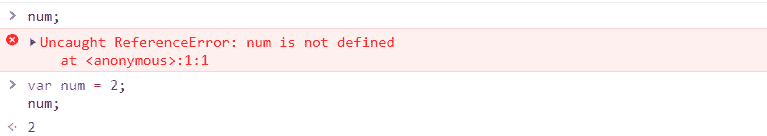
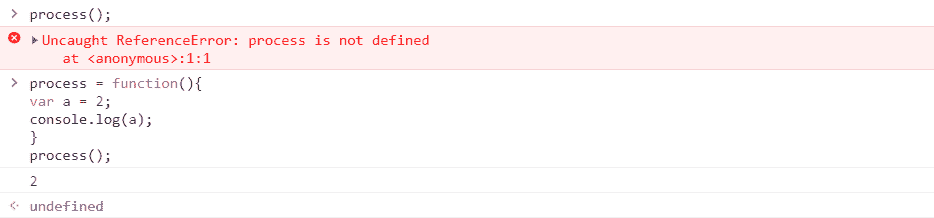

# 为什么 jQuery 出现错误“$未定义”？

> 原文:[https://www . geesforgeks . org/why-error-is-not-defined-occurrent-in-jquery/](https://www.geeksforgeeks.org/why-error-is-not-defined-occured-in-jquery/)

jQuery 开发人员面临的最常见错误之一是“$未定义”错误。起初，这似乎是一个小错误，但考虑到超过 70%的网站以某种形式使用 jQuery，这可能会造成巨大的混乱。

**这个错误背后的原因:**
这个错误基本上是在开发人员使用一个变量时，在脚本中声明它之前出现的。

**示例:**

## java 描述语言

```html
// ReferenceError: num is not defined
num;

declaration
var num;

// No more errors
data;
```

**输出:**



在上面的例子中，我们看到*‘num’*在声明之前已经被调用过了。这就是为什么*引用错误:num 没有定义*被扔在第一行的原因。在第三行中，再次调用“num”。但是，这次不会抛出错误，因为变量已经在脚本的第二行中定义了。

这是一个非常常见的错误。避免这种情况的最好方法是在调用变量和函数之前提升它们。再看一个例子。

**示例:**

## java 描述语言

```html
//reference error
process();

process = function(){
var a = 2;
console.log(a);
}

// no error
process();
```

**输出:**



**此错误最常见的原因:**

*   **在 jQuery 脚本文件**前嵌入 jQuery 插件
    “{ content }”；用于声明 jQuery 中的任何变量。插件基本上是预先编写的代码块。这些块使用预定义的 jQuery 函数和方法。因此，有必要在插件文件之前嵌入 jQuery 脚本文件。否则，应用程序将无法理解 jQuery 编码。

**正确顺序:**

## java 描述语言

```html
<script src="/lib/jquery.min.js"></script>
<script src="/lib/jquery.plugin.js"></script>
```

*   **CDN 托管的 jQuery 问题:**
    有可能该网站使用的 CDN 托管的 jQuery 版本可能已经在客户的连接上被阻止。这类问题通常出现在来自中国、印度尼西亚、韩国等国的 IP 地址上。
    为了避免这个问题，最好提供本地托管的 jQuery 回退版本。

**示例:**

## java 描述语言

```html
//an external CDN link
<script src=
"https://ajax.googleapis.com/ajax/libs/jquery/3.4.1/jquery.min.js">
</script>

//fall back to local jQuery
<script>
window.jQuery || document.write('
<script src="http://www.mywebsite.com/jquery.min.js"><\/script>'))
</script>
```