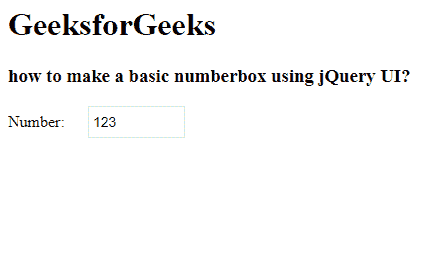

# 测量 jQuery 数字框小工具

> 原文:[https://www . geesforgeks . org/measuri-jquery-number box-widget/](https://www.geeksforgeeks.org/easui-jquery-numberbox-widget/)

EasyUI 是一个 HTML5 框架，用于使用基于 jQuery、React、Angular 和 Vue 技术的用户界面组件。它有助于构建交互式 web 和移动应用程序的功能，为开发人员节省了大量时间。

在本文中，我们将学习如何使用 jQuery 易用户界面设计数字箱。数字框允许用户在框中添加数值。

**jQuery 易 UI 下载:**

```html
https://www.jeasyui.com/download/index.php
```

**语法:**

```html
<input class="easyui-numberbox">
```

**属性:**

*   **禁用:**定义是否禁用该字段。
*   **值:**默认值。
*   **分钟:**最小允许值。
*   **最大值:**最大允许值。
*   **精度:**小数点后显示的最大精度。
*   **十进制分隔符:**十进制字符分隔数字的整数和小数部分。。
*   **组分隔符:**分隔整数组以显示千和百万的字符。
*   **前缀:**前缀字符串。
*   **后缀:**后缀字符串。
*   **过滤:**定义如何过滤按键。
*   **格式化程序:**格式化数字箱值的函数。
*   **解析器:**解析字符串的函数。

**方法:**

*   **选项:**返回数字框选项。
*   **销毁:**销毁数字箱对象。
*   **禁用:**禁用该字段。
*   **启用:**启用该字段。
*   **固定:**将值固定为有效值。
*   **设置值:**设置数字框值。
*   **获取值:**获取数字箱值。
*   **清除:**清除数字箱值。
*   **复位:**复位数字箱值。

#### **事件:**

*   **onChange:** 当字段值改变时触发。

**方法:**首先，添加项目所需的 jQuery Easy UI 脚本。

> <！–易 UI 的 jQuery 库–>
> <脚本类型=【text/JavaScript】src =【jQuery . easui . min . js】></脚本>
> <！–易 UI Mobile 的 jQuery 库–>
> <脚本类型=“text/JavaScript”src =“jQuery . easui . Mobile . js”></脚本>

**示例:**

## 超文本标记语言

```html
<!doctype html> 
<html> 

<head> 
    <meta charset="UTF-8"> 
    <meta name="viewport" content="initial-scale=1.0, 
        maximum-scale=1.0, user-scalable=no"> 

    <!-- EasyUI specific stylesheets-->
    <link rel="stylesheet" type="text/css"
        href="themes/metro/easyui.css"> 

    <link rel="stylesheet" type="text/css"
        href="themes/mobile.css"> 

    <link rel="stylesheet" type="text/css"
        href="themes/icon.css"> 

    <!--jQuery library -->
    <script type="text/javascript" src="jquery.min.js"> 
    </script> 

    <!--jQuery libraries of EasyUI -->
    <script type="text/javascript"
        src="jquery.easyui.min.js"> 
    </script> 

    <!--jQuery library of EasyUI Mobile -->
    <script type="text/javascript"
        src="jquery.easyui.mobile.js"> 
    </script> 

    <h1>GeeksforGeeks</h1>
    <h3>how to make a basic numberbox using jQuery UI?</h3>
</head> 

<body>
     <input class="easyui-numberbox" 
            value="123" label="Number:" >
</body>
</html>
```

**输出:**



**参考:**T2】http://www.jeasyui.com/documentation/