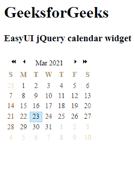

# easy ui jquery 日历小部件

> 哎哎哎:# t0]https://www . geeksforgeeks . org/easy ui-jquery-calendar 小部件/

EasyUI 是一个 HTML5 框架，用于使用基于 jQuery、React、Angular 和 Vue 技术的用户界面组件。它有助于构建交互式 web 和移动应用程序的功能，为开发人员节省了大量时间。

在本文中，我们将学习如何使用 jQuery 易用户界面设计日历。日历小部件显示一个月的日历，允许用户选择日期并移到下一个月或上一个月。

**jQuery 易 UI 下载:**

```html
https://www.jeasyui.com/download/index.php
```

**语法:**

```html
<input class="easyui-calendar">
```

**属性:**

*   **宽度:**日历组件的宽度。
*   **高度:**日历组件的高度。
*   **适合:**如果为真，则设置日历大小以适合其父容器。
*   **边框:**定义是否显示边框。
*   **显示周:**定义是否显示周数。
*   **周数表头:**周数表头显示的标签。
*   **获取周数:**返回周数的函数。
*   **第一天:**定义一周的第一天。
*   **周:**要显示的周列表。
*   **月份:**要显示的月份列表。
*   **年:**历年。
*   **月:**日历的月份。
*   **当前:**当前日期。
*   **格式化程序:**日格式化程序功能。

**事件:**

*   **onSelect:** 当用户选择日期时触发。
*   **更改日期:**更改日期时触发。
*   **开启导航门:**导航年和月时触发。

**方法:**

*   **选项**返回选项对象。
*   **调整大小**调整日历大小。
*   **移动到**将日历移动到指定日期。

**CDN 链接:**首先，添加项目所需的 jQuery Easy UI 脚本。

> <！–易 UI 的 jQuery 库–>
> <脚本类型=“text/JavaScript”src =“jQuery . easui . min . js”></脚本>
> <！–易 UI Mobile 的 jQuery 库–>
> <脚本类型=“text/JavaScript”src =“jQuery . easui . Mobile . js”>
> </脚本>

**例 1:**

## 超文本标记语言

```html
<!doctype html>
<html>

<head>
    <meta charset="UTF-8">
    <meta name="viewport" content="initial-scale=1.0,
        maximum-scale=1.0, user-scalable=no">

    <!-- EasyUI specific stylesheets-->
    <link rel="stylesheet" type="text/css"
        href="themes/metro/easyui.css">

    <link rel="stylesheet" type="text/css"
        href="themes/mobile.css">

    <link rel="stylesheet" type="text/css"
        href="themes/icon.css">

    <!--jQuery library -->
    <script type="text/javascript" src="jquery.min.js">
    </script>

    <!--jQuery libraries of EasyUI -->
    <script type="text/javascript"
        src="jquery.easyui.min.js">
    </script>

    <!--jQuery library of EasyUI Mobile -->
    <script type="text/javascript"
        src="jquery.easyui.mobile.js">
    </script>

    <script type="text/javascript">
      $(document).ready(function (){
        $('#gfg').calendar({
          border: false
        });
      });
    </script>
</head>

<body>

    <h1>GeeksforGeeks</h1>
    <h3>EasyUI jQuery calendar widget</h3>

        <div  id="gfg" style="margin-bottom:20px">
         <div  class="easyui-calendar"
               style="width:250px">
         </div>
      </div>

</body>
</html>
```

**输出:**



**参考:**T2】http://www.jeasyui.com/documentation/