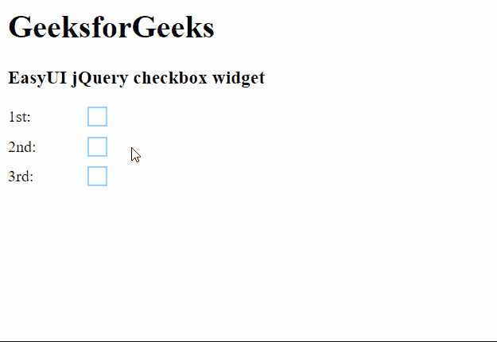

# easy ui jquery checkbox widget

> 哎哎哎:# t0]https://www . geeksforgeeks . org/easy ui-jquery checkbox widget/

在本文中，我们将学习如何使用 jQuery 易用户界面设计一个复选框。**复选框**小部件用于选择多个选项。每个选项都可以通过点击框来启用。EasyUI 是一个 HTML5 框架，用于使用基于 jQuery、React、Angular 和 Vue 技术的用户界面组件。它有助于构建交互式 web 和移动应用程序的功能，为开发人员节省了大量时间。

**jQuery 易 UI 下载:**

```
https://www.jeasyui.com/download/index.php
```

**语法:**

```
<input class="easyui-checkbox">
```

**属性:**

*   **宽度:**用于设置复选框的宽度。
*   **高度:**用于设置复选框的高度。
*   **值:**用于设置复选框的默认值。
*   **勾选:**用于勾选复选框。
*   **禁用:**用于禁用复选框。
*   **标签:**复选框绑定的标签。
*   **标签宽度:**用于设置标签宽度。
*   **标签位置:**用于设置标签位置。
*   **标签对齐:**用于设置标签对齐。

**事件:**

*   **onChange:** 当检查的值改变时，它关闭。

**方法:**

*   **选项**:返回选项对象。
*   **设置值**:设置复选框的值。
*   **禁用**:禁用复选框组件。
*   **启用**:启用复选框组件。
*   **勾选**:勾选复选框。
*   **取消勾选**:取消勾选复选框。
*   **清零**:清零值。
*   **复位**:复位数值。

**CDN 链接:**首先，添加项目所需的 jQuery Easy UI 脚本。

> <！–易 UI 的 jQuery 库–>
> <脚本类型=【text/JavaScript】src =【jQuery . easui . min . js】></脚本>
> <！–易 UI Mobile 的 jQuery 库–>
> <脚本类型=“text/JavaScript”src =“jQuery . easui . Mobile . js”></脚本>

**示例:**

## 超文本标记语言

```
<html>
<head> 
    <!-- EasyUI specific stylesheets-->
    <link rel="stylesheet" type="text/css"
          href="themes/metro/easyui.css"> 

    <link rel="stylesheet" type="text/css"
          href="themes/mobile.css"> 

    <link rel="stylesheet" type="text/css"
          href="themes/icon.css"> 

    <!--jQuery library -->
    <script type="text/javascript" 
            src="jquery.min.js"> 
    </script> 

    <!--jQuery libraries of EasyUI -->
    <script type="text/javascript"
            src="jquery.easyui.min.js"> 
    </script> 

    <!--jQuery library of EasyUI Mobile -->
    <script type="text/javascript"
            src="jquery.easyui.mobile.js"> 
    </script>
</head> 
<body>
    <h1>GeeksforGeeks</h1>
    <h3>EasyUI jQuery checkbox widget</h3>

 <form id="gfg">
    <div style="margin-bottom:10px">
        <input class="easyui-checkbox" 
               name="language" 
               value="HTML" 
               label="1st:">
    </div>
    <div style="margin-bottom:10px">
        <input class="easyui-checkbox" 
               name="language" 
               value="JavaScript" 
               label="2nd:">
    </div>
    <div style="margin-bottom:10px">
        <input class="easyui-checkbox" 
               name="language"
               value="jQuery" 
               label="3rd:">
    </div>
</form>
</body>
</html>
```

**输出:**



**参考:**T2】https://www.jeasyui.com/documentation/checkbox.php