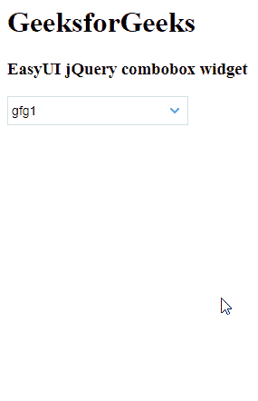

# easy ui jquery combobox widget

> 哎哎哎:# t0]https://www . geeksforgeeks . org/easy ui-jquery combobox widget/

EasyUI 是一个 HTML5 框架，用于使用基于 jQuery、React、Angular 和 Vue 技术的用户界面组件。它有助于构建交互式 web 和移动应用程序的功能，为开发人员节省了大量时间。

在本文中，我们将学习如何使用 jQuery EasyUI 设计一个组合框。组合框显示一个可编辑的文本框和下拉列表，用户可以从中选择一个或多个值。

**jQuery 易 UI 下载:**

```html
https://www.jeasyui.com/download/index.php
```

**语法:**

```html
<input class="easyui-combobox">
```

**属性:**

*   **值字段:**要绑定到此组合框的基础数据值名称。
*   **文本字段:**要绑定到此组合框的基础数据字段名称。
*   **分组字段:**指示要分组的字段。
*   **组格式化程序:**返回要在组项目上显示的组文本。
*   **模式:**定义文本改变时如何加载列表数据。
*   **网址:**从远程加载列表数据的网址。
*   **方法:**检索数据的 http 方法。
*   **数据:**待加载的列表数据。
*   **查询参数:**请求远程数据时将发送到服务器的附加参数。
*   **限制列表:**为真，将输入值限制在列出的项目。
*   **显示项目图标:**为真，在文本框中显示所选项目的图标。
*   **组位置:**项目组位置，
*   **过滤:**定义当“模式”设置为“本地”时，如何过滤本地数据。
*   **格式化程序:**定义如何渲染行。
*   **加载器:**定义如何从远程服务器加载数据。返回 false 可以中止此操作。
*   **加载过滤器:**返回过滤后的数据进行显示。

**事件:**

*   **onBeforeLoad:** 在请求加载数据之前激发。
*   **加载成功:**远程数据加载成功时触发。
*   **加载错误:**加载远程数据时出现错误时触发。
*   **onChange:** 当字段值改变时触发。
*   **onClick:** 当用户点击列表项时触发。
*   **onSelect:** 当用户选择列表项时触发。
*   **未选择:**当用户取消选择列表项时触发。

**方法:**

*   **选项:**返回选项对象。
*   **获取数据:**返回加载的数据。
*   **加载数据:**加载地区列表数据。
*   **重新加载:**请求远程列表数据。
*   **设置值:**设置组合框值数组。
*   **设置值:**设置组合框值。
*   **清除:**清除组合框值。
*   **选择:**选择指定项目。
*   **取消选择:**取消选择指定的项目。

**CDN 链接:**首先，添加项目所需的 jQuery Easy UI 脚本。

> <！–易 UI 的 jQuery 库–>
> <脚本类型=“text/JavaScript”src =“jQuery . easui . min . js”>
> </脚本>

**例 1:**

## 超文本标记语言

```html
<!doctype html> 
<html> 

<head> 
    <meta charset="UTF-8"> 
    <meta name="viewport" content="initial-scale=1.0, 
        maximum-scale=1.0, user-scalable=no"> 

    <!-- EasyUI specific stylesheets-->
    <link rel="stylesheet" type="text/css"
        href="themes/metro/easyui.css"> 

    <link rel="stylesheet" type="text/css"
        href="themes/mobile.css"> 

    <link rel="stylesheet" type="text/css"
        href="themes/icon.css"> 

    <!--jQuery library -->
    <script type="text/javascript" src="jquery.min.js"> 
    </script> 

    <!--jQuery libraries of EasyUI -->
    <script type="text/javascript"
        src="jquery.easyui.min.js"> 
    </script> 

    <!--jQuery library of EasyUI Mobile -->
    <script type="text/javascript"
        src="jquery.easyui.mobile.js"> 
    </script> 

    <script type="text/javascript"> 
      $(document).ready(function (){ 
         $('#gfg').combobox({ 
           valueField: 'value',
           textField: 'text'
         }); 
      }); 
    </script> 
</head> 

<body>

    <h1>GeeksforGeeks</h1>
    <h3>EasyUI jQuery combobox widget</h3>
    <select id="gfg" class="easyui-combobox" 
            name="dept" style="width:200px;">
      <option>gfg1</option>
      <option>gfg2</option>
      <option>gfg3</option>
      <option>gfg4</option>
      <option>gfg5</option>
    </select>
</body>
</html>
```

**输出:**



**参考:**T2】http://www.jeasyui.com/documentation/