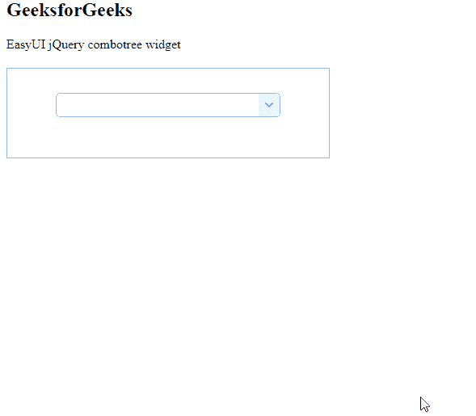

# easy ui jquery combat widget

> 哎哎哎:# t0]https://www . geeksforgeeks . org/easy ui-jquery-combotee 小部件/

EasyUI 是一个 HTML5 框架，用于使用基于 jQuery、React、Angular 和 Vue 技术的用户界面组件。它有助于构建交互式 web 和移动应用程序的功能，为开发人员节省了大量时间。

在本文中，我们将学习如何使用 jQuery EasyUI 设计一个组合框。 combotree 将选择控件与下拉树相结合。

**jQuery 易 UI 下载:**

```html
https://www.jeasyui.com/download/index.php
```

**语法:**

```html
<input class="easyui-combotree">
```

**属性:**

*   **可编辑:**定义用户是否可以直接在字段中键入文本。
*   **文本字段:**要绑定到此组合框的基础数据字段名称。

**方法:**

*   **选项:**返回选项对象。
*   **清除:**清除组件值。
*   **设置值:**设置组件值数组。
*   **设置值:**设置组件值。
*   **树:**返回树对象。
*   **加载数据:**加载区域树数据。
*   **重新加载:** 再次请求远程树数据。

**CSN 链接:**首先，添加项目所需的 jQuery Easy UI 脚本。

> <脚本类型= " text/JavaScript " src = " jquery . easy ui . min . js "></脚本>
> 
> <脚本类型= " text/JavaScript " src = " jquery . easy ui . mobile . js "></脚本>

**例 1:**

## 超文本标记语言

```html
<html>
<head>
    <link rel="stylesheet" type="text/css"  
          href=
"https://www.jeasyui.com/easyui/themes/default/easyui.css">

    <link rel="stylesheet" type="text/css"  
          href=
"https://www.jeasyui.com/easyui/themes/icon.css">

    <script type="text/javascript" src="jquery.min.js">  
    </script>  

    <!--jQuery libraries of EasyUI -->
    <script type="text/javascript"
        src="jquery.easyui.min.js">  
    </script>  

    <!--jQuery library of EasyUI Mobile -->

    <script type="text/javascript"
        src="jquery.easyui.mobile.js">  
    </script> 

    <script type="text/javascript">
        $(document).ready(function (){
            $('#gfg').combotree({
                editable: false,
                dnd: false
            });
        });

    </script>
</head>
<body>
<h2>GeeksforGeeks</h2>

<p>EasyUI jQuery combotree widget</p>

    <div class="easyui-panel" style="padding:5px">
    <div id="gfg">
        <div style="margin-bottom:20px">
            <input class="easyui-combotree" style="width:100%">
        </div>
    </div>
      </div>

</body>
</html>
```

**输出:**



**参考:**T2】http://www.jeasyui.com/documentation/